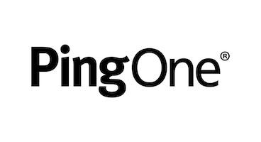
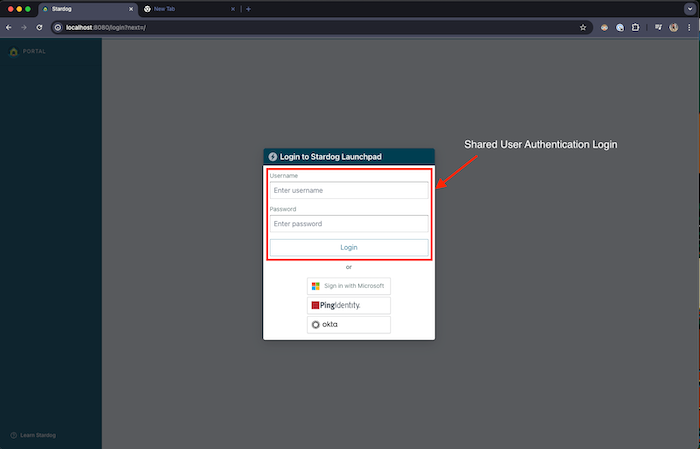
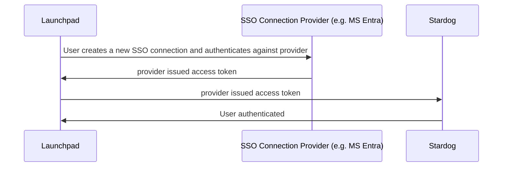
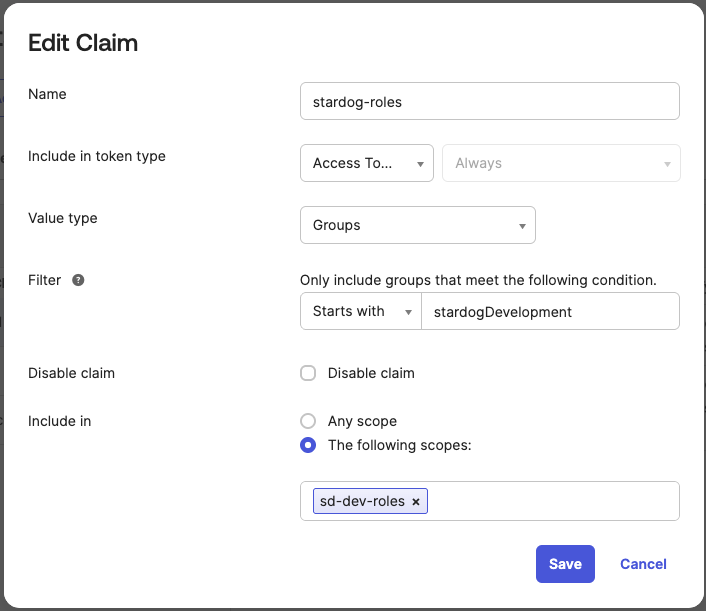
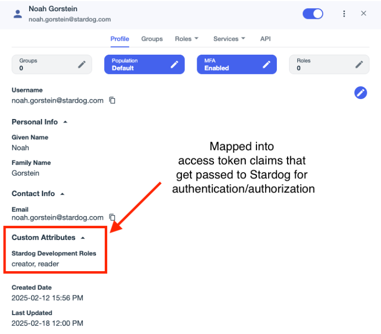

# Stardog Launchpad Documentation

> [!IMPORTANT]
> The current version of Launchpad is v3. See [here](./v2-deprecated/) for the deprecated v2 documentation. 

> [!NOTE]
> See the [Release Notes](./release-notes.md) for the changelog and information about releases.


## Quick Facts

- Launchpad is a slimmed down version of the [Stardog Cloud Portal](https://cloud.stardog.com) intended to be deployed on-premise.
- Launchpad is distributed as a single Docker container
- Launchpad allows users to manage multiple connections to Stardog endpoints.
- Launchpad contains all Stardog Applications - Studio, Explorer, Designer, Knowledge Catalog
- Launchpad must be configured with an SSO provider (e.g. Microsoft Entra) to manage user authentication and authorization. 
- Launchpad persists data to a local directory that should be mounted to a volume for persistence.
- Launchpad does not handle SSL termination. It is recommended to use a reverse proxy like Nginx or Apache to handle SSL termination.

https://github.com/user-attachments/assets/71652eb8-6106-4413-be44-995a1bf08245

*Demo using Microsoft Entra ID to log users into Launchpad. A new connection using a Stardog username and password connection is then made.*

## Getting Started

This is the general guide to getting Launchpad up and running. For more detailed information, see the [Configuration](#configuration) guide.

0. Prerequisites
    - Docker
    - An SSO provider to log users in with (e.g. Microsoft Entra)
    - A Stardog endpoint to connect to 

1. Pull the Docker Image

   - Log in to Stardog's Docker registry

    ```bash
    docker login stardog-stardog-apps.jfrog.io
    ```

   - Pull the Launchpad Docker image

    ```bash
    docker pull stardog-stardog-apps.jfrog.io/launchpad:current
    ```

2. Configure Launchpad and optionally your Stardog servers.
   - Launchpad must be configured with an SSO provider to log users in with.
   - Launchpad can optionally be configured with "SSO Connections", allowing users to use SSO to connect to Stardog endpoints that have also been configured to accept JWT tokens from the SSO provider. Without SSO Connections, users will need to manually enter their Stardog credentials to connect to Stardog endpoints.
      - The SSO provider for connections can be from the same provider as the main SSO provider or a different provider. They should, however, be different applications in the SSO provider. For example, Microsoft Entra can be used as the Launchpad SSO (main) provider and also as the SSO provider for connections, but Launchpad and each of the SSO connections (the Stardog endpoints) should be different "App Registrations" in Microsoft Entra.
      - The SSO provider must be configured to issue JWT tokens that can be used to authenticate with Stardog.
      - See [SSO Connection Configuration](#sso-connection-configuration) for more information on configuring SSO Connections.

3. Create and run the Launchpad container

    ```bash
    docker run \
      --env-file /path/to/launchpad/.env.launchpad \
      -p 8080:8080 \
      -v /path/to/launchpad/data:/data \
      stardog-stardog-apps.jfrog.io/launchpad:current
    ```

    - The `--env-file` flag should point to a file containing the environment variables for Launchpad. See the [Configuration](#configuration) section for more information.
    - The container exposes port `8080`, which can be mapped to any port on the host machine.
    - `/data` is the directory where Launchpad will persist data. **This should be mounted to a volume for persistence**.

> [!IMPORTANT]
> By default, the Launchpad container will run as `root` user (uid `0`). This is not recommended for production use. If you want to run the container as a different user, you can use the `--user` flag in the `docker run` command. See [Run Launchpad with a Given User](#run-launchpad-with-a-given-user) for more information.

4. Access Launchpad in your browser at the [`BASE_URL`](#base_url) you configured.

## Data Persistence

As mentioned in the [Getting Started](#getting-started) section, Launchpad persists data to a local directory that should be mounted to a volume for persistence. This is done by mounting a volume to the `/data` directory in the Launchpad container. 

> [!IMPORTANT]
>The volume mounted should be owned and writable by the user that is running the Launchpad container. See [Run Launchpad with a Given User](#run-launchpad-with-a-given-user) for more information.

## Run Launchpad with a Given User

You can run Launchpad with a given user by using the `--user` flag in the `docker run` command. This is useful if you want to run Launchpad as a specific user instead of the default `root` user.

```bash
docker run \
  --user <user_id>:<group_id> \
  --env-file /path/to/launchpad/.env.launchpad \
  -p 8080:8080 \
  -v /path/to/launchpad/data:/data \
  stardog-stardog-apps.jfrog.io/launchpad:current
```

> [!IMPORTANT]
> When using the `--user` flag, the user id and group id must have the appropriate permissions to the directory mounted to `/data`. This is the directory where Launchpad will persist data. If the user id and group id do not have the appropriate permissions, you may encounter permission errors when trying to access the data in Launchpad. This is especially important if you are running Launchpad on Linux, as Linux handles file permissions differently than macOS for Docker containers.
>
> The following error may be seen in the logs if the user does not have the appropriate permissions to the `/data` directory:
>```
>django.db.utils.OperationalError: unable to open database file
>```
>
> To fix this, you can change the ownership of the directory on the host machine mounted to `/data` to the user id and group id that you are using to run the Launchpad container. You can do this by running the following command on the host machine:
>```bash
>sudo chown <user_id>:<group_id> /path/to/launchpad/data
>```

> [!NOTE]
> Similarly in Kubernetes, you can set the `securityContext` for the Launchpad pod to run as a specific user.
>
> ```yaml
>securityContext:
>  runAsNonRoot: true
>  runAsUser: 100001
>  runAsGroup: 100001
>```


## Getting Help

Issues are disabled on this repository. All support requests and feedback should be routed directly to either your dedicated Customer Success Manager (CSM) or Stardog Support.

## Configuration

The following sections detail the configuration options available in Launchpad. All configuration options are set as environment variables in the Docker container.

| Section | Description |
| :------ | :---------- |
| [General Configuration](#general-configuration) | General configuration options available in Launchpad |
| [Login Provider Configuration](#login-provider-configuration) | Configuration options for the SSO provider used to log users into Launchpad |
| [SSO Connection Configuration](#sso-connection-configuration) | Configuration options for SSO Connections, allowing users to use SSO to connect to Stardog endpoints that have also been configured to accept JWT tokens from the SSO provider. |

### Example Configuration

Here is an example of a configuration file for Launchpad. When using Docker/Docker Compose, you can pass this file to the container using the `--env-file` flag or equivalent in your Docker Compose file.

```bash
# General Configuration
BASE_URL=http://localhost:8080
COOKIE_SECRET=supersecret

# Microsoft Entra Login Provider (to log users into Launchpad)
AZURE_AUTH_ENABLED=true
AZURE_CLIENT_ID=<client_id>
AZURE_CLIENT_SECRET=<client_secret>
AZURE_TENANT=<tenant_id>

# Development Stardog Server SSO Connection using Microsoft Entra (to authenticate users connecting to Stardog)
SSOCONNECTION_DEVELOPMENT_AZURE_CLIENT_ID=<client_id>
SSOCONNECTION_DEVELOPMENT_AZURE_CLIENT_SECRET=<client_secret>
SSOCONNECTION_DEVELOPMENT_AZURE_TENANT=<tenant_id>
SSOCONNECTION_DEVELOPMENT_AZURE_STARDOG_ENDPOINT=http://localhost:5825
SSOCONNECTION_DEVELOPMENT_AZURE_DISPLAY_NAME=Development

# Production Stardog Server SSO Connection using Microsoft Entra (to authenticate users connecting to Stardog)
SSOCONNECTION_PRODUCTION_AZURE_CLIENT_ID=<client_id>
SSOCONNECTION_PRODUCTION_AZURE_CLIENT_SECRET=<client_secret>
SSOCONNECTION_PRODUCTION_AZURE_TENANT=<tenant_id>
SSOCONNECTION_PRODUCTION_AZURE_STARDOG_ENDPOINT=http://localhost:5826
SSOCONNECTION_PRODUCTION_AZURE_DISPLAY_NAME=Production
```

### General Configuration

This section details the general configuration options available in Launchpad. 


#### `BASE_URL`

The `BASE_URL` is used to set the base URL for Launchpad. This is the URL that users will use to access Launchpad. 

- **Required:** Yes
- **Default:** not set

#### `COOKIE_SECRET`

The `COOKIE_SECRET` is used to set the secret used to sign cookies in Launchpad. This should be a large, random string.

- **Required:** Yes
- **Default:** not set

#### `SESSION_EXPIRATION`

The `SESSION_EXPIRATION` is used to set the expiration time in **seconds** for user sessions in Launchpad. 

- Required: No
- Default: `43200` (12 hours)

#### `GUNICORN_WORKERS`

The `GUNICORN_WORKERS` is used to set the number of Gunicorn workers to use for Launchpad. By default, this is set to `2 * CPU cores + 1`. This should work for most use cases, but can be overridden to increase or decrease the number of workers. This is useful for environments with limited resources like memory. This setting should be provided as a positive integer.

- **Required:** No
- **Default:** `2 * CPU cores + 1`

#### `DESIGNER_STORAGE_ENABLED`

The `DESIGNER_STORAGE_ENABLED` option is used to configure the storage location for projects in Stardog Designer. By default, this should be set to `false`, resulting in projects being stored in a user browser's local storage. If set to `true`, projects will be stored in the Launchpad database under your Launchpad user account.

> [!TIP]
> It's recommended to set this to `true` to avoid accidental data loss of Designer projects if the user clears their browser's local storage.

- **Required:** No
- **Default:** `false`

#### `VOICEBOX_SERVICE_ENDPOINT`

The `VOICEBOX_SERVICE_ENDPOINT` is used to specify the endpoint for the [Voicebox Service](./voicebox.md#voicebox-service). This is used to enable the Voicebox in Launchpad.

- **Required:** No
- **Default:** not set

### Login Provider Configuration

This section details the configuration options available for the SSO provider used to log users into Launchpad. 

> [!IMPORTANT]
> Launchpad **should** be configured with at least 1 SSO provider to log users into the application. You may use shared user authentication to bypass the need to have a SSO login provider, but this is **not** recommended for production use. See [Shared User Authentication](#shared-user-authentication) for more information.

Available Login SSO providers:
- [Microsoft Entra (formerly known as Azure Active Directory)](#microsoft-entra-login-provider)
- [Google](#google-login-provider)
- [Okta](#okta-login-provider)
- [PingOne](#pingone-login-provider)
- [Kerberos](#kerberos-login-provider)

------------

<a name="microsoft-entra-login-provider"></a>
**Microsoft Entra**


The following configuration options are available for Microsoft Entra.

> [!NOTE]
> See [How to Create an Azure App Registration to Login with Microsoft Entra in Launchpad](#how-to-create-an-azure-app-registration-to-login-with-microsoft-entra-in-launchpad) for instructions on 
> how to create an Azure App Registration to login with Microsoft Entra in Launchpad.

#### `AZURE_AUTH_ENABLED`

The `AZURE_AUTH_ENABLED` is used to enable or disable Microsoft Entra authentication to log users into Launchpad.

- **Required:** Yes (if using Microsoft Entra)
- **Default:** `false`

#### `AZURE_CLIENT_ID`

The `AZURE_CLIENT_ID` is the client id of the Azure App Registration used to sign users into Launchpad.

- **Required:** Yes (if using Microsoft Entra)
- **Default:** not set

#### `AZURE_CLIENT_SECRET`

The `AZURE_CLIENT_SECRET` is the client secret of the Azure App Registration used to sign users into Launchpad.

> [!NOTE]
> This should be used if not using a client certificate (`AZURE_CLIENT_CERTIFICATE_FILE` or `AZURE_CLIENT_CERTIFICATE_THUMBPRINT`).

- **Required:** Yes (if using Microsoft Entra)
- **Default:** not set

#### `AZURE_TENANT`

The `AZURE_TENANT` is the tenant id of the Azure App Registration used to sign users into Launchpad.

- **Required:** Yes (if using Microsoft Entra)
- **Default:** `organizations`


#### `AZURE_CLIENT_PRIVATE_KEY_FILE`

The `AZURE_CLIENT_PRIVATE_KEY_FILE` is the path (in the Docker container) to the private key file corresponding to the certificate used as a credential with Application Registration;

> [!NOTE]
> This should be used if not using a client secret (`AZURE_CLIENT_SECRET`). The private key must **not** be password protected.

- **Required:** Yes (if using client certificate with Microsoft Entra)
- **Default:** not set

#### `AZURE_CLIENT_CERTIFICATE_FILE`

The `AZURE_CLIENT_CERTIFICATE_FILE` is the path (in the Docker container) to the certificate file used as a credential with the Application Registration. 

> [!NOTE]
> This should be set if `AZURE_CLIENT_CERTIFICATE_THUMBPRINT` not specified.

- **Required:** Yes (if using client certificate with Microsoft Entra and not using `AZURE_CLIENT_CERTIFICATE_THUMBPRINT`)
- **Default:** not set

#### `AZURE_CLIENT_CERTIFICATE_THUMBPRINT`

Thumbprint of the certificate used as a credential with the Application Registration. 

> [!NOTE]
> This should be set if `AZURE_CLIENT_CERTIFICATE_FILE` not specified)

- **Required:** Yes (if using client certificate with Microsoft Entra and not using `AZURE_CLIENT_CERTIFICATE_FILE`)
- **Default:** not set

#### `AZURE_GOV_CLOUD_US`

The `AZURE_GOV_CLOUD_US` is used to set the Azure cloud environment to the Azure US Government Cloud.

- **Required:** Yes (if using Azure US Government Cloud)
- **Default:** `false`

#### `AZURE_AUTH_BASE_URL`

The `AZURE_AUTH_BASE_URL` is used to set the base URL for Microsoft Entra. This is the URL that users will use to authenticate with Microsoft Entra.

> [!NOTE]
> If `AZURE_GOV_CLOUD_US` is set to `true`, this will be automatically set to `https://login.microsoftonline.us`

- **Required:** No
- **Default:** `https://login.microsoftonline.com`

#### `AZURE_GRAPH_BASE_URL`

The `AZURE_GRAPH_BASE_URL` is used to set the base URL for the Microsoft Graph API. This is used to retrieve user information from Microsoft Entra.

> [!NOTE]
> If `AZURE_GOV_CLOUD_US` is set to `true`, this will be automatically set to `https://graph.microsoft.us`

- **Required:** No
- **Default:** `https://graph.microsoft.com`

#### How To Create an Azure App Registration to login with Microsoft Entra in Launchpad

1. **Create App Registration**
   - Open Azure Portal ([https://portal.azure.com](https://portal.azure.com))
   - Navigate to **Microsoft Entra ID** > **App registrations**
   - Click **"New registration"**
   - Name application (e.g., "Stardog Launchpad")
   - Select **"Accounts in this organizational directory only"**
   - Click **"Register"**

2. **Configure Authentication**
   - Go to app's **"Authentication"**
   - Add web platform redirect URI:
     - **Type**: Web
     - **Redirect URI**: `{BASE_URL}/oauth/azure/redirect`
      - See [`BASE_URL`](#base_url) for more information on what the value should.
   - Enable "ID tokens (used for implicit and hybrid flows)"

3. **Generate Credentials**
   - *Option 1: Client Secret*
     - Go to **"Certificates & secrets"**
     - Click **"New client secret"**
     - Set expiration
     - **Copy secret value immediately** - this is only shown while creating a secret. It cannot be retrieved later.
   
   - *Option 2: Certificate*
     - Go to **"Certificates & secrets"**
     - Upload certificate to app registration
      - If you don't have a certificate, you can create a self-signed certificate using [`openssl`](https://github.com/openssl/openssl), however, it is recommended to use a certificate from a trusted certificate authority.
     - Note certificate thumbprint in the web interface

4. **Collect Configuration Values**
   - **Client ID**: Found in "Overview"
   - **Tenant ID**: Found in "Overview"
   - **Client Secret** or Certificate details

5. **Configure Launchpad Environment Variables**

   - Using Client Secret:

   ```bash
   AZURE_AUTH_ENABLED=true
   AZURE_CLIENT_ID=<client_id>
   AZURE_TENANT=<tenant_id>
   AZURE_CLIENT_SECRET=<client_secret>
   ```

   - Using Certificate:

   ```bash
   AZURE_AUTH_ENABLED=true
   AZURE_CLIENT_ID=<client_id>
   AZURE_TENANT=<tenant_id>
   # Use AZURE_CLIENT_CERTIFICATE_FILE or AZURE_CLIENT_CERTIFICATE_THUMBPRINT. See note below.
   # AZURE_CLIENT_CERTIFICATE_FILE=<path_to_certificate_file-in-docker-image>
   AZURE_CLIENT_CERTIFICATE_THUMBPRINT=<certificate_thumbprint>
   AZURE_CLIENT_PRIVATE_KEY_FILE=<path_to_private_key_file-in-docker-image>
   ```

> [!NOTE]
There is no need to set both `AZURE_CLIENT_CERTIFICATE_FILE` and `AZURE_CLIENT_CERTIFICATE_THUMBPRINT`. Use one or the other. If both are set, `AZURE_CLIENT_CERTIFICATE_THUMBPRINT` will be used.

> [!NOTE]
> If your tenant is in the Azure US Government Cloud, set `AZURE_GOV_CLOUD_US=true`.


------------

<a name="google-login-provider"></a>
**Google**


The following configuration options are available for Google SSO.

> [!NOTE]
> See [How to Create a Google OAuth2.0 Client to login with Google in Launchpad](#how-to-create-a-google-oauth-20-client-to-login-with-google-in-launchpad) for additional information.

#### `GOOGLE_AUTH_ENABLED`

The `GOOGLE_AUTH_ENABLED` is used to enable or disable Google authentication to log users into Launchpad.

- **Required:** Yes (if using Google)
- **Default:** `false`

#### `GOOGLE_CLIENT_ID`

The `GOOGLE_CLIENT_ID` is the client id of the Google OAuth2.0 client used to log users into Launchpad.

- **Required:** Yes (if using Google)
- **Default:** not set

#### `GOOGLE_CLIENT_SECRET`

The `GOOGLE_CLIENT_SECRET` is the client secret of the Google OAuth2.0 client used to log users into Launchpad.

- **Required:** Yes (if using Google)
- **Default:** not set

#### How To Create a Google OAuth 2.0 Client to login with Google in Launchpad

1. **Create OAuth 2.0 Client**
  - Go to [Google Cloud Console](https://console.cloud.google.com)
  - Create a new project or select existing project
  - Navigate to **"APIs & Services"** > **"Credentials"** in the left-hand vertical menu
  - Click **"Create Credentials"** > **"OAuth client ID"**
  - Choose **"Web application"** type
  - Name your OAuth 2.0 client (e.g. "Stardog Launchpad")

2. **Configure Authorized Redirects**
  - *( Add redirect URI )*: `{BASE_URL}/oauth/google/redirect`
   - See [`BASE_URL`](#base_url) for more information on what the value should.

3. **Generate Credentials**
  - Click **"Create"**
  - Google will display *Client ID* and *Client Secret*
  - Copy these values immediately or download the JSON file containing the credentials.

4. **Configure Launchpad Environment Variables**

```bash
GOOGLE_AUTH_ENABLED=true
GOOGLE_CLIENT_ID=<client_id>
GOOGLE_CLIENT_SECRET=<client_secret>
```

------------

<a name="okta-login-provider"></a>
**Okta**


The following configuration options are available for Okta SSO.

> [!NOTE]
> See [How to Create an Okta Application to login with Okta in Launchpad](#how-to-create-an-okta-application-to-login-with-okta-in-launchpad) for additional information.

#### `OKTA_AUTH_ENABLED`

The `OKTA_AUTH_ENABLED` setting is used to enable or disable Okta authentication to log users into Launchpad.

- **Required:** Yes (if using Okta)
- **Default:** `false`

#### `OKTA_CLIENT_ID`

The `OKTA_CLIENT_ID` is the client id of the Okta Application used to log users into Launchpad.

- **Required:** Yes (if using Okta)
- **Default:** not set

#### `OKTA_DOMAIN`

The `OKTA_DOMAIN` is the domain of the Okta Application used to log users into Launchpad.

- **Required:** Yes (if using Okta)
- **Default:** not set

#### `OKTA_CLIENT_SECRET`

The `OKTA_CLIENT_SECRET` is the client secret of the Okta Application used to log users into Launchpad.

- **Required:** Yes (if using Okta and not using `OKTA_CLIENT_PRIVATE_KEY_FILE`)
- **Default:** not set

#### `OKTA_CLIENT_PRIVATE_KEY_FILE`

The `OKTA_CLIENT_PRIVATE_KEY_FILE` is the path (in the Docker container) to the private key file corresponding to the certificate used as a credential with the Okta Application.

> [!NOTE]
> This should be used if not using a client secret (`OKTA_CLIENT_SECRET`).

- **Required:** Yes (if using `private_key_jwt` auth with Okta)
- **Default:** not set

#### `OKTA_REQUIRE_PKCE`

The `OKTA_REQUIRE_PKCE` is used to require Proof Key for Code Exchange (PKCE) for the Okta Application.

- **Required:** Yes (if this setting is checked in the Okta Application)
- **Default:** `false`

#### `OKTA_POST_LOGOUT_REDIRECT_URI`

The `OKTA_POST_LOGOUT_REDIRECT_URI` is the URL that users will be redirected to after logging out of Launchpad.

> [!IMPORTANT]
> The URL must be registered in the Okta Application or the user will not be redirected.

- **Required:** No
- **Default:** not set

#### How to Create an Okta Application to login with Okta in Launchpad

##### 1. Create a new application in Okta
   - Sign into your Okta Admin Dashboard
   - Navigate to **Applications** > **Applications**
   - Click **"Create App Integration"**
   - Choose **"OIDC - OpenID Connect"** as the Sign-in method
   - Click **"Next"**

##### 2. Configure the application
   - **General Settings**
     - **App Integration Name**: Name your application (e.g. "Stardog Launchpad")
   - **Sign-in redirect URIs**: `{BASE_URL}/oauth/okta/redirect`
      - See [`BASE_URL`](#base_url) for more information on what the value should.
   - **Sign out redirect URIs**: This can be set to `BASE_URL` if you want users to be redirected to the Launchpad home page after logging out. You will need to set the `OKTA_POST_LOGOUT_REDIRECT_URI` environment variable to this value.
      - See [`BASE_URL`](#base_url) for more information on what the value should.
   - **Assignments**: Assign the application to users or groups
   - Click **"Save"**

##### 3. Configure Application Client Credentials

After creating the application, you will need to decide between using a *client secret* or *public/private key pair* for authentication. These are for `client_secret_basic` and `private_key_jwt` authentication methods, respectively.

> [!NOTE]
> Aside from the client authentication method, there is an option to "Require Proof Key for Code Exchange (PKCE) as additional verification" in the Okta Application. If you enable this setting, you will need to set `OKTA_REQUIRE_PKCE=true` when configuring Launchpad.

###### Client Secret

This is the simpler method, however it is less secure than using private key JWT authentication. It is also the default method used for Okta when creating an application through their wizard.

1. Navigate to the **"General"** tab of the application
2. Under **Client Credentials**
   - Make note of your **Client ID** - you will need this later when configuring Launchpad
   - Click **"Show Client Secret"** and copy the value to somewhere safe. You will need this later when configuring Launchpad.

###### Public/Private Key (Private Key JWT)

1. Navigate to the **"General"** tab of the application
2. Under **Client Credentials**, click **"Edit"** to change the **Client Authentication** method to **Public/Private Key**
3. A new section will appear within the **Client Credentials** section called **Public/Private Key**
   - You can choose to upload a public key or generate a new key pair in Okta. If you choose to generate a new key pair, you will need to copy the private key **in PEM format** to a safe location. You will need this later when configuring Launchpad.
4. Make note of your **Client ID** - you will need this later when configuring Launchpad.

##### 4. Configure Launchpad

```
OKTA_AUTH_ENABLED=true
OKTA_CLIENT_ID=<client_id>
OKTA_DOMAIN=<okta_domain>

# optional
OKTA_POST_LOGOUT_REDIRECT_URI=<post_logout_uri>

# required if setting checked in Okta Application
OKTA_REQUIRE_PKCE=true
```

Depending on the authentication method you chose, you will need to set either `OKTA_CLIENT_SECRET` or `OKTA_CLIENT_PRIVATE_KEY_FILE`.

```
# Using client secret
OKTA_CLIENT_SECRET=<client_secret>

# Using private key JWT
OKTA_CLIENT_PRIVATE_KEY_FILE=/path/to/private-key/in/container.pem
```

> [!NOTE]
> The Okta domain can be found in the right side of the upper navigation bar after clicking on your username.
>
> 


> [!IMPORTANT]
> If using `OKTA_CLIENT_PRIVATE_KEY_FILE`, the private key must be accessible in the Docker container. This can be done by mounting a volume to the path specified in the environment variable.

------------

<a name="pingone-login-provider"></a>
**PingOne**



The following configuration options are available for PingOne SSO.

> [!NOTE]
> See [How to Create a PingOne OIDC Client to login with PingOne in Launchpad](#how-to-create-a-pingone-oidc-client-to-login-with-pingone-in-launchpad) for additional information.

#### `PING_AUTH_ENABLED`

`PING_AUTH_ENABLED` is used to enable or disable PingOne authentication to log users into Launchpad.

- **Required:** Yes (if using PingOne)
- **Default:** `false`

#### `PING_CLIENT_ID`

`PING_CLIENT_ID` is the client id of the PingOne OIDC client used to log users into Launchpad.

- **Required:** Yes (if using PingOne)
- **Default:** not set

#### `PING_CLIENT_SECRET`

`PING_CLIENT_SECRET` is the client secret of the PingOne OIDC client used to log users into Launchpad.

- **Required:** Yes (if using PingOne)
- **Default:** not set

#### `PING_ENVIRONMENT_ID`

`PING_ENVIRONMENT_ID` is the environment id of the PingOne environment used to log users into Launchpad.

- **Required:** Yes (if using PingOne)
- **Default:** not set

#### `PING_TOKEN_AUTH_METHOD`

`PING_TOKEN_AUTH_METHOD` is the authentication method used to authenticate with PingOne. `client_secret_post` are `client_secret_basic` the only supported values. The default when creating an OIDC client in PingOne is `client_secret_basic`.

- **Required:** No (Yes if the authentication method set in PingOne is not `client_secret_basic`) 
- **Default:** `client_secret_basic`

#### `PING_OIDC_DISCOVERY_URL`

`PING_OIDC_DISCOVERY_URL` is the URL of the OIDC discovery document for the PingOne environment. This is used to retrieve the OIDC configuration for the PingOne environment. The default if not set is `https://auth.pingone.com/{PING_ENVIRONMENT_ID}/as/.well-known/openid-configuration`. This can be overridden if needed to support custom PingOne for Enterprise environments.

- **Required:** No
- **Default:** `https://auth.pingone.com/{PING_ENVIRONMENT_ID}/as/.well-known/openid-configuration`

#### How To Create a PingOne OIDC Client to login with PingOne in Launchpad

1. **Create an OIDC Application**. [See the Ping docs for more information on creating an OIDC app.](https://docs.pingidentity.com/pingoneforenterprise/pingone_sso_for_saas_apps/p14saas_add_update_oidc_app.html)
   - select **OIDC Web App** as the application type 
   - set the **Redirect URI** to `{BASE_URL}/oauth/ping/redirect`
      - See [`BASE_URL`](#base_url) for more information on what the value should.
   - under **Resources**, add additional scopes to the application: `email`, `profile`. `openid` should already be added by default but is also required.
   - under **Configuration**, add a redirect URI of `{BASE_URL}/oauth/ping/redirect`
   - **optionally**, under **Configuration** > **Token Endpoint Auth Method**, set the token endpoint auth method to either `Client Secret Basic` (default) *or* `Client Secret Post`. If you set this to `Client Secret Post`, you will need to set `PING_TOKEN_AUTH_METHOD=client_secret_post` in the Launchpad configuration.

2. Configure Launchpad

All of the following settings can be found in the application's overview page, including the client secret.

```
PING_AUTH_ENABLED=true
PING_CLIENT_ID=<client_id>
PING_CLIENT_SECRET=<client_secret>
PING_ENVIRONMENT_ID=<environment_id>

# only required if you selected "Client Secret Post" for the "Token Endpoint Auth Method" in the Ping Application Configuration.
# This will default to `client_secret_basic` if not provided or an invalid value is provided.
# PING_TOKEN_AUTH_METHOD=client_secret_post

# only required if the OIDC discovery URL is different from the default of `https://auth.pingone.com/{PING_ENVIRONMENT_ID}/as/.well-known/openid-configuration`
# PING_OIDC_DISCOVERY_URL=<custom_discovery_url>
```

------------

<a name="kerberos-login-provider"></a>
**Kerberos**


The following configuration options are available to use Kerberos authentication to log users into Launchpad. When users are successfully authenticated with Kerberos, they will be logged into Launchpad without needing to enter any credentials. Their username will be derived from the Kerberos principal name used to authenticate.

#### `KERBEROS_AUTH_ENABLED`

The `KERBEROS_AUTH_ENABLED` is used to enable or disable Kerberos authentication to log users into Launchpad.

- **Required:** Yes (if using Kerberos)
- **Default:** `false`

#### `KERBEROS_KEYTAB`

The `KERBEROS_KEYTAB` is the path (in the Docker container) to the Kerberos keytab file used to authenticate users with Kerberos. The keytab file should contain the credentials for the Kerberos service principal (e.g. `HTTP/launchpad-hostname@<REALM>`) that will be used to authenticate users.

- **Required:** Yes (if using Kerberos)
- **Default:** not set

#### How to Configure Kerberos Authentication in Launchpad

Kerberos authentication provides secure, single sign-on access to Launchpad and connected Stardog endpoints without requiring users to enter credentials repeatedly.

1. Create the Launchpad service principal.

In a `kadmin` shell, run the following command to create the service principal:

```bash
addprinc -randkey HTTP/<launchpad-hostname>@<REALM>
```

> [!IMPORTANT]
> Replace `<launchpad-hostname>` with the hostname of the server where Launchpad is running (should match [`BASE_URL`](#base_url)), and `<REALM>` with your Kerberos realm (e.g. `MYCOMPANY.COM`).

2. Create a keytab file for the Launchpad service principal. This keytab file will be used to authenticate users with Kerberos.

```bash
ktadd -k /path/to/launchpad-mount/launchpad.keytab HTTP/<launchpad-hostname>@<REALM>
```

3. Configure Launchpad

Add the following environment variable to your Launchpad configuration:
```bash
KERBEROS_AUTH_ENABLED=true
KERBEROS_KEYTAB=/kerberos-config/launchpad.keytab
```

> [!NOTE]
> The `KERBEROS_KEYTAB` should point to the keytab file in the Docker container. It needs to mounted to the container at the path specified in the environment variable. For example, if you are using Docker, you can mount the keytab file to the container using the `-v` flag:
>
>```bash
>docker run \
>  --env-file /path/to/launchpad/.env.launchpad \
>  -p 8080:8080 \
>  -v /path/to/launchpad/data:/data \
>  -v /path/to/launchpad-mount/launchpad.keytab:/kerberos-config/launchpad.keytab \
>  stardog-stardog-apps.jfrog.io/launchpad:current
>```

4. Configure your browser to negotiate Kerberos authentication with Launchpad. 
This step is browser-specific and involves adding the Launchpad URL to the list of trusted sites for Kerberos authentication. You may need to restart your browser after making these changes.

   **Firefox**
   - Navigate to about:config
   - Modify these settings:
      - `network.negotiate-auth.trusted-uris`: Add the value set for [`BASE_URL`](#base_url)
      - `network.negotiate-auth.delegation-uris`: Add the value set for [`BASE_URL`](#base_url)
   - Restart Firefox for changes to take effect

   **Chrome**

   This varies between operating systems. On macOS, run the following commands in a terminal to add the Launchpad URL to the list of trusted sites for Kerberos authentication:
   ```bash
   defaults write com.google.Chrome AuthServerAllowlist "your-launchpad-url.com"
   defaults write com.google.Chrome AuthNegotiateDelegateAllowlist "your-launchpad-url.com"
   ```
   - Restart Chrome for changes to take effect

>[!NOTE]
> If you are using a different browser, please refer to the browser's documentation on how to configure Kerberos authentication. Most (if not all) browsers by default do not allow Kerberos authentication for arbitrary URLs, so you must configure the browser to trust your Launchpad URL.

5. Obtain a Kerberos ticket for a regular user account.

This may involve running the `kinit` command in a terminal, or using a Kerberos client application to obtain a ticket.

```bash
kinit <username>@<REALM>
```

6. Access Launchpad and click on the **"Login with Kerberos"** button. You should be automatically logged in.


7. Connect to Stardog endpoints using Kerberos authentication.
   
   a. Ensure the user account has access to your Stardog endpoints and that your browser is configured to trust those endpoint URLs for Kerberos authentication.
   
   b. In Launchpad, click **"Add an Endpoint"**.
   
   c. Toggle the **Connect using browser authentication** switch. This will use the Kerberos ticket you obtained earlier to authenticate with the Stardog endpoint.


#### Troubleshooting

**Authentication fails:**
- Verify your Kerberos ticket is valid by running `klist`
- Ensure the browser is configured to trust the Launchpad URL
- Check that the service principal was created correctly
- Confirm the keytab file is accessible by the Launchpad container

-------------

<a name="shared-user-authentication"></a>
**Shared User Authentication**

If you prefer not to use SSO for logging into Launchpad, you can enable shared user authentication. 

> [!WARNING] 
> This method is not recommended for production and should only be used for testing.

Shared user authentication works by defining a single username and password in the Launchpad configuration. Anyone who enters these credentials will be granted access. Note that this method is not secure: only one shared user can be configured at a time, and all data (e.g. saved connections) be attributed to that shared user. 

> [!NOTE]
> This method can be used in conjunction with an SSO login provider.



#### `SHARED_USER_AUTH_ENABLED`

The `SHARED_USER_AUTH_ENABLED` is used to enable or disable shared user authentication to log users into Launchpad. When enabled, users will see a username and password inputs in the login form. 

- **Required:** Yes (if using shared user authentication)
- **Default:** `false`

#### `SHARED_USER_USERNAME`

The `SHARED_USER_USERNAME` is the username of the shared user used to log users into Launchpad. This username should be between 1 and 150 characters long. Can contain letters/digits/./+/-/_ only. No '@' character is permitted.

- **Required:** Yes (if using shared user authentication)
- **Default:** not set

#### `SHARED_USER_PASSWORD`

The `SHARED_USER_PASSWORD` is the optional password of the shared user used to log users into Launchpad.

- **Required:** No
- **Default:** not set

### SSO Connection Configuration

As mentioned earlier, SSO Connections allow logged in users to use SSO to connect to Stardog endpoints that have also been configured to accept JWT tokens from the SSO provider. Launchpad administrators need to configure SSO Connections to allow their Launchpad users to connect to Stardog endpoints using SSO. This should be done before deploying Launchpad.

> [!IMPORTANT]
> Even if your login provider is the same as your connection provider (e.g. Microsoft Entra), they should be different applications in the SSO provider. For example, Microsoft Entra can be used as Launchpad SSO provider and also as the SSO provider for connections, but they should be different "App Registrations" in Microsoft Entra. Strictly speaking for SSO connections, there should be a 1:1 relationship between the SSO application registered with the provider and the Stardog endpoint. This is because the SSO provider will issue a JWT token that is specific to the Stardog endpoint and contains a claim containing the roles that the user has on that Stardog endpoint. You likely want to restrict the roles that a user has on one Stardog endpoint from being used to access another Stardog endpoint.

Similar to all the other configuration options, SSO Connections are set as environment variables in the Docker container. They are declared using a common prefix `SSOCONNECTION_` followed by a unique identifier and provider identifier for the connection. The unique identifier is used to differentiate between different SSO Connections, while the provider identifier is used to specify the SSO provider for the connection. The configuration options for the SSO Connection are then appended to the end of the environment variable name.

```bash
SSOCONNECTION_<unique_identifier>_<provider_identifier>_<config_option>
```

> [!IMPORTANT]
> The unique identifier must not contain underscores or any special characters. It should only contain alphanumeric characters.
>
>Examples:
> - **Valid**: `DEV1`, `PROD`, `TEST2`
> - **Invalid**: `DEV-1`, `PROD_AZURE`, `TEST@2`

Here's an example of 1 SSO connnection declaration:

```bash
SSOCONNECTION_DEVELOPMENT_AZURE_CLIENT_ID=<client_id>
SSOCONNECTION_DEVELOPMENT_AZURE_CLIENT_SECRET=<client_secret>
SSOCONNECTION_DEVELOPMENT_AZURE_TENANT=<tenant_id>
SSOCONNECTION_DEVELOPMENT_AZURE_STARDOG_ENDPOINT=<stardog_endpoint>
SSOCONNECTION_DEVELOPMENT_AZURE_DISPLAY_NAME=<user-facing-display-name>
```
- All environment variables are prefixed with `SSOCONNECTION` to indicate that this is an SSO Connection.
- `DEVELOPMENT` is the unique identifier for this SSO Connection.
- `AZURE` is the SSO provider identifier for this SSO Connection.
- `CLIENT_ID`, `CLIENT_SECRET`, `TENANT`, `STARDOG_ENDPOINT`, and `DISPLAY_NAME` are the configuration options for this SSO Connection.

> [!NOTE]
> See the [Microsoft Entra SSO Connection Provider Configuration](#microsoft-entra-sso-connection-provider) for more information on the configuration options for Microsoft Entra SSO Connections.

With a similar configuration to above (of course with actual values populated), your users would then see a dropdown populated when clicking **"Add SSO endpoint"**. It's labeled **"SSO Connection Registration"** in the form. The `DISPLAY_NAME` is the name your Launchpad user will see. In the demo just below, 3 SSO connections are configured. The display names are `Development`, `Staging`, and `Production` respectively. The `STARDOG_ENDPOINT` is also provided (`http://localhost:5825`) so that your users do not have to manually enter this field.

https://github.com/user-attachments/assets/e22a18d1-a9a3-4e50-93ed-6e29fc028e4b

| Supported SSO Connection providers | Provider Identifier in Environment Variable |
| :--------------------------------- | :------------------ |
| [Microsoft Entra (formerly known as Azure Active Directory)](#microsoft-entra-sso-connection-provider) | `AZURE` |
| [Okta](#okta-sso-connection-provider) | `OKTA` |
| [PingOne](#pingone-sso-connection-provider) | `PING` |

> [!NOTE]
> You can have multiple SSO Connections for the same provider. Just make sure the unique identifier is different for each connection.


#### SSO Connection Sequence Diagram

Below is a sequence diagram showing how a user would create a new SSO connection and authenticate against the provider. The provider would then issue an access token that would be used to authenticate against the Stardog endpoint. That access token is stored in the user's Launchpad session. It will be refreshed as needed. If the user logs out of Launchpad, the user will need to re-authenticate against the provider to get a new access token.



<a name="microsoft-entra-sso-connection-provider"></a>
**Microsoft Entra**


The following configuration options are available for Microsoft Entra SSO Connections.

#### `SSOCONNECTION_<unique_identifier>_AZURE_CLIENT_ID`

The `SSOCONNECTION_<unique_identifier>_AZURE_CLIENT_ID` is the client id of the Azure App Registration used to authenticate and authorize users to connect to the Stardog endpoint.

- **Required:** Yes
- **Default:** not set

#### `SSOCONNECTION_<unique_identifier>_AZURE_CLIENT_SECRET`

The `SSOCONNECTION_<unique_identifier>_AZURE_CLIENT_SECRET` is the client secret of the Azure App Registration used to authenticate and authorize users to connect to the Stardog endpoint.

- **Required:** Yes
- **Default:** not set

#### `SSOCONNECTION_<unique_identifier>_AZURE_TENANT`

The `SSOCONNECTION_<unique_identifier>_AZURE_TENANT` is the tenant id of the Azure App Registration used to authenticate and authorize users to connect to the Stardog endpoint.

- **Required:** Yes
- **Default:** not set

#### `SSOCONNECTION_<unique_identifier>_AZURE_STARDOG_ENDPOINT`

The `SSOCONNECTION_<unique_identifier>_AZURE_STARDOG_ENDPOINT` is the URL of the Stardog endpoint that users will connect to using this SSO Connection. This is not required. If not set, users will need to manually enter the Stardog endpoint URL when creating an SSO connection. If provided, it will be pre-filled in the SSO Connection form.

- **Required:** No
- **Default:** not set

#### `SSOCONNECTION_<unique_identifier>_AZURE_DISPLAY_NAME`

The `SSOCONNECTION_<unique_identifier>_AZURE_DISPLAY_NAME` is the user-facing display name for this SSO Connection. This is the name that will be displayed to users when they are selecting an SSO Connection to connect to a Stardog endpoint. If not set, the unique identifier will be used as the display name.

- **Required:** No
- **Default:** <unique_identifier>

#### `SSOCONNECTION_<unique_identifier>_AZURE_GOV_CLOUD_US`

The `SSOCONNECTION_<unique_identifier>_AZURE_GOV_CLOUD_US` is used to set the Azure cloud environment. If set to `true`, it's assumed that the Azure App Registration is in your tenant in the Azure US Government Cloud.

- **Required:** Yes (if using Azure US Government Cloud)
- **Default:** `false`

#### `SSOCONNECTION_<unique_identifier>_AZURE_AUTH_BASE_URL`

The `SSOCONNECTION_<unique_identifier>_AZURE_AUTH_BASE_URL` is used to set the base URL for Microsoft Entra. This is the URL that users will use to authenticate with Microsoft Entra.

> [!NOTE]
> If `SSOCONNECTION_<unique_identifier>_AZURE_GOV_CLOUD_US` is set to `true`, this will be automatically set to `https://login.microsoftonline.us`

- **Required:** No
- **Default:** `https://login.microsoftonline.com`

#### `SSOCONNECTION_<unique_identifier>_AZURE_GRAPH_BASE_URL`

The `SSOCONNECTION_<unique_identifier>_AZURE_GRAPH_BASE_URL` is used to set the base URL for the Microsoft Graph API. This is used to retrieve user information from Microsoft Entra.

> [!NOTE]
> If `SSOCONNECTION_<unique_identifier>_AZURE_GOV_CLOUD_US` is set to `true`, this will be automatically set to `https://graph.microsoft.us`

- **Required:** No
- **Default:** `https://graph.microsoft.com`

#### Setting up a Microsoft Entra SSO Connection

Setting up a Microsoft Entra SSO connection consists of 3 main steps:

1. [Creating the Microsft Entra App Registration](#1-creating-the-microsoft-entra-app-registration)
2. [Configuring the Launchpad environment variables using the App Registration details](#2-configuring-the-launchpad-environment-variables-using-the-app-registration-details)
3. [Configuring the Stardog endpoint to accept JWT tokens from Microsoft Entra App Registration](#3-configuring-the-stardog-endpoint-to-accept-jwt-tokens-from-the-microsoft-entra-app-registration)

> [!NOTE]
> SSO connections leverage Stardog's JWT token authentication. This means that the Stardog endpoint must be configured to accept JWT tokens from the SSO provider. Stardog is able to auto-create users and assign roles based on the claims in the JWT token, provided that the roles claimed in the JWT token are valid roles in Stardog. This is explained in more detail below, but see the [Stardog Documentation](https://docs.stardog.com/operating-stardog/security/oauth-integration) for more information.


##### 1. Creating the Microsoft Entra App Registration

1. **Create App Registration**
   - Open Azure Portal ([https://portal.azure.com](https://portal.azure.com))
   - Navigate to **Microsoft Entra ID** > **App registrations**
   - Click **"New registration"**
   - Name application (e.g., "Stardog Development Endpoint")
   - Select **"Accounts in this organizational directory only"**
   - Click **"Register"**
2. **Configure Authentication**
   - Go to app's **"Authentication"**
   - Add web platform redirect URI:
     - **Type**: Web
     - **Redirect URI**: `{BASE_URL}/auth/sso-connection`
      - See [`BASE_URL`](#base_url) for more information on what the value should.
3. **Generate Credentials**
   - Go to **"Certificates & secrets"**
   - Click **"New client secret"**
   - Set expiration     - **Copy secret value immediately** - this is only shown while creating a secret. It cannot be retrieved later.
4. **Modify Manifest**
   - Go to **"Manifest"**
   - Set `requestedAccessTokenVersion` under `api` to `2`
5. **Create and Assign App Roles**
   - Go to **"App roles"**
   - Click **"Create app role"**
   - Create roles that you want to assign to users connecting to the Stardog endpoint. **These roles should match the roles in Stardog.**
   - Assign roles to users in the **"Enterprise applications"** service.
6. **Collect Configuration Values**
   - **Client ID**: Found in "Overview"
   - **Tenant ID**: Found in "Overview"
   - **Client Secret**: From Step 3. 

##### 2. Configuring the Launchpad environment variables using the App Registration details

```bash
SSOCONNECTION_<unique-identifier>_AZURE_CLIENT_ID=<client_id>
SSOCONNECTION_<unique-identifier>_AZURE_CLIENT_SECRET=<client>
SSOCONNECTION_<unique-identifier>_AZURE_TENANT=<tenant_id>
SSOCONNECTION_<unique-identifier>_AZURE_STARDOG_ENDPOINT=<stardog_endpoint> # optional
SSOCONNECTION_<unique-identifier>_AZURE_DISPLAY_NAME=<user-facing-display-name> # optional
```

> [!NOTE]
> If your tenant is in the Azure US Government Cloud, set `SSOCONNECTION_<unique-identifier>_AZURE_GOV_CLOUD_US=true`.


##### 3. Configuring the Stardog endpoint to accept JWT tokens from the Microsoft Entra App Registration

1. **Add the Microsoft Entra issuer entry to the Stardog endpoint's JWT configuration**
   - The JWT configuration for the Stardog server needs to be customized. To provide a configuration file for JWT configuration to Stardog, set the following property in the [`stardog.properties`](https://docs.stardog.com/operating-stardog/server-administration/server-configuration#stardogproperties) file:

   ```properties
   jwt.conf=/path/to/jwt.yaml
   ```

   - The `jwt.yaml` file should contain the following configuration:

   ```yaml
   issuers:
     https://login.microsoftonline.com/<SSOCONNECTION_$uid_AZURE_TENANT>/v2.0:
       usernameField: preferred_username
       audience: <AZURE_CLIENT_ID>
       algorithms:
       RS256:
         keyUrl: https://login.microsoftonline.com/<SSOCONNECTION_$uid_AZURE_TENANT>/discovery/v2.0/keys
       autoCreateUsers: True
       rolesClaimPath: roles
   ```

   - `https://login.microsoftonline.com/<SSOCONNECTION_$uid_AZURE_TENANT>/v2.0` is the issuer URL for Microsoft Entra. Replace `<SSOCONNECTION_$uid_AZURE_TENANT>` with the tenant id of the Azure App Registration for the SSO connection.
   - `usernameField` is the claim in the JWT token that contains the username of the user. This should be set to `preferred_username`.
   - `audience` is the client id of the Azure App Registration.
   - `algorithms` is the algorithm used to sign the JWT token. In this case, it is `RS256`. The `keyUrl` is the URL to the public key used to verify the JWT token.
   - `autoCreateUsers` is set to `True` to allow Stardog to auto-create users based on the `roles` claim in the JWT token.
   - `rolesClaimPath` is the path to the claim in the JWT token that contains the app roles assigned to the user. 

> [!NOTE]
> If you are using Microsoft Entra in the Azure US Government Cloud, the issuer URL should be `https://login.microsoftonline.us/<SSOCONNECTION_$uid_AZURE_TENANT>/v2.0` and the `keyUrl` should be `https://login.microsoftonline.us/<SSOCONNECTION_$uid_AZURE_TENANT>/discovery/v2.0/keys`.

2. **Make sure to restart the Stardog server after making these changes.**

3. **Create the roles in Stardog that match the app roles in the Azure App Registration.**
   - *This is required for Stardog to auto-create users and assign roles based on the claims in the JWT token.*

------------

<a name="okta-sso-connection-provider"></a>
**Okta**


The following configuration options are available for Okta SSO Connections.

#### `SSOCONNECTION_<unique_identifier>_OKTA_CLIENT_ID`

The `SSOCONNECTION_<unique_identifier>_OKTA_CLIENT_ID` is the client id of the Okta application used to authenticate and authorize users to connect to the Stardog endpoint.

- **Required:** Yes
- **Default:** not set

#### `SSOCONNECTION_<unique_identifier>_OKTA_DOMAIN`

The `SSOCONNECTION_<unique_identifier>_OKTA_DOMAIN` is the domain of the Okta application used to authenticate and authorize users to connect to the Stardog endpoint.

- **Required:** Yes
- **Default:** not set

#### `SSOCONNECTION_<unique_identifier>_OKTA_CLIENT_SECRET`

The `SSOCONNECTION_<unique_identifier>_OKTA_CLIENT_SECRET` is the client secret of the Okta application used to authenticate and authorize users to connect to the Stardog endpoint.

- **Required:** Yes (if not using `SSOCONNECTION_<unique_identifier>_OKTA_CLIENT_PRIVATE_KEY_FILE`)
- **Default:** not set

#### `SSOCONNECTION_<unique_identifier>_OKTA_CLIENT_PRIVATE_KEY_FILE`

The `SSOCONNECTION_<unique_identifier>_OKTA_CLIENT_PRIVATE_KEY_FILE` is the path (in the Docker container) to the private key file corresponding to the certificate used as a credential with the Okta application.

- **Required:** Yes (if using Public/Private Key authentication with Okta)
- **Default:** not set

#### `SSOCONNECTION_<unique_identifier>_OKTA_REQUIRE_PKCE`

The `SSOCONNECTION_<unique_identifier>_OKTA_REQUIRE_PKCE` is used to require Proof Key for Code Exchange (PKCE) for the Okta application.

- **Required:** Yes (if this setting is checked in the Okta application)
- **Default:** `false`

#### `SSOCONNECTION_<unique_identifier>_OKTA_AUTHORIZATION_SERVER_ID`

The `SSOCONNECTION_<unique_identifier>_OKTA_AUTHORIZATION_SERVER_ID` is the ID of the custom authorization server in Okta. The [custom authorization server](https://developer.okta.com/docs/guides/customize-tokens-returned-from-okta/main/#add-a-custom-claim-to-a-token) is used to issue access tokens with custom claims for the Stardog endpoint. A custom claim is used to specify the Stardog roles assigned to the user in the Stardog endpoint. If not set, the default authorization server (with ID of `default`) will be used.

- **Required:** Yes
- **Default:** `default`

#### `SSOCONNECTION_<unique_identifier>_OKTA_ROLES_SCOPE`

The `SSOCONNECTION_<unique_identifier>_OKTA_ROLES_SCOPE` is the scope used to retrieve the roles assigned to the user from the Okta application.

- **Required:** Yes
- **Default:** not set

#### `SSOCONNECTION_<unique_identifier>_OKTA_STARDOG_ENDPOINT`

The `SSOCONNECTION_<unique_identifier>_OKTA_STARDOG_ENDPOINT` is the URL of the Stardog endpoint that users will connect to using this SSO Connection. This is not required. If not set, users will need to manually enter the Stardog endpoint URL when creating an SSO connection. If provided, it will be pre-filled in the SSO Connection form.

- **Required:** No
- **Default:** not set

#### `SSOCONNECTION_<unique_identifier>_OKTA_DISPLAY_NAME`

The `SSOCONNECTION_<unique_identifier>_OKTA_DISPLAY_NAME` is the user-facing display name for this SSO Connection. This is the name that will be displayed to users when they are selecting an SSO Connection to connect to a Stardog endpoint. If not set, the unique identifier will be used as the display name.

- **Required:** No
- **Default:** <unique_identifier>

#### Setting up an Okta SSO Connection

These steps walk through how to configure Okta and Stardog to allow users to create SSO Connections in Launchpad to use Okta access tokens to authenticate and authorize against Stardog.

##### Step 1: Create a New OIDC Application in Okta

1. Sign in to your Okta Admin Dashboard
2. Navigate to **Applications** > **Applications**
3. Click **Create App Integration**
4. Select **OIDC - OpenID Connect** as the Sign-in method
5. Choose **Web Application** as the Application type
6. Click **Next**

##### Step 2: Configure Application Settings for Stardog SSO connection

1. **General Settings**:
   - **App integration name**: Enter a name for your SSO connection (e.g., "Stardog Developer Server SSO")

2. **Grant types**:
   - Ensure **Authorization Code** is selected
   - Additionally, select **Refresh Token** to enable token refresh capability

3. **Sign-in redirect URIs**:
   - Add your redirect URI: `{BASE_URL}/auth/sso-connection`
      - See [`BASE_URL`](#base_url) for more information on what the value should.

4. **Assignments**:
   - Choose who can access this integration

5. Click **Save**

6. Configure **_client credentials_**. After creating the application, you'll need to decide between using client secret or public key/private key JWT authentication.

##### Client Secret

This is the simpler approach and default but less secure than private key JWT authentication.

1. Navigate to the **General** tab of your application.
2. Under **Client Credentials**:
    - **Client secret** should be checked for **Client authentication**
    - Note your **Client ID**
    - Note your **Client Secret** by clicking on the "Eye" icon to unhide the **Client Secret** or copy it to your clipboard.

##### Private Key JWT Authentication

1. Navigate to the **General** tab of your application.
2. Under **Client Credentials**, click **Edit** to change the **Client authentication** mode to **Public Key / Private Key**
3. A new section should appear within **Client Credentials**, named **Public Keys**. You can choose how you want to configure your keys but for simplicity here, you can click **Add Key** which should open a modal asking you to paste your own public key or automatically generate a new key pair. Click **Generate new key**, and copy the _**PEM**_ format of your private key to a file. This will be used later and is only shown once by Okta for security.
4. Note your **Client ID** for later use.

##### Step 3: Configure Custom Authorization Server and Scopes

In order to auto-create users in Stardog and authorize them based on claims representing Stardog roles in access tokens issued from Okta, you need to utilize a **custom authorization server** in Okta to add custom claims into an access token.

> [!NOTE]
> Per Okta, an authorization server defines your security boundary, and is used to mint access and identity tokens for use with OIDC clients and OAuth 2.0 service accounts when accessing your resources via API. Within each authorization server you can define your own OAuth scopes, claims, and access policies. Read more [in the Okta docs](https://developer.okta.com/authentication-guide/implementing-authentication/set-up-authz-server.html)

1. Navigate to **Security** > **API** > **Authorization Servers**
2. You can either:
   - Use the default server (should be named "default")
   - Create a new authorization server by clicking **Add Authorization Server**

3. If creating a new server:
   - Provide a **Name** and **Description**
   - Set the **Audience** (this will be the `aud` claim for access tokens minted by this server). This audience should match the `audience` field in the [JWT configuration for Stardog](#7-configure-stardog-to-accept-jwt-tokens-from-okta).
   - Click **Save**

4. Select your authorization server (new or `default`)
5. Go to the **Scopes** tab
6. Click **Add Scope**
7. Complete the form:
   - **Name**: `sd-dev-roles` (or your preferred scope name)
   - **Description**: "Stardog Roles for Authorization"
   - Enable **Include in public metadata**
   - Click **Create**

##### Step 4: Create a Claim for Stardog Roles

1. Still in your authorization server, go to the **Claims** tab
2. Click **Add Claim**
3. Complete the form:
   - **Name**: `stardog-roles` (or your preferred claim name)
   - **Include in token type**: Select Access Token
   - **Value type**: Choose appropriate type (**Groups** or **Expression**)
   - **Value/Filter**: Enter an expression that maps some information about the user to Stardog roles
   - **Include in**: Select specific scopes including the `sd-dev-roles` scope (or whatever you named your custom scope) you created.
   - Click **Create**

> [!TIP]
> The **Value/Filter** field should be an expression that maps some information about the user to Stardog role names that exist in your Stardog instance. For example, if you have a groups in Okta that represent roles in Stardog that are prepended with `stardogDevelopment`, you can add a filter to make it such that only users in groups that start with `stardogDevelopment` are assigned the roles in Stardog. This is up to you how you want to map the roles in Okta to roles in Stardog.
>
> 
>

##### Step 5: Configure Custom Authorization Server's Access Policies

1. Still in your authorization server, go to the **Access Policies** tab
2. Click **Add Policy**
3. Complete the policy configuration:
    - **Name:** Enter a name for your policy (e.g. "Stardog SSO Connection Policy")
    - **Assign to:** Choose which clients this policy applies to. You'll want to select the client you created in Step 1.
4. Click **Create Policy**
5. Click **Add Rule**
6. Configure the new rule:
    - **Scopes**: Select which scopes can be requested, including: `openid`, `profile`, `email`, `offline_access` and `sd-dev-roles` (or whatever you named your custom scope)
7. Click **Create Rule**

##### Step 6: Configure Launchpad Settings

```
SSOCONNECTION_STAGING_OKTA_CLIENT_ID=your-client-id-from-okta
SSOCONNECTION_STAGING_OKTA_CLIENT_SECRET=your-client-secret-from-okta
SSOCONNECTION_STAGING_OKTA_DOMAIN=your-okta-domain.okta.com
SSOCONNECTION_STAGING_OKTA_AUTHORIZATION_SERVER_ID=default
SSOCONNECTION_STAGING_OKTA_ROLES_SCOPE=sd-dev-roles

# optional but recommended
SSOCONNECTION_STAGING_OKTA_DISPLAY_NAME=Stardog Staging
SSOCONNECTION_STAGING_OKTA_STARDOG_ENDPOINT=http://localhost:5825

# if using private_key_jwt_auth, set the path to the private key file
# make sure to remove the client secret if using private_key_jwt_auth
# SSOCONNECTION_STAGING_OKTA_CLIENT_PRIVATE_KEY_FILE=/path/to/key.pem

# if requiring PKCE
# SSOCONNECTION_STAGING_OKTA_REQUIRE_PKCE=true
```

- `STAGING` is the unique identifier for this SSO Connection. `OKTA` is the provider identifier for this SSO Connection.
- The `SSOCONNECTION_STAGING_OKTA_CLIENT_ID` and `SSOCONNECTION_DEVOKTA_OKTA_CLIENT_SECRET` are the client id and client secret of the Okta application you created.
- The `SSOCONNECTION_STAGING_OKTA_DOMAIN` is the domain of your Okta application.
- The `SSOCONNECTION_STAGING_OKTA_AUTHORIZATION_SERVER_ID` is the ID of the custom authorization server in Okta. If not set, the `default` authorization server will be used.
- The `SSOCONNECTION_STAGING_OKTA_DISPLAY_NAME` is the user-facing display name for this SSO Connection.
- The `SSOCONNECTION_STAGING_OKTA_STARDOG_ENDPOINT` is the URL of the Stardog endpoint that users will connect to using this SSO Connection. This is not required. If not set, users will need to manually enter the Stardog endpoint URL when creating an SSO connection.
- The `SSOCONNECTION_STAGING_OKTA_ROLES_SCOPE` is the additional scope used to retrieve the roles assigned to the user from the Okta application.

> [!NOTE]
> If you are using private key JWT authentication, set `SSOCONNECTION_STAGING_OKTA_CLIENT_PRIVATE_KEY_FILE` to the path of the private key file in the Docker container. You will need to mount a volume to the path specified in the environment variable.

> [!TIP]
> The custom authorization server ID can be found by navigating to **Security** > **API** > **Authorization Servers** in the Okta Admin Dashboard and selecting the custom authorization server you created or the default server. There should be a **Metadata URI** that contains the authorization server ID that follows the pattern:
>
>```
>https://{$DOMAIN}/oauth2/{$AUTHORIZATION_SERVER_ID}/.well-known/oauth-authorization-server
>```
>
> The authorization server ID is generally an alphanumeric string that is unique to the authorization server.

#### Step 7: Configure Stardog to accept Okta Access Tokens

Add the following entry to Stardog's `jwt.yml`, replacing all templated values.

```yaml
issuers:
  https://<domain>/oauth2/<custom-auth-server-id>:
    usernameField: sub
    autoCreateUsers: True
    audience: <custom-auth-server-audience>
    rolesClaimPath: <custom-claim>
    algorithms:
      RS256:
        keyUrl: https://<domain>/oauth2/<custom-auth-server-id>/v1/keys
```

- `https://<domain>/oauth2/<custom-auth-server-id>` is the issuer URL for Okta. Replace `<domain>` with your Okta domain and `<custom-auth-server-id>` with the ID of the custom authorization server in Okta.
- `sub` is the claim in the JWT token that contains the username of the user. You can change this if you have a different claim that contains the username.
- `autoCreateUsers` is set to `True` to allow Stardog to auto-create users based on the `roles` claim in the JWT token.
- `audience` is the audience configured for the custom authorization server in Okta.
- `rolesClaimPath` is the path to the claim in the JWT token that contains the app roles assigned to the user. This should match the claim you created in Okta.
- `keyUrl` is the URL to the public key used to verify the JWT token.

> [!TIP]
> Using the **Token Preview** tab under your custom authorization server, you can see the decoded token claims for a token you would be issued, which can help troubleshoot this integration. You'll want to make sure you request the `sd-dev-roles` scope (or whatever you named your custom scope) when you authenticate to get a token with the `stardog-roles` claim.

------------

<a name="pingone-sso-connection-provider"></a>
**PingOne SSO**


The following configuration options are available for PingOne SSO Connections.

#### `SSOCONNECTION_<unique_identifier>_PING_CLIENT_ID`

The `SSOCONNECTION_<unique_identifier>_PING_CLIENT_ID` is the client id of the PingOne OIDC client used to authenticate and authorize users to connect to the Stardog endpoint.

- **Required:** Yes
- **Default:** not set

#### `SSOCONNECTION_<unique_identifier>_PING_CLIENT_SECRET`

The `SSOCONNECTION_<unique_identifier>_PING_CLIENT_SECRET` is the client secret of the PingOne OIDC client used to authenticate and authorize users to connect to the Stardog endpoint.

- **Required:** Yes
- **Default:** not set

#### `SSOCONNECTION_<unique_identifier>_PING_ENVIRONMENT_ID`

The `SSOCONNECTION_<unique_identifier>_PING_ENVIRONMENT_ID` is the environment id of the PingOne environment used to authenticate and authorize users to connect to the Stardog endpoint.

- **Required:** Yes
- **Default:** not set

#### `SSOCONNECTION_<unique_identifier>_PING_ROLES_SCOPE`

The `SSOCONNECTION_<unique_identifier>_PING_ROLES_SCOPE` is the scope used to retrieve the roles assigned to the user from PingOne. This is used to retrieve the roles assigned to the user from PingOne and assign them to the user in Stardog.

- **Required:** Yes
- **Default:** not set

#### `SSOCONNECTION_<unique_identifier>_PING_TOKEN_AUTH_METHOD`

The `SSOCONNECTION_<unique_identifier>_PING_TOKEN_AUTH_METHOD` is the authentication method used to authenticate with PingOne. `client_secret_post` are `client_secret_basic` the only supported values. The default when creating an OIDC client in PingOne is `client_secret_basic`.

- **Required:** No (Yes if the authentication method set in PingOne is not `client_secret_basic`)
- **Default:** `client_secret_basic`

#### `SSOCONNECTION_<unique_identifier>_PING_OIDC_DISCOVERY_URL`

The `SSOCONNECTION_<unique_identifier>_PING_OIDC_DISCOVERY_URL` is the URL of the OIDC discovery document for the PingOne environment. This is used to retrieve the OIDC configuration for the PingOne environment. The default if not set is `https://auth.pingone.com/{PING_ENVIRONMENT_ID}/as/.well-known/openid-configuration`. This can be overridden if needed to support custom PingOne for Enterprise environments.

- **Required:** No
- **Default:** `https://auth.pingone.com/{PING_ENVIRONMENT_ID}/as/.well-known/openid-configuration`

#### `SSOCONNECTION_<unique_identifier>_PING_DISPLAY_NAME`

The `SSOCONNECTION_<unique_identifier>_PING_DISPLAY_NAME` is the user-facing display name for this SSO Connection. This is the name that will be displayed to users when they are selecting an SSO Connection to connect to a Stardog endpoint. If not set, the unique identifier will be used as the display name.

- **Required:** No
- **Default:** <unique_identifier>

#### `SSOCONNECTION_<unique_identifier>_PING_STARDOG_ENDPOINT`

The `SSOCONNECTION_<unique_identifier>_PING_STARDOG_ENDPOINT` is the URL of the Stardog endpoint that users will connect to using this SSO Connection. This is not required. If not set, users will need to manually enter the Stardog endpoint URL when creating an SSO connection. If provided, it will be pre-filled in the SSO Connection form.

- **Required:** No
- **Default:** not set

#### Setting up a PingOne SSO Connection

> [!IMPORTANT]
> The following example uses a custom attribute on a user in PingOne to store the Stardog roles assigned to the user. This is just one way to store roles in PingOne that represent a user's Stardog roles. You can use any method that works for your organization. The important thing is that the roles are available in the access token that is issued by PingOne. The `SSOCONNECTION_<unique_identifier>_PING_ROLES_SCOPE` should be set to the scope to pull in the claim representing Stardog roles in the access token.
>
> 
>

1. Add a new custom user attribute to the Ping user profile. This attribute will be used to store the Stardog roles for a user. If you have multiple Stardog servers, you can create multiple attributes, one for each server.
   - Under **Directory** > **User Attributes**, add a **Declared** user attribute.
      - **Name**: `stardogDevelopmentRoles`
      - **Description** (Optional): "Roles assigned to the user on the development Stardog server"
      - **Display Name:** "Development Stardog Roles"
      - **Allow multiple values**: Yes

2. Assign a value to the user attribute for a user.

   - Under **Directory** > **Users**, select a user and assign a value to the `stardogDevelopmentRoles` attribute. You need to click the **+Add** button in the **Custom Attributes** section at the bottom of the user's profile. The values should match **exactly** the roles in Stardog. For example, if you have a role in Stardog called `admin`, you should have a value in the `stardogDevelopmentRoles` attribute called `admin`. Case sensitivity matters.

3. Under **Applications** > **Resources**, create a new custom resource to access the custom attribute representing the Stardog roles in the user's profile. This resource will be used to access the custom attribute in the access token. The new resource dialog has 3 parts:
   - Section 1: Create Resource Profile
      - **Resource Name**: `stardogDevelopmentServer`
      - **Audience** (Optional): Can be left blank in which case it will default to the resource name (`stardogDevelopmentServer`). This can be changed to something else if you want to use a different audience in the access token. We will use this audience in the JWT configuration for Stardog.
      - **Description**: "Access to the development Stardog server roles"
      - **Attributes**: Add the `stardogDevelopmentRoles` attribute
   - Section 2: Attributes
      - Configure the Stardog **Roles** and **Username** attributes for the resource.
         - Click the **+Add** button.
            - For the Stardog roles attribute name, choose a name (e.g., `sd-roles`) and for the PingOne mappings selector, use `Stardog Development Roles`. This will map the `stardogDevelopmentRoles` attribute to the `sd-roles` claim in the access token. The `sd-roles` claim will be used in the JWT configuration for Stardog and will be used to assign roles to the user in Stardog.
            - For the username attribute name, choose a name (e.g., `sd-username`) and for the PingOne mappings selector, use `Email Address` or some other unique attribute. This will map the username of the user to the `sd-username` claim in the access token. The `username` claim will be used to create the user in Stardog.
   - Section 3: Scopes
      - Configure scopes for the resource. This will be used by Launchpad to request the roles claim in the access token.
         - Scope Name: `stardogDevelopmentServerAccess` (or some other name)
         - Description: "Access to the development Stardog server roles"

4. Create an OIDC application for the Stardog server in PingOne. [See the Ping docs for more information on creating an OIDC app.](https://docs.pingidentity.com/pingoneforenterprise/pingone_sso_for_saas_apps/p14saas_add_update_oidc_app.html)
   - select **OIDC Web App** as the application type
   - under **Resources**, add additional scopes to the application:
      - `email`
      - `profile`
      - `offline_access` (used to get a refresh token)
      - `stardogDevelopmentServerAccess` (or the scope name you used in step 3 to access the custom resource representing the Stardog roles)
   - under **Configuration**, add a redirect URI of `{BASE_URL}/auth/sso-connection`
   - optionally, under **Configuration** > **Token Endpoint Auth Method**, select "Client Secret Basic" *or* "Client Secret Post". If you select "Client Secret Post", you will need to set `SSOCONNECTION_<unique_identifier>_PING_TOKEN_AUTH_METHOD=client_secret_post` in the Launchpad configuration.

5. Configure Launchpad

Most of the settings needed can be found in the application's overview page, for the exception of the `SSOCONNECTION_<unique_identifier>_PING_ROLES_SCOPE` which is the scope used to retrieve the Stardog roles assigned to the user from PingOne.

```bash
# required
SSOCONNECTION_<unique_identifier>_PING_CLIENT_ID=<client_id>
SSOCONNECTION_<unique_identifier>_PING_CLIENT_SECRET=<client_secret>
SSOCONNECTION_<unique_identifier>_PING_ENVIRONMENT_ID=<environment_id>
# This is the scope used to retrieve the roles assigned to the user from PingOne. 
# This should match the scope you used in the custom resource in PingOne.
SSOCONNECTION_<unique_identifier>_PING_ROLES_SCOPE=stardogDevelopmentServerAccess

# optional but helpful for Launchpad users
SSOCONNECTION_<unique_identifier>_PING_DISPLAY_NAME=<user-facing-display-name>
SSOCONNECTION_<unique_identifier>_PING_STARDOG_ENDPOINT=<stardog_endpoint>

# only required if you selected "Client Secret Post" for the "Token Endpoint Auth Method" in the Ping Application Configuration.
SSOCONNECTION_<unique_identifier>_PING_TOKEN_AUTH_METHOD=client_secret_post

# only required if the OIDC discovery URL is different from the default of `https://auth.pingone.com/{PING_ENVIRONMENT_ID}/as/.well-known/openid-configuration`
SSOCONNECTION_<unique_identifier>_PING_OIDC_DISCOVERY_URL=<custom_discovery_url>
```

6. Configure Stardog to accept JWT tokens from PingOne. [See the Stardog documentation for more information on configuring Stardog to accept JWT tokens.](https://docs.stardog.com/operating-stardog/security/oauth-integration)

You will need to add the following entry to your Stardog server's jwt configuration. This will allow Stardog to accept JWT tokens from PingOne and auto-create users and assign roles based on the claims in the JWT token.

```yaml
issuers:
  # issuer URL for PingOne (non enterprise)
  https://auth.pingone.com/<SSOCONNECTION_$uid_PING_ENVIRONMENT_ID>/as:
    usernameField: sd-username
    rolesClaimPath: sd-roles
    autoCreateUsers: True
    audience: stardogDevelopmentServer
    algorithms:
    RS256:
      keyUrl: https://auth.pingone.com/<SSOCONNECTION_$uid_PING_ENVIRONMENT_ID>/as/jwks
```

- the top-level key under `issuers`, is the issuer URL for PingOne. This should match the issuer URL in the PingOne OIDC configuration. This should be in your PingOne OIDC application's connection settings under the `Issuer ID` field. For non enterprise, this is `https://auth.pingone.com/<SSOCONNECTION_$uid_PING_ENVIRONMENT_ID>/as`. Replace this as needed for your environment.
- the `rolesClaimPath` should be set to the claim in the JWT token that contains the roles assigned to the user in PingOne. This should match the `sd-roles` (or whatever you named it) attribute in the custom resource in PingOne.
- the `usernameField` should be set to the claim in the JWT token that contains the username of the user in PingOne. This should match the `sd-username` (or whatever you named it) attribute in the custom resource in PingOne.
- the `audience` should be set to the audience defined in the custom resource in PingOne. This should match the `Resource Name` in the custom resource in PingOne if you did not set the `Audience` field.
- similar to the issuer URL, the `keyUrl` should be set to the URL of the public key used to verify the JWT token. This should match the `JWKS URI` in the PingOne OIDC configuration. This may not follow the template below for an enterprise PingOne environment - replace as needed.
