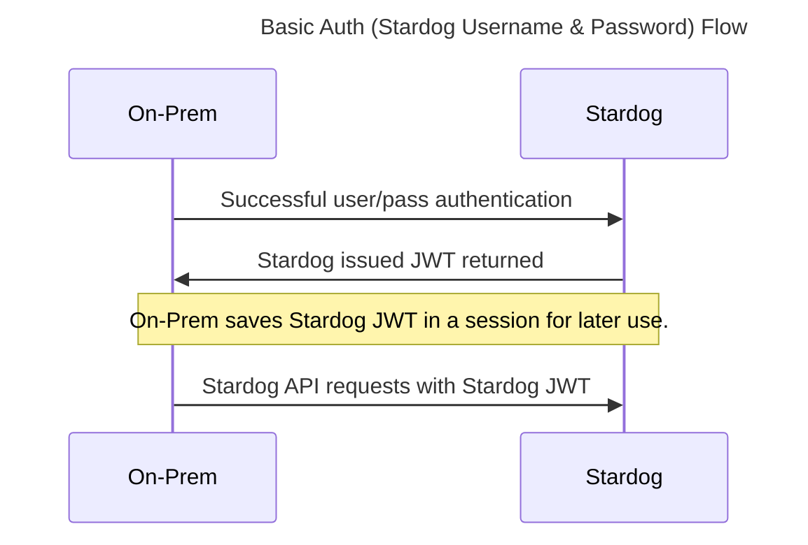
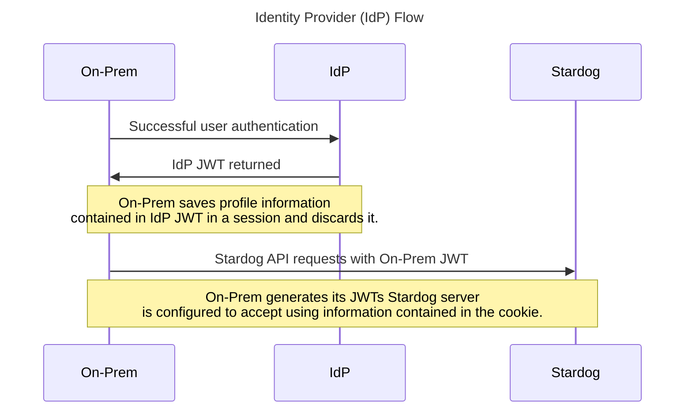
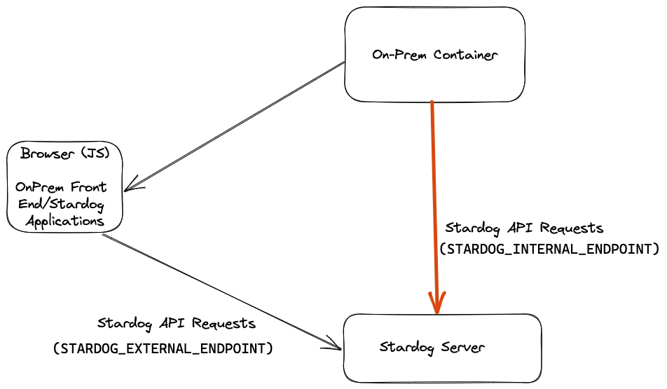

# onprem-configs

This repository contains documentation and examples configurations for the On-Prem Stardog Portal.

## Overview

On-Prem is a login service for a **single** Stardog instance for access to Stardog Applications (Studio, Explorer, Designer). With the right configurations for On-Prem and
the Stardog server itself, a user can access their Stardog server via:

- [Basic Auth (Stardog username and password)](./basic/)
- Kerberos
- [Google](./google/)
- [Azure AD](./azure/)
- [Keycloak](./keycloak/)

## How it Works

There are 2 main flows (Kerberos being the exception) used by the On-Prem application with respect to authentication.

1. Basic Auth (Stardog username and password)

2. Identity Provider (e.g. Google)

Both authentication flows utilize Stardog's [OAuth 2.0 Integration](https://docs.stardog.com/operating-stardog/security/oauth-integration). In short, Stardog can produce JWT tokens it can then accept for authenticated API requests. Stardog can also be configured to accept JWT tokens issued by a trusted issuer and optionally auto-create users if roles from the IdP are mapped properly to pre-defined Stardog roles.

High-level diagrams:





## Get Started

1. Login in to the Docker registry:

```
docker login stardog-stardog-apps.jfrog.io
```

2. Pull the latest image:

```
docker pull stardog-stardog-apps.jfrog.io/cloud-login:onprem-current
```

3. Configure the Stardog server as needed and create a configuration for On-Prem.

> **Note**:
> Example configurations are provided in this repository.

4. Create and run the container.

   ```
   docker run \
     --env-file .env \
     -p 8080:8080 \
     --rm \
     --name stardog-apps \
     stardog-stardog-apps.jfrog.io/cloud-login:onprem-current
   ```

   - On-Prem will always be served at port `8080` from the container. Map this port as needed.

## Getting Help

Issues are disabled on this repository. All support requests and feedback should be routed directly to either your dedicated Customer Success Manager (CSM) or Stardog Support.

## SSL Cert Verification

If users authenticate via **BasicAuth** or **Kerberos**, API requests to Stardog from On-Prem originate from 2 different locations.

1. The Docker container running the backend login service

- uses the `STARDOG_INTERNAL_ENDPOINT` environment variable for requests to Stardog

2. The user's browser - the On-Prem front end and Stardog Applications (Studio, Explorer, Designer)

- uses the `STARDOG_EXTERNAL_ENDPOINT` environment variable for requests to Stardog

> **Note**:
> For users authenticating with an IdP, API requests to Stardog from On-Prem will only originate from the user's browser.

Below is a diagram describing the above:



A configuration option, `STARDOG_SERVER_CERT_PATH`, is provided for the backend service running in the On-Prem container to verify the Stardog server's SSL certificate, just like a web browser does. This can be particularly helpful if you've secured your Stardog server using a self-signed certificate.`STARDOG_SERVER_CERT_PATH` should be set to the path inside the On-Prem Docker container where the CA bundle (sometimes referred to as the certificate chain) containing root and intermediate certificates is located. You will need to mount a volume on the host machine containing the CA bundle to the On-Prem container.

```
docker run \
  --env-file .env \
  -p 8080:8080 \
  -v /host-machine/certs:/certs \
  --rm \
  --name stardog-apps \
  stardog-stardog-apps.jfrog.io/cloud-login:onprem-current
```

- In the above example, a directory on the host machine `/host-machine/certs` is mounted to the `/certs` directory inside the Docker container. Suppose a CA bundle was contained in the directory named `ca-chain.cert.pem`, then `STARDOG_SERVER_CERT_PATH` should be set to `/certs/ca-chain.cer.pem`.

> **Note**:
> The above configuration option only performs SSL cert validation for communications between the backend login service running in Docker and Stardog, **not** the On-Prem front end and the Stardog Applications themselves (Studio, Designer, Explorer). Users will need to configure their browsers to ensure communications between their browser and Stardog can be made.

## Client Side Certificates

Configuration options are also provided to specify a client side certificate for communications between the On-Prem container and the Stardog server.

- `STARDOG_CLIENT_CERT_PATH`: the path inside the Docker container to the client side certificate
- `STARDOG_CLIENT_CERT_PRIVATE_KEY_PATH`the path inside the Docker container to the client side certificate's private key

If desired, the `STARDOG_CLIENT_CERT_PRIVATE_KEY_PATH` can be omitted by bundling the client certificate and private key into the same file and specifying the path to that file for `STARDOG_CLIENT_CERT_PATH`.

> **Warning**:
> The private key to your client certificate **must** be unencrypted.

## Accessing Launchpad with HTTPS

To enable HTTPS communications for Launchpad, you can configure a reverse proxy or load balancer, such as [nginx](https://nginx.org/en/). Once you have set up your proxy/load balancer, set the `BASE_URL` environment variable to its address. 

An example nginx config file is below:
```yaml
version: '3'
services:
     nginx:
         user: root
         container_name: nginx
         hostname: nginx
         image: nginx
         restart: unless-stopped
         ports:
             - 9443:443
         volumes:
             - /path/to/conf/nginx:/etc/nginx/conf.d
             - /path/to/SSL:/etc/ssl/private
             - /path/to/nginx:/var/log/nginx
```

## Configuration Options

All available configuration options are listed in the table below:

| **Environment Variable**               | **Default**          | **Required**                                     | **Description**                                                                                                                                                                                                                                                                                                                                                     |
| -------------------------------------- | -------------------- | ------------------------------------------------ | ------------------------------------------------------------------------------------------------------------------------------------------------------------------------------------------------------------------------------------------------------------------------------------------------------------------------------------------------------------------- |
| `AZURE_AUTH_ENABLED`                   | not set              | N (Y if Azure auth desired)                      | Enable Azure auth                                                                                                                                                                                                                                                                                                                                                   |
| `AZURE_CLIENT_SECRET`                  | not set              | N (Y if `AZURE_AUTH_ENABLED=true`)               | Azure AD OAuth secret                                                                                                                                                                                                                                                                                                                                               |
| `AZURE_CLIENT_ID`                      | not set              | N (Y if `AZURE_AUTH_ENABLED=true`)               | Azure AD OAuth ID                                                                                                                                                                                                                                                                                                                                                   |
| `AZURE_TENANT`                         | `organizations`      | N                                                | Azure tenant type                                                                                                                                                                                                                                                                                                                                                   |
| `BASE_URL`                             | not set              | Y                                                | Full URL of the service                                                                                                                                                                                                                                                                                                                                             |
| `COOKIE_SECRET`                        | not set              | Y                                                | Used to sign cookies used by the service                                                                                                                                                                                                                                                                                                                            |
| `FRIENDLY_NAME`                        | `Stardog Cloud`      | N                                                | Display name on the login form                                                                                                                                                                                                                                                                                                                                      |
| `GOOGLE_AUTH_ENABLED`                  | `false`              | N (Y if Google Auth is desired)                  | Whether or not to give users the option to authenticate using Google Auth.                                                                                                                                                                                                                                                                                          |
| `GOOGLE_CLIENT_ID`                     | not set              | N (Y if `GOOGLE_AUTH_ENABLED=true`)              | Google OAuth client ID                                                                                                                                                                                                                                                                                                                                              |
| `GOOGLE_CLIENT_SECRET`                 | not set              | N (Y if `GOOGLE_AUTH_ENABLED=true`)              | Google OAuth secret                                                                                                                                                                                                                                                                                                                                                 |
| `JWK_LOCATION`                         | not set              | Y (if IDP being used, e.g. Google)               | Path to the directory containing the public and private keys the application uses to sign/verify JWTs.                                                                                                                                                                                                                                                              |
| `JWT_ISSUER`                           | `${BASE_URL}`        | N                                                | JWT issuer used                                                                                                                                                                                                                                                                                                                                                     |
| `K8S_DEPLOYMENT`                       | `false`              | N (Y if Kubernetes is being used for deployment) | Whether or not the application is being deployed in/with Kubernetes.                                                                                                                                                                                                                                                                                                |
| `KEYCLOAK_AUTH_ENABLED`                | `false`              | N (Y if Keycloak Auth is desired)                | Whether or not to give users the option to authenticate using Keycloak.                                                                                                                                                                                                                                                                                             |
| `KEYCLOAK_CLIENT_ID`                   | not set              | N (Y if `KEYCLOAK_AUTH_ENABLED=true`)            | Keycloak OpenID Connect client id                                                                                                                                                                                                                                                                                                                                   |
| `KEYCLOAK_CLIENT_SECRET`               | not set              | N (Y if `KEYCLOAK_AUTH_ENABLED=true`)            | Keycloak OpenID Connect client secret                                                                                                                                                                                                                                                                                                                               |
| `KEYCLOAK_ENDPOINT`                    | not set              | N (Y if `KEYCLOAK_AUTH_ENABLED=true`)            | The publicly accessible endpoint of the Keycloak service                                                                                                                                                                                                                                                                                                            |
| `KEYCLOAK_REALM`                       | not set              | N (Y if `KEYCLOAK_AUTH_ENABLED=true`)            | Keycloak realm the OpenID Connect client and users are in                                                                                                                                                                                                                                                                                                           |
| `KEYCLOAK_TOKEN_ROLES_CLAIM`           | `realm_access.roles` | N                                                | Claim in Keycloak ID token containing Stardog roles                                                                                                                                                                                                                                                                                                                 |
| `PASSWORD_AUTH_ENABLED`                | `true`               | N                                                | Enable basic authentication (Stardog username and password)                                                                                                                                                                                                                                                                                                         |
| `SECURE`                               | `true`               | N                                                | Whether or not to require https. The login service assumes you are using https and will throw an error `BASE_URL` is set to a non-https URL. If however, you do wish to deploy just using http , set this to `false`.                                                                                                                                               |
| `SESSION_EXPIRATION`                   | `86400`              | N                                                | Time until session (JWT token issued by the application) expires in seconds. Default is `86400` which is 24 hours.                                                                                                                                                                                                                                                  |
| `STARDOG_INTERNAL_ENDPOINT`            | `${BASE_URL}:5820`   | Y                                                | If Stardog is running in Docker, you need to tell the login service running in Docker the Stardog container’s address. If not running in Docker, set to `STARDOG_EXTERNAL_ENDPOINT`                                                                                                                                                                                 |
| `STARDOG_EXTERNAL_ENDPOINT`            | `${BASE_URL}:5820`   | Y                                                | Public location of Stardog endpoint                                                                                                                                                                                                                                                                                                                                 |
| `STARDOG_SERVER_CERT_PATH`             | not set              | N                                                | Path to the CA bundle to perform SSL cert verifications against Stardog server for the login service running in Docker. See [SSL Cert Verification](#ssl-cert-verification) for additional information.                                                                                                                                                             |
| `STARDOG_CLIENT_CERT_PATH`             | not set              | N                                                | Path to the client certificate for the login service running in Docker. Used for communications between the login service running in Docker and the Stardog server. The client certificate and private key can optionally be bundled together and specified with this option. See [Client Side Certificates](#client-side-certificates) for additional information. |
| `STARDOG_CLIENT_CERT_PRIVATE_KEY_PATH` | not set              | N                                                | Path to the client certificate's private key for the login service running in Docker. Used for communications between the login service running in Docker and the Stardog server. See [Client Side Certificates](#client-side-certificates) for additional information.                                                                                             |
