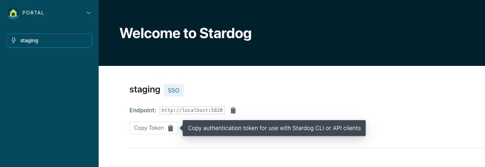

# Stardog Launchpad Documentation

> [!IMPORTANT]
> The current version of Launchpad is v3. See [here](./v2-deprecated/) for the deprecated v2 documentation. 

> [!NOTE]
> See the [Release Notes](./release-notes.md) for the changelog and information about releases.


## Quick Facts

- Launchpad is a slimmed down version of the [Stardog Cloud Portal](https://cloud.stardog.com) intended to be deployed on-premise.
- Launchpad is distributed as a single Docker container
- Launchpad allows users to manage multiple connections to Stardog endpoints.
- Launchpad contains all Stardog Applications - Studio, Explorer, Designer, Knowledge Catalog
- Launchpad must be configured with an SSO provider (e.g. Microsoft Entra) to manage user authentication and authorization. 
- Launchpad persists data to a local directory that should be mounted to a volume for persistence.
- Launchpad does not handle SSL termination. It is recommended to use a reverse proxy like Nginx or Apache to handle SSL termination.

https://github.com/user-attachments/assets/71652eb8-6106-4413-be44-995a1bf08245

*Demo using Microsoft Entra ID to log users into Launchpad. A new connection using a Stardog username and password connection is then made.*

## Getting Started

This is the general guide to getting Launchpad up and running. For more detailed information, see the [Configuration](#configuration) guide.

0. Prerequisites
    - Docker
    - An SSO provider to log users in with (e.g. Microsoft Entra)
    - A Stardog endpoint to connect to 

1. Pull the image from Docker Hub

   - (Optional) Authenticate with Docker Hub if required in your environment.

    ```bash
    docker login
    ```

   - Pull the Launchpad Docker image (replace `<tag>` with your desired Launchpad release, for example `current` or `v3.6.0`).

   ```bash
   docker pull stardog/launchpad:<tag>
   ```

> [!NOTE]
> Existing customers with access to Stardog's private JFrog Artifactory can continue to pull Launchpad images from `stardog-stardog-apps.jfrog.io/launchpad:<tag>`. Authenticate with `docker login stardog-stardog-apps.jfrog.io` before pulling if your environment still relies on that registry.

2. Configure Launchpad and optionally your Stardog servers.
   - Launchpad must be configured with an SSO provider to log users in with.
   - Launchpad can optionally be configured with "SSO Connections", allowing users to use SSO to connect to Stardog endpoints that have also been configured to accept JWT tokens from the SSO provider. Without SSO Connections, users will need to manually enter their Stardog credentials to connect to Stardog endpoints.
      - The SSO provider for connections can be from the same provider as the main SSO provider or a different provider. They should, however, be different applications in the SSO provider. For example, Microsoft Entra can be used as the Launchpad SSO (main) provider and also as the SSO provider for connections, but Launchpad and each of the SSO connections (the Stardog endpoints) should be different "App Registrations" in Microsoft Entra.
      - The SSO provider must be configured to issue JWT tokens that can be used to authenticate with Stardog.
      - See [Provider Configuration](#provider-configuration) for more information on configuring SSO providers.

3. Create and run the Launchpad container

    ```bash
    docker run \
      --env-file /path/to/launchpad/.env.launchpad \
      -p 8080:8080 \
      -v /path/to/launchpad/data:/data \
      stardog/launchpad:<tag>
    ```

    - The `--env-file` flag should point to a file containing the environment variables for Launchpad. See the [Configuration](#configuration) section for more information.
    - Use the same `<tag>` you pulled in the previous step to run the expected Launchpad version.
    - The container exposes port `8080`, which can be mapped to any port on the host machine.
    - `/data` is the directory where Launchpad will persist data. **This should be mounted to a volume for persistence**.

> [!IMPORTANT]
> By default, the Launchpad container will run as `root` user (uid `0`). This is not recommended for production use. If you want to run the container as a different user, you can use the `--user` flag in the `docker run` command. See [Run Launchpad with a Given User](#run-launchpad-with-a-given-user) for more information.

4. Access Launchpad in your browser at the [`BASE_URL`](#base_url) you configured.

## Data Persistence

As mentioned in the [Getting Started](#getting-started) section, Launchpad persists data to a local directory that should be mounted to a volume for persistence. This is done by mounting a volume to the `/data` directory in the Launchpad container. 

> [!IMPORTANT]
>The volume mounted should be owned and writable by the user that is running the Launchpad container. See [Run Launchpad with a Given User](#run-launchpad-with-a-given-user) for more information.

## Run Launchpad with a Given User

You can run Launchpad with a given user by using the `--user` flag in the `docker run` command. This is useful if you want to run Launchpad as a specific user instead of the default `root` user.

```bash
docker run \
  --user <user_id>:<group_id> \
  --env-file /path/to/launchpad/.env.launchpad \
  -p 8080:8080 \
  -v /path/to/launchpad/data:/data \
  stardog/launchpad:<tag>
```

> [!IMPORTANT]
> When using the `--user` flag, the user id and group id must have the appropriate permissions to the directory mounted to `/data`. This is the directory where Launchpad will persist data. If the user id and group id do not have the appropriate permissions, you may encounter permission errors when trying to access the data in Launchpad. This is especially important if you are running Launchpad on Linux, as Linux handles file permissions differently than macOS for Docker containers.
>
> The following error may be seen in the logs if the user does not have the appropriate permissions to the `/data` directory:
>```
>django.db.utils.OperationalError: unable to open database file
>```
>
> To fix this, you can change the ownership of the directory on the host machine mounted to `/data` to the user id and group id that you are using to run the Launchpad container. You can do this by running the following command on the host machine:
>```bash
>sudo chown <user_id>:<group_id> /path/to/launchpad/data
>```

> [!NOTE]
> Similarly in Kubernetes, you can set the `securityContext` for the Launchpad pod to run as a specific user.
>
> ```yaml
>securityContext:
>  runAsNonRoot: true
>  runAsUser: 100001
>  runAsGroup: 100001
>```


## Getting Help

Issues are disabled on this repository. All support requests and feedback should be routed directly to either your dedicated Customer Success Manager (CSM) or Stardog Support.

## Configuration

The following sections detail the configuration options available in Launchpad. All configuration options are set as environment variables in the Docker container.

| Section | Description |
| :------ | :---------- |
| [General Configuration](#general-configuration) | General configuration options available in Launchpad |
| [Provider Configuration](#provider-configuration) | Configuration options for authentication providers |

### Example Configuration

Here is an example of a configuration file for Launchpad. When using Docker/Docker Compose, you can pass this file to the container using the `--env-file` flag or equivalent in your Docker Compose file.

```bash
# General Configuration
BASE_URL=http://localhost:8080
COOKIE_SECRET=supersecret

# Microsoft Entra Login Provider (to log users into Launchpad)
AZURE_AUTH_ENABLED=true
AZURE_CLIENT_ID=<client_id>
AZURE_CLIENT_SECRET=<client_secret>
AZURE_TENANT=<tenant_id>

# Development Stardog Server SSO Connection using Microsoft Entra (to authenticate users connecting to Stardog)
SSOCONNECTION_DEVELOPMENT_AZURE_CLIENT_ID=<client_id>
SSOCONNECTION_DEVELOPMENT_AZURE_CLIENT_SECRET=<client_secret>
SSOCONNECTION_DEVELOPMENT_AZURE_TENANT=<tenant_id>
SSOCONNECTION_DEVELOPMENT_AZURE_STARDOG_ENDPOINT=http://localhost:5825
SSOCONNECTION_DEVELOPMENT_AZURE_DISPLAY_NAME=Development

# Production Stardog Server SSO Connection using Microsoft Entra (to authenticate users connecting to Stardog)
SSOCONNECTION_PRODUCTION_AZURE_CLIENT_ID=<client_id>
SSOCONNECTION_PRODUCTION_AZURE_CLIENT_SECRET=<client_secret>
SSOCONNECTION_PRODUCTION_AZURE_TENANT=<tenant_id>
SSOCONNECTION_PRODUCTION_AZURE_STARDOG_ENDPOINT=http://localhost:5826
SSOCONNECTION_PRODUCTION_AZURE_DISPLAY_NAME=Production
```

### General Configuration

This section details the general configuration options available in Launchpad. 

<a name="base_url"></a>
#### `BASE_URL`

The `BASE_URL` is used to set the base URL for Launchpad. This is the URL that users will use to access Launchpad. 

- **Required:** Yes
- **Default:** not set

#### `COOKIE_SECRET`

The `COOKIE_SECRET` is used to set the secret used to sign cookies in Launchpad. This should be a large, random string.

- **Required:** Yes
- **Default:** not set

#### `SESSION_EXPIRATION`

The `SESSION_EXPIRATION` is used to set the expiration time in **seconds** for user sessions in Launchpad. 

- Required: No
- Default: `43200` (12 hours)

#### `GUNICORN_WORKERS`

The `GUNICORN_WORKERS` is used to set the number of Gunicorn workers to use for Launchpad. By default, this is set to `2 * CPU cores + 1`. This should work for most use cases, but can be overridden to increase or decrease the number of workers. This is useful for environments with limited resources like memory. This setting should be provided as a positive integer.

- **Required:** No
- **Default:** `2 * CPU cores + 1`

#### `DESIGNER_STORAGE_ENABLED`

The `DESIGNER_STORAGE_ENABLED` option is used to configure the storage location for projects in Stardog Designer. By default, this should be set to `false`, resulting in projects being stored in a user browser's local storage. If set to `true`, projects will be stored in the Launchpad database under your Launchpad user account.

> [!TIP]
> It's recommended to set this to `true` to avoid accidental data loss of Designer projects if the user clears their browser's local storage.

- **Required:** No
- **Default:** `false`

#### `VOICEBOX_SERVICE_ENDPOINT`

The `VOICEBOX_SERVICE_ENDPOINT` is used to specify the endpoint for the [Voicebox Service](./voicebox.md#voicebox-service). This is used to enable the Voicebox in Launchpad.

- **Required:** No
- **Default:** not set

#### `VOICEBOX_THREE_ENABLED`

The `VOICEBOX_THREE_ENABLED` option enables the "Think Mode" feature in Voicebox, which uses a multi-agent architecture and Voicebox 3 to enable chain-of-thought reasoning for handling complex, multi-step questions. When enabled, users will see a "Think Mode" button in the Voicebox input interface.

> [!IMPORTANT]
> This feature requires Voicebox Service version `v0.22.0+`. See the [Voicebox Release Notes](./voicebox.md#0220-release-oct-16-2025) for more information.

- **Required:** No
- **Default:** `false`

#### `VOICEBOX_SUGGESTIONS_ENABLED`

The `VOICEBOX_SUGGESTIONS_ENABLED` option enables the "Voicebox Suggestions" feature in Designer. This makes it possible to create a Voicebox-enabled Knowledge Graph, complete with spotlight questions, from just a project description, input data, and a few clicks. When enabled, users will see the new Voicebox-assisted project creation flow when creating a new project in Designer.

> [!IMPORTANT]
> This feature requires Voicebox Service version `v0.22.0+`. See the [Voicebox Release Notes](./voicebox.md#0220-release-oct-16-2025) for more information.

- **Required:** No
- **Default:** `false`

#### `COPY_CONNECTION_TOKEN_BUTTON_ENABLED`

The `COPY_CONNECTION_TOKEN_BUTTON_ENABLED` option controls whether the "Copy Token" button is displayed on Stardog connection pages, allowing users to copy the JWT authentication token to their clipboard. Administrators can disable this button if they prefer not to expose this functionality to users.



- **Required:** No
- **Default:** `true`

### Provider Configuration

Launchpad supports various authentication providers for both logging users into Launchpad and connecting to Stardog endpoints. Each provider has its own configuration requirements and capabilities.

> [!IMPORTANT]
> Launchpad **should** be configured with at least 1 SSO provider to log users into the application. You may use shared user authentication to bypass the need to have a SSO login provider, but this is **not** recommended for production use.

| Provider | Login Provider | SSO Connections |
| :------- | :------------- | :-------------- |
| [Microsoft Entra](./providers/microsoft-entra.md) | ✅ | ✅ |
| [Google](./providers/google.md) | ✅ | ❌ |
| [Okta](./providers/okta.md) | ✅ | ✅ |
| [PingOne](./providers/pingone.md) | ✅ | ✅ |
| [Duo](./providers/duo.md) | ✅ | ❌ |
| [Kerberos](./providers/kerberos.md) | ✅ | ✅ |
| [Shared User](./providers/shared-user.md) | ✅ | ❌ |

#### SSO Connection Configuration

SSO Connections allow logged-in users to authenticate against Stardog endpoints using SSO tokens. This requires both Launchpad and the Stardog endpoint to be configured with the same SSO provider.

SSO connections use the `SSOCONNECTION_<unique_identifier>_<provider_identifier>_<config_option>` environment variable pattern. For example:

```bash
SSOCONNECTION_DEVELOPMENT_AZURE_CLIENT_ID=<client_id>
SSOCONNECTION_DEVELOPMENT_AZURE_CLIENT_SECRET=<client_secret>
SSOCONNECTION_DEVELOPMENT_AZURE_TENANT=<tenant_id>
SSOCONNECTION_DEVELOPMENT_AZURE_STARDOG_ENDPOINT=http://localhost:5825
SSOCONNECTION_DEVELOPMENT_AZURE_DISPLAY_NAME=Development
```

> [!IMPORTANT]
> The unique identifier must not contain underscores or special characters. Use only alphanumeric characters.

> [!NOTE]
> Even if your login provider is the same as your connection provider (e.g. Microsoft Entra), they should be different applications in the SSO provider. This ensures proper security boundaries between Launchpad authentication and Stardog endpoint access.

##### Internal Stardog Endpoint Configuration

SSO connections support configuring an additional internal or private endpoint for server-side operations using the `SSOCONNECTION_<unique_identifier>_<provider_identifier>_STARDOG_INTERNAL_ENDPOINT` environment variable. This is particularly beneficial for the Voicebox service container, which may not be able to access Stardog on the public endpoint but can communicate using an internal endpoint.

```bash
SSOCONNECTION_DEVELOPMENT_AZURE_STARDOG_INTERNAL_ENDPOINT=http://stardog-internal:5820
```

When both public and internal endpoints are configured:
- **Browser-based requests** (Studio, Explorer, Designer, Knowledge Catalog) use the public endpoint
- **Server-side requests** (Voicebox) automatically use the internal endpoint

This supports architectures where different network routes are required for backend services versus browser-based access. Users can override the internal endpoint in the "Advanced Options" section when creating SSO connections in the Launchpad UI.

For detailed setup instructions for each provider, see the individual provider configuration guides linked in the table above.
