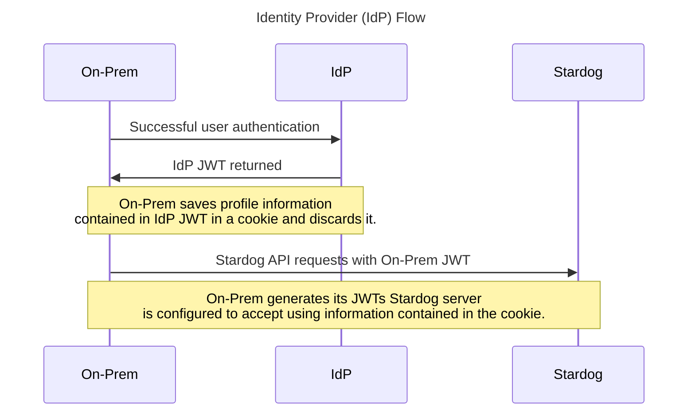

# onprem-configs

This repository contains documentation and examples configurations for the On-Prem Stardog Portal.

## Overview

On-Prem is a login service for a __single__ Stardog instance for access to Stardog Applications (Studio, Explorer, Designer). With the right configurations for On-Prem and
the Stardog server itself, a user can access their Stardog server via:

- [Basic Auth (Stardog username and password)](./basic/)
- Kerberos
- [Google SSO](./google/)
- Keycloak SSO

## How it Works

There are 2 main flows (Kerberos being the exception) used by the On-Prem application with respect to authentication.

1. Basic Auth (Stardog username and password)
2. Identity Provider (e.g. Google)

Both authentication flows utilize Stardog's [OAuth 2.0 Integration](https://docs.stardog.com/operating-stardog/security/oauth-integration). In short, Stardog can produce JWT tokens it can then accept for authenticated API requests. Stardog can also be configured to accept JWT tokens issued by a trusted issuer and optionally auto-create users if roles from the IdP are mapped properly to pre-defined Stardog roles.

High-level diagrams:


 


## Get Started

1. Login in to the Docker registry:

    ```
    docker login stardog-stardog-apps.jfrog.io
    ```

2. Pull the latest image:

    ```
    docker pull stardog-stardog-apps.jfrog.io/cloud-login:onprem-current
    ```

3. Configure the Stardog server as needed and create a configuration for On-Prem.

> **Note**:
> Example configurations are provided in this repository.

4. Create and run the container.

    ```
    docker run \
      --env-file .env \
      -p 8080:8080 \
      --rm \
      --name stardog-apps \
      stardog-stardog-apps.jfrog.io/cloud-login:onprem-current
    ```

    - On-Prem will always be served at port `8080` from the container. Map this port as needed.

## Configuration Options

All available configuration options are listed in the table below:

| **Environment Variable**    | **Default**        | **Required**                                     | **Description**                                                                                                                                                                                |
| --------------------------- | ------------------ | ------------------------------------------------ | ---------------------------------------------------------------------------------------------------------------------------------------------------------------------------------------------- |
| `BASE_URL`                  | not set            | Y                                                | Full URL of the service                                                                                                                                                                        |
| `COOKIE_SECRET`             | not set            | Y                                                | Used to sign cookies used by the service                                                                                                                                                       |
| `FRIENDLY_NAME`             | `Stardog Cloud`    | N                                                | Display name on the login form                                                                                                                                                                 |
| `GOOGLE_AUTH_ENABLED`       | `false`            | N (Y if Google Auth is desired)                  | Whether or not to give users the option to authenticate using Google Auth.                                                                                                                     |
| `GOOGLE_CLIENT_ID`          | not set            | N (Y if `GOOGLE_AUTH_ENABLED=true`)              | Google OAuth client ID                                                                                                                                                                         |
| `GOOGLE_CLIENT_SECRET`      | not set            | N (Y if `GOOGLE_AUTH_ENABLED=true`)              | Google OAuth secret                                                                                                                                                                            |
| `JWK_LOCATION`              | not set            | Y (if IDP being used, e.g. Google)               | Path to the directory containing the public and private keys the application uses to sign/verify JWTs.                                                                                         |
| `JWT_ISSUER`                | `${BASE_URL}`      | N                                                | JWT issuer used                                                                                                                                                                                |
| `K8S_DEPLOYMENT`            | `false`            | N (Y if Kubernetes is being used for deployment) | Whether or not the application is being deployed in/with Kubernetes.                                                                                                                           |
| `KEYCLOAK_AUTH_ENABLED`     | `false`            | N (Y if Keycloak Auth is desired)                | Whether or not to give users the option to authenticate using Keycloak.                                                                                                                        |
| `KEYCLOAK_CLIENT_ID`        | not set            | N (Y if `KEYCLOAK_AUTH_ENABLED=true`)            | Keycloak OpenID Connect client id                                                                                                                                                              |
| `KEYCLOAK_CLIENT_SECRET`    | not set            | N (Y if `KEYCLOAK_AUTH_ENABLED=true`)            | Keycloak OpenID Connect client secret                                                                                                                                                          |
| `KEYCLOAK_ENDPOINT`         | not set            | N (Y if `KEYCLOAK_AUTH_ENABLED=true`)            | The publicly accessible endpoint of the Keycloak service                                                                                                                                       |
| `KEYCLOAK_REALM`            | not set            | N (Y if `KEYCLOAK_AUTH_ENABLED=true`)            | Keycloak realm the OpenID Connect client and users are in                                                                                                                                      |
| `PASSWORD_AUTH_ENABLED`     | `true`             | N                                                | Enable basic authentication (Stardog username and password)                                                                                                                                    |
| `SECURE`                    | `true`             | N                                                | Whether or not to require https. The login service assumes you are using https and will throw an error `BASE_URL` is set to a non-https URL. If however, you do wish to deploy just using http , set this to `false`. |
| `SESSION_EXPIRATION`        | `86400`            | N                                                | Time until session (JWT token issued by the application) expires in seconds. Default is `86400` which is 24 hours.                                                                             |
| `STARDOG_INTERNAL_ENDPOINT` | `${BASE_URL}:5820` | Y                                                | If Stardog is running in Docker, you need to tell the login service running in Docker the Stardog container’s address. If not running in Docker, set to `STARDOG_EXTERNAL_ENDPOINT`                                                                         |
| `STARDOG_EXTERNAL_ENDPOINT` | `${BASE_URL}:5820` | Y                                                | Public location of Stardog endpoint                                                                                                                                                            |
