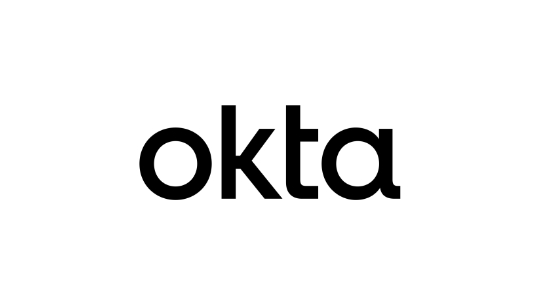
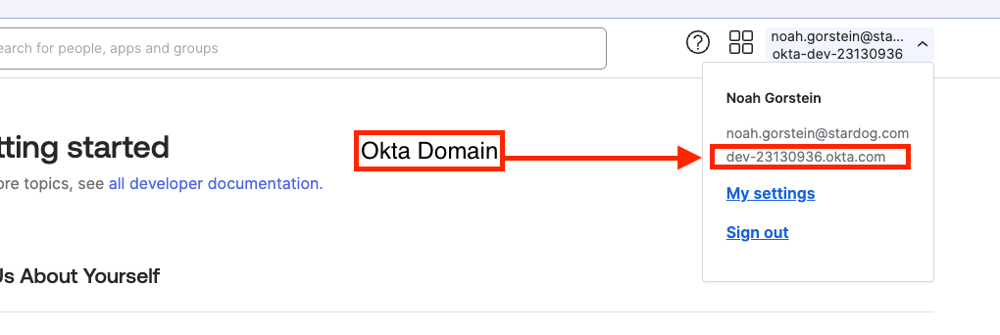
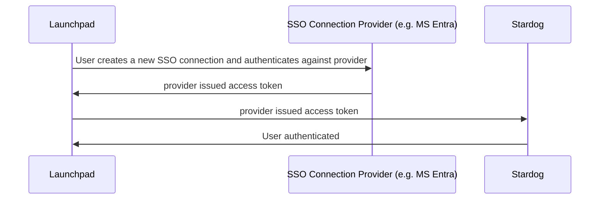

# Stardog Launchpad Documentation

> [!IMPORTANT]
> The current version of Launchpad is v3. See [here](./v2-deprecated/) for the deprecated v2 documentation. 

> [!NOTE]
> See the [Release Notes](./release-notes.md) for the changelog and information about releases.


## Quick Facts

- Launchpad is a slimmed down version of the [Stardog Cloud Portal](https://cloud.stardog.com) intended to be deployed on-premise.
- Launchpad is distributed as a single Docker container
- Launchpad allows users to manage multiple connections to Stardog endpoints.
- Launchpad contains all Stardog Applications - Studio, Explorer, Designer, Knowledge Catalog
- Launchpad must be configured with an SSO provider (e.g. Microsoft Entra) to manage user authentication and authorization. 
- Launchpad persists data to a local directory that should be mounted to a volume for persistence.
- Launchpad does not handle SSL termination. It is recommended to use a reverse proxy like Nginx or Apache to handle SSL termination.

https://github.com/user-attachments/assets/71652eb8-6106-4413-be44-995a1bf08245

*Demo using Microsoft Entra ID to log users into Launchpad. A new connection using a Stardog username and password connection is then made.*

## Getting Started

This is the general guide to getting Launchpad up and running. For more detailed information, see the [Configuration](#configuration) guide.

0. Prerequisites
    - Docker
    - An SSO provider to log users in with (e.g. Microsoft Entra)
    - A Stardog endpoint to connect to 

1. Pull the Docker Image

   - Log in to Stardog's Docker registry

    ```bash
    docker login stardog-stardog-apps.jfrog.io
    ```

   - Pull the Launchpad Docker image

    ```bash
    docker pull stardog-stardog-apps.jfrog.io/launchpad:current
    ```

2. Configure Launchpad and optionally your Stardog servers.
   - Launchpad must be configured with an SSO provider to log users in with.
   - Launchpad can optionally be configured with "SSO Connections", allowing users to use SSO to connect to Stardog endpoints that have also been configured to accept JWT tokens from the SSO provider. Without SSO Connections, users will need to manually enter their Stardog credentials to connect to Stardog endpoints.
      - The SSO provider for connections can be from the same provider as the main SSO provider or a different provider. They should, however, be different applications in the SSO provider. For example, Microsoft Entra can be used as the Launchpad SSO (main) provider and also as the SSO provider for connections, but Launchpad and each of the SSO connections (the Stardog endpoints) should be different "App Registrations" in Microsoft Entra.
      - The SSO provider must be configured to issue JWT tokens that can be used to authenticate with Stardog.
      - See [SSO Connection Configuration](#sso-connection-configuration) for more information on configuring SSO Connections.

3. Create and run the Launchpad container

    ```bash
    docker run \
      --env-file /path/to/launchpad/.env.launchpad \
      -p 8080:8080 \
      -v /path/to/launchpad/data:/data \
      stardog-stardog-apps.jfrog.io/launchpad:current
    ```

    - The `--env-file` flag should point to a file containing the environment variables for Launchpad. See the [Configuration](#configuration) section for more information.
    - The container exposes port `8080`, which can be mapped to any port on the host machine.
    - `/data` is the directory where Launchpad will persist data. **This should be mounted to a volume for persistence**.

4. Access Launchpad in your browser at the [`BASE_URL`](#base_url) you configured.

## Data Persistence

As mentioned in the [Getting Started](#getting-started) section, Launchpad persists data to a local directory that should be mounted to a volume for persistence. This is done by mounting a volume to the `/data` directory in the Launchpad container.

## Getting Help

Issues are disabled on this repository. All support requests and feedback should be routed directly to either your dedicated Customer Success Manager (CSM) or Stardog Support.

## Configuration

The following sections detail the configuration options available in Launchpad. All configuration options are set as environment variables in the Docker container.

| Section | Description |
| :------ | :---------- |
| [General Configuration](#general-configuration) | General configuration options available in Launchpad |
| [Login Provider Configuration](#login-provider-configuration) | Configuration options for the SSO provider used to log users into Launchpad |
| [SSO Connection Configuration](#sso-connection-configuration) | Configuration options for SSO Connections, allowing users to use SSO to connect to Stardog endpoints that have also been configured to accept JWT tokens from the SSO provider. |

### Example Configuration

Here is an example of a configuration file for Launchpad. When using Docker/Docker Compose, you can pass this file to the container using the `--env-file` flag or equivalent in your Docker Compose file.

```bash
# General Configuration
BASE_URL=http://localhost:8080
COOKIE_SECRET=supersecret

# Microsoft Entra Login Provider (to log users into Launchpad)
AZURE_AUTH_ENABLED=true
AZURE_CLIENT_ID=<client_id>
AZURE_CLIENT_SECRET=<client_secret>
AZURE_TENANT=<tenant_id>

# Development Stardog Server SSO Connection using Microsoft Entra (to authenticate users connecting to Stardog)
SSOCONNECTION_DEVELOPMENT_AZURE_CLIENT_ID=<client_id>
SSOCONNECTION_DEVELOPMENT_AZURE_CLIENT_SECRET=<client_secret>
SSOCONNECTION_DEVELOPMENT_AZURE_TENANT=<tenant_id>
SSOCONNECTION_DEVELOPMENT_AZURE_STARDOG_ENDPOINT=http://localhost:5825
SSOCONNECTION_DEVELOPMENT_AZURE_DISPLAY_NAME=Development

# Production Stardog Server SSO Connection using Microsoft Entra (to authenticate users connecting to Stardog)
SSOCONNECTION_PRODUCTION_AZURE_CLIENT_ID=<client_id>
SSOCONNECTION_PRODUCTION_AZURE_CLIENT_SECRET=<client_secret>
SSOCONNECTION_PRODUCTION_AZURE_TENANT=<tenant_id>
SSOCONNECTION_PRODUCTION_AZURE_STARDOG_ENDPOINT=http://localhost:5826
SSOCONNECTION_PRODUCTION_AZURE_DISPLAY_NAME=Production
```

### General Configuration

This section details the general configuration options available in Launchpad. 


#### `BASE_URL`

The `BASE_URL` is used to set the base URL for Launchpad. This is the URL that users will use to access Launchpad. 

- **Required:** Yes
- **Default:** not set

#### `COOKIE_SECRET`

The `COOKIE_SECRET` is used to set the secret used to sign cookies in Launchpad. This should be a large, random string.

- **Required:** Yes
- **Default:** not set

#### `SESSION_EXPIRATION`

The `SESSION_EXPIRATION` is used to set the expiration time in **seconds** for user sessions in Launchpad. 

- Required: No
- Default: `43200` (12 hours)

### Login Provider Configuration

This section details the configuration options available for the SSO provider used to log users into Launchpad. 

> [!IMPORTANT]
> Launchpad **must** be configured with at least 1 SSO provider to log users into the application.

Available Login SSO providers:
- [Microsoft Entra (formerly known as Azure Active Directory)](#microsoft-entra-login-provider)
- [Google](#google-login-provider)
- [Okta](#okta-login-provider)

------------

<a name="microsoft-entra-login-provider"></a>
**Microsoft Entra**


The following configuration options are available for Microsoft Entra.

> [!NOTE]
> See [How to Create an Azure App Registration to Login with Microsoft Entra in Launchpad](#how-to-create-an-azure-app-registration-to-login-with-microsoft-entra-in-launchpad) for instructions on 
> how to create an Azure App Registration to login with Microsoft Entra in Launchpad.

#### `AZURE_AUTH_ENABLED`

The `AZURE_AUTH_ENABLED` is used to enable or disable Microsoft Entra authentication to log users into Launchpad.

- **Required:** Yes (if using Microsoft Entra)
- **Default:** `false`

#### `AZURE_CLIENT_ID`

The `AZURE_CLIENT_ID` is the client id of the Azure App Registration used to sign users into Launchpad.

- **Required:** Yes (if using Microsoft Entra)
- **Default:** not set

#### `AZURE_CLIENT_SECRET`

The `AZURE_CLIENT_SECRET` is the client secret of the Azure App Registration used to sign users into Launchpad.

> [!NOTE]
> This should be used if not using a client certificate (`AZURE_CLIENT_CERTIFICATE_FILE` or `AZURE_CLIENT_CERTIFICATE_THUMBPRINT`).

- **Required:** Yes (if using Microsoft Entra)
- **Default:** not set

#### `AZURE_TENANT`

The `AZURE_TENANT` is the tenant id of the Azure App Registration used to sign users into Launchpad.

- **Required:** Yes (if using Microsoft Entra)
- **Default:** `organizations`


#### `AZURE_CLIENT_PRIVATE_KEY_FILE`

The `AZURE_CLIENT_PRIVATE_KEY_FILE` is the path (in the Docker container) to the private key file corresponding to the certificate used as a credential with Application Registration;

> [!NOTE]
> This should be used if not using a client secret (`AZURE_CLIENT_SECRET`). The private key must **not** be password protected.

- **Required:** Yes (if using client certificate with Microsoft Entra)
- **Default:** not set

#### `AZURE_CLIENT_CERTIFICATE_FILE`

The `AZURE_CLIENT_CERTIFICATE_FILE` is the path (in the Docker container) to the certificate file used as a credential with the Application Registration. 

> [!NOTE]
> This should be set if `AZURE_CLIENT_CERTIFICATE_THUMBPRINT` not specified.

- **Required:** Yes (if using client certificate with Microsoft Entra and not using `AZURE_CLIENT_CERTIFICATE_THUMBPRINT`)
- **Default:** not set

#### `AZURE_CLIENT_CERTIFICATE_THUMBPRINT`

Thumbprint of the certificate used as a credential with the Application Registration. 

> [!NOTE]
> This should be set if `AZURE_CLIENT_CERTIFICATE_FILE` not specified)

- **Required:** Yes (if using client certificate with Microsoft Entra and not using `AZURE_CLIENT_CERTIFICATE_FILE`)
- **Default:** not set

#### `AZURE_GOV_CLOUD_US`

The `AZURE_GOV_CLOUD_US` is used to set the Azure cloud environment to the Azure US Government Cloud.

- **Required:** Yes (if using Azure US Government Cloud)
- **Default:** `false`

#### `AZURE_AUTH_BASE_URL`

The `AZURE_AUTH_BASE_URL` is used to set the base URL for Microsoft Entra. This is the URL that users will use to authenticate with Microsoft Entra.

> [!NOTE]
> If `AZURE_GOV_CLOUD_US` is set to `true`, this will be automatically set to `https://login.microsoftonline.us`

- **Required:** No
- **Default:** `https://login.microsoftonline.com`

#### `AZURE_GRAPH_BASE_URL`

The `AZURE_GRAPH_BASE_URL` is used to set the base URL for the Microsoft Graph API. This is used to retrieve user information from Microsoft Entra.

> [!NOTE]
> If `AZURE_GOV_CLOUD_US` is set to `true`, this will be automatically set to `https://graph.microsoft.us`

- **Required:** No
- **Default:** `https://graph.microsoft.com`

#### How To Create an Azure App Registration to login with Microsoft Entra in Launchpad

1. **Create App Registration**
   - Open Azure Portal ([https://portal.azure.com](https://portal.azure.com))
   - Navigate to **Microsoft Entra ID** > **App registrations**
   - Click **"New registration"**
   - Name application (e.g., "Stardog Launchpad")
   - Select **"Accounts in this organizational directory only"**
   - Click **"Register"**

2. **Configure Authentication**
   - Go to app's **"Authentication"**
   - Add web platform redirect URI:
     - **Type**: Web
     - **Redirect URI**: `{BASE_URL}/oauth/azure/redirect`
      - See [`BASE_URL`](#base_url) for more information on what the value should.
   - Enable "ID tokens (used for implicit and hybrid flows)"

3. **Generate Credentials**
   - *Option 1: Client Secret*
     - Go to **"Certificates & secrets"**
     - Click **"New client secret"**
     - Set expiration
     - **Copy secret value immediately** - this is only shown while creating a secret. It cannot be retrieved later.
   
   - *Option 2: Certificate*
     - Go to **"Certificates & secrets"**
     - Upload certificate to app registration
      - If you don't have a certificate, you can create a self-signed certificate using [`openssl`](https://github.com/openssl/openssl), however, it is recommended to use a certificate from a trusted certificate authority.
     - Note certificate thumbprint in the web interface

4. **Collect Configuration Values**
   - **Client ID**: Found in "Overview"
   - **Tenant ID**: Found in "Overview"
   - **Client Secret** or Certificate details

5. **Configure Launchpad Environment Variables**

   - Using Client Secret:

   ```bash
   AZURE_AUTH_ENABLED=true
   AZURE_CLIENT_ID=<client_id>
   AZURE_TENANT=<tenant_id>
   AZURE_CLIENT_SECRET=<client_secret>
   ```

   - Using Certificate:

   ```bash
   AZURE_AUTH_ENABLED=true
   AZURE_CLIENT_ID=<client_id>
   AZURE_TENANT=<tenant_id>
   # Use AZURE_CLIENT_CERTIFICATE_FILE or AZURE_CLIENT_CERTIFICATE_THUMBPRINT. See note below.
   # AZURE_CLIENT_CERTIFICATE_FILE=<path_to_certificate_file-in-docker-image>
   AZURE_CLIENT_CERTIFICATE_THUMBPRINT=<certificate_thumbprint>
   AZURE_CLIENT_PRIVATE_KEY_FILE=<path_to_private_key_file-in-docker-image>
   ```

> [!NOTE]
There is no need to set both `AZURE_CLIENT_CERTIFICATE_FILE` and `AZURE_CLIENT_CERTIFICATE_THUMBPRINT`. Use one or the other. If both are set, `AZURE_CLIENT_CERTIFICATE_THUMBPRINT` will be used.

> [!NOTE]
> If your tenant is in the Azure US Government Cloud, set `AZURE_GOV_CLOUD_US=true`.


------------

<a name="google-login-provider"></a>
**Google**


The following configuration options are available for Google SSO.

> [!NOTE]
> See [How to Create a Google OAuth2.0 Client to login with Google in Launchpad](#how-to-create-a-google-oauth-20-client-to-login-with-google-in-launchpad) for additional information.

#### `GOOGLE_AUTH_ENABLED`

The `GOOGLE_AUTH_ENABLED` is used to enable or disable Google authentication to log users into Launchpad.

- **Required:** Yes (if using Google)
- **Default:** `false`

#### `GOOGLE_CLIENT_ID`

The `GOOGLE_CLIENT_ID` is the client id of the Google OAuth2.0 client used to log users into Launchpad.

- **Required:** Yes (if using Google)
- **Default:** not set

#### `GOOGLE_CLIENT_SECRET`

The `GOOGLE_CLIENT_SECRET` is the client secret of the Google OAuth2.0 client used to log users into Launchpad.

- **Required:** Yes (if using Google)
- **Default:** not set

#### How To Create a Google OAuth 2.0 Client to login with Google in Launchpad

1. **Create OAuth 2.0 Client**
  - Go to [Google Cloud Console](https://console.cloud.google.com)
  - Create a new project or select existing project
  - Navigate to **"APIs & Services"** > **"Credentials"** in the left-hand vertical menu
  - Click **"Create Credentials"** > **"OAuth client ID"**
  - Choose **"Web application"** type
  - Name your OAuth 2.0 client (e.g. "Stardog Launchpad")

2. **Configure Authorized Redirects**
  - *( Add redirect URI )*: `{BASE_URL}/oauth/google/redirect`
   - See [`BASE_URL`](#base_url) for more information on what the value should.

3. **Generate Credentials**
  - Click **"Create"**
  - Google will display *Client ID* and *Client Secret*
  - Copy these values immediately or download the JSON file containing the credentials.

4. **Configure Launchpad Environment Variables**

```bash
GOOGLE_AUTH_ENABLED=true
GOOGLE_CLIENT_ID=<client_id>
GOOGLE_CLIENT_SECRET=<client_secret>
```

------------

<a name="okta-login-provider"></a>
**Okta**



The following configuration options are available for Okta SSO.

> [!NOTE]
> See [How to Create an Okta Application to login with Okta in Launchpad](#how-to-create-an-okta-application-to-login-with-okta-in-launchpad) for additional information.

#### `OKTA_AUTH_ENABLED`

The `OKTA_AUTH_ENABLED` setting is used to enable or disable Okta authentication to log users into Launchpad.

- **Required:** Yes (if using Okta)
- **Default:** `false`

#### `OKTA_CLIENT_ID`

The `OKTA_CLIENT_ID` is the client id of the Okta Application used to log users into Launchpad.

- **Required:** Yes (if using Okta)
- **Default:** not set

#### `OKTA_DOMAIN`

The `OKTA_DOMAIN` is the domain of the Okta Application used to log users into Launchpad.

- **Required:** Yes (if using Okta)
- **Default:** not set

#### `OKTA_CLIENT_SECRET`

The `OKTA_CLIENT_SECRET` is the client secret of the Okta Application used to log users into Launchpad.

- **Required:** Yes (if using Okta and not using `OKTA_CLIENT_PRIVATE_KEY_FILE`)
- **Default:** not set

#### `OKTA_CLIENT_PRIVATE_KEY_FILE`

The `OKTA_CLIENT_PRIVATE_KEY_FILE` is the path (in the Docker container) to the private key file corresponding to the certificate used as a credential with the Okta Application.

> [!NOTE]
> This should be used if not using a client secret (`OKTA_CLIENT_SECRET`).

- **Required:** Yes (if using `private_key_jwt` auth with Okta)
- **Default:** not set

#### `OKTA_REQUIRE_PKCE`

The `OKTA_REQUIRE_PKCE` is used to require Proof Key for Code Exchange (PKCE) for the Okta Application.

- **Required:** Yes (if this setting is checked in the Okta Application)
- **Default:** `false`

#### `OKTA_POST_LOGOUT_REDIRECT_URI`

The `OKTA_POST_LOGOUT_REDIRECT_URI` is the URL that users will be redirected to after logging out of Launchpad.

> [!IMPORTANT]
> The URL must be registered in the Okta Application or the user will not be redirected.

- **Required:** No
- **Default:** not set

#### How to Create an Okta Application to login with Okta in Launchpad

##### 1. Create a new application in Okta
   - Sign into your Okta Admin Dashboard
   - Navigate to **Applications** > **Applications**
   - Click **"Create App Integration"**
   - Choose **"OIDC - OpenID Connect"** as the Sign-in method
   - Click **"Next"**

##### 2. Configure the application
   - **General Settings**
     - **App Integration Name**: Name your application (e.g. "Stardog Launchpad")
   - **Sign-in redirect URIs**: `{BASE_URL}/oauth/okta/redirect`
      - See [`BASE_URL`](#base_url) for more information on what the value should.
   - **Sign out redirect URIs**: This can be set to `{BASE_URL}` if you want users to be redirected to the Launchpad home page after logging out. You will need to set the `OKTA_POST_LOGOUT_REDIRECT_URI` environment variable to this value.
      - See [`BASE_URL`](#base_url) for more information on what the value should.
   - **Assignments**: Assign the application to users or groups
   - Click **"Save"**

##### 3. Configure Application Client Credentials

After creating the application, you will need to decide between using a *client secret* or *public/private key pair* for authentication. These are for `client_secret_basic` and `private_key_jwt` authentication methods, respectively.

> [!NOTE]
> Aside from the client authentication method, there is an option to "Require Proof Key for Code Exchange (PKCE) as additional verification" in the Okta Application. If you enable this setting, you will need to set `OKTA_REQUIRE_PKCE=true` when configuring Launchpad.

###### Client Secret

This is the simpler method, however it is less secure than using private key JWT authentication. It is also the default method used for Okta when creating an application through their wizard.

1. Navigate to the **"General"** tab of the application
2. Under **Client Credentials**
   - Make note of your **Client ID** - you will need this later when configuring Launchpad
   - Click **"Show Client Secret"** and copy the value to somewhere safe. You will need this later when configuring Launchpad.

###### Public/Private Key (Private Key JWT)

1. Navigate to the **"General"** tab of the application
2. Under **Client Credentials**, click **"Edit"** to change the **Client Authentication** method to **Public/Private Key**
3. A new section will appear within the **Client Credentials** section called **Public/Private Key**
   - You can choose to upload a public key or generate a new key pair in Okta. If you choose to generate a new key pair, you will need to copy the private key **in PEM format** to a safe location. You will need this later when configuring Launchpad.
4. Make note of your **Client ID** - you will need this later when configuring Launchpad.

##### 4. Configure Launchpad

```
OKTA_AUTH_ENABLED=true
OKTA_CLIENT_ID=<client_id>
OKTA_DOMAIN=<okta_domain>

# optional
OKTA_POST_LOGOUT_REDIRECT_URI=<post_logout_uri>

# required if setting checked in Okta Application
OKTA_REQUIRE_PKCE=true
```

Depending on the authentication method you chose, you will need to set either `OKTA_CLIENT_SECRET` or `OKTA_CLIENT_PRIVATE_KEY_FILE`.

```
# Using client secret
OKTA_CLIENT_SECRET=<client_secret>

# Using private key JWT
OKTA_CLIENT_PRIVATE_KEY_FILE=/path/to/private-key/in/container.pem
```

> [!NOTE]
> The Okta domain can be found in the right side of the upper navigation bar after clicking on your username.
>
> 


> [!IMPORTANT]
> If using `OKTA_CLIENT_PRIVATE_KEY_FILE`, the private key must be accessible in the Docker container. This can be done by mounting a volume to the path specified in the environment variable.

### SSO Connection Configuration

As mentioned earlier, SSO Connections allow logged in users to use SSO to connect to Stardog endpoints that have also been configured to accept JWT tokens from the SSO provider. Launchpad administrators need to configure SSO Connections to allow their Launchpad users to connect to Stardog endpoints using SSO. This should be done before deploying Launchpad.

> [!IMPORTANT]
> Even if your login provider is the same as your connection provider (e.g. Microsoft Entra), they should be different applications in the SSO provider. For example, Microsoft Entra can be used as Launchpad SSO provider and also as the SSO provider for connections, but they should be different "App Registrations" in Microsoft Entra. Strictly speaking for SSO connections, there should be a 1:1 relationship between the SSO application registered with the provider and the Stardog endpoint. This is because the SSO provider will issue a JWT token that is specific to the Stardog endpoint and contains a claim containing the roles that the user has on that Stardog endpoint. You likely want to restrict the roles that a user has on one Stardog endpoint from being used to access another Stardog endpoint.

Similar to all the other configuration options, SSO Connections are set as environment variables in the Docker container. They are declared using a common prefix `SSOCONNECTION_` followed by a unique identifier and provider identifier for the connection. The unique identifier is used to differentiate between different SSO Connections, while the provider identifier is used to specify the SSO provider for the connection. The configuration options for the SSO Connection are then appended to the end of the environment variable name.

```bash
SSOCONNECTION_<unique_identifier>_<provider_identifier>_<config_option>
```

> [!IMPORTANT]
> The unique identifier must not contain underscores or any special characters. It should only contain alphanumeric characters.
>
>Examples:
> - **Valid**: `DEV1`, `PROD`, `TEST2`
> - **Invalid**: `DEV-1`, `PROD_AZURE`, `TEST@2`

Here's an example of 1 SSO connnection declaration:

```bash
SSOCONNECTION_DEVELOPMENT_AZURE_CLIENT_ID=<client_id>
SSOCONNECTION_DEVELOPMENT_AZURE_CLIENT_SECRET=<client_secret>
SSOCONNECTION_DEVELOPMENT_AZURE_TENANT=<tenant_id>
SSOCONNECTION_DEVELOPMENT_AZURE_STARDOG_ENDPOINT=<stardog_endpoint>
SSOCONNECTION_DEVELOPMENT_AZURE_DISPLAY_NAME=<user-facing-display-name>
```
- All environment variables are prefixed with `SSOCONNECTION` to indicate that this is an SSO Connection.
- `DEVELOPMENT` is the unique identifier for this SSO Connection.
- `AZURE` is the SSO provider identifier for this SSO Connection.
- `CLIENT_ID`, `CLIENT_SECRET`, `TENANT`, `STARDOG_ENDPOINT`, and `DISPLAY_NAME` are the configuration options for this SSO Connection.

> [!NOTE]
> See the [Microsoft Entra SSO Connection Provider Configuration](#microsoft-entra-sso-connection-provider) for more information on the configuration options for Microsoft Entra SSO Connections.

With a similar configuration to above (of course with actual values populated), your users would then see a dropdown populated when clicking **"Add SSO endpoint"**. It's labeled **"SSO Connection Registration"** in the form. The `DISPLAY_NAME` is the name your Launchpad user will see. In the demo just below, 3 SSO connections are configured. The display names are `Development`, `Staging`, and `Production` respectively. The `STARDOG_ENDPOINT` is also provided (`http://localhost:5825`) so that your users do not have to manually enter this field.

https://github.com/user-attachments/assets/e22a18d1-a9a3-4e50-93ed-6e29fc028e4b

| Supported SSO Connection providers | Provider Identifier in Environment Variable |
| :--------------------------------- | :------------------ |
| [Microsoft Entra (formerly known as Azure Active Directory)](#microsoft-entra-sso-connection-provider) | `AZURE` |

> [!NOTE]
> You can have multiple SSO Connections for the same provider. Just make sure the unique identifier is different for each connection.


#### SSO Connection Sequence Diagram

Below is a sequence diagram showing how a user would create a new SSO connection and authenticate against the provider. The provider would then issue an access token that would be used to authenticate against the Stardog endpoint. That access token is stored in the user's Launchpad session. It will be refreshed as needed. If the user logs out of Launchpad, the user will need to re-authenticate against the provider to get a new access token.



<a name="microsoft-entra-sso-connection-provider"></a>
**Microsoft Entra**


The following configuration options are available for Microsoft Entra SSO Connections.

#### `SSOCONNECTION_<unique_identifier>_AZURE_CLIENT_ID`

The `SSOCONNECTION_<unique_identifier>_AZURE_CLIENT_ID` is the client id of the Azure App Registration used to authenticate and authorize users to connect to the Stardog endpoint.

- **Required:** Yes
- **Default:** not set

#### `SSOCONNECTION_<unique_identifier>_AZURE_CLIENT_SECRET`

The `SSOCONNECTION_<unique_identifier>_AZURE_CLIENT_SECRET` is the client secret of the Azure App Registration used to authenticate and authorize users to connect to the Stardog endpoint.

- **Required:** Yes
- **Default:** not set

#### `SSOCONNECTION_<unique_identifier>_AZURE_TENANT`

The `SSOCONNECTION_<unique_identifier>_AZURE_TENANT` is the tenant id of the Azure App Registration used to authenticate and authorize users to connect to the Stardog endpoint.

- **Required:** Yes
- **Default:** not set

#### `SSOCONNECTION_<unique_identifier>_AZURE_STARDOG_ENDPOINT`

The `SSOCONNECTION_<unique_identifier>_AZURE_STARDOG_ENDPOINT` is the URL of the Stardog endpoint that users will connect to using this SSO Connection. This is not required. If not set, users will need to manually enter the Stardog endpoint URL when creating an SSO connection. If provided, it will be pre-filled in the SSO Connection form.

- **Required:** No
- **Default:** not set

#### `SSOCONNECTION_<unique_identifier>_AZURE_DISPLAY_NAME`

The `SSOCONNECTION_<unique_identifier>_AZURE_DISPLAY_NAME` is the user-facing display name for this SSO Connection. This is the name that will be displayed to users when they are selecting an SSO Connection to connect to a Stardog endpoint. If not set, the unique identifier will be used as the display name.

- **Required:** No
- **Default:** <unique_identifier>

#### `SSOCONNECTION_<unique_identifier>_AZURE_GOV_CLOUD_US`

The `SSOCONNECTION_<unique_identifier>_AZURE_GOV_CLOUD_US` is used to set the Azure cloud environment. If set to `true`, it's assumed that the Azure App Registration is in your tenant in the Azure US Government Cloud.

- **Required:** Yes (if using Azure US Government Cloud)
- **Default:** `false`

#### `SSOCONNECTION_<unique_identifier>_AZURE_AUTH_BASE_URL`

The `SSOCONNECTION_<unique_identifier>_AZURE_AUTH_BASE_URL` is used to set the base URL for Microsoft Entra. This is the URL that users will use to authenticate with Microsoft Entra.

> [!NOTE]
> If `SSOCONNECTION_<unique_identifier>_AZURE_GOV_CLOUD_US` is set to `true`, this will be automatically set to `https://login.microsoftonline.us`

- **Required:** No
- **Default:** `https://login.microsoftonline.com`

#### `SSOCONNECTION_<unique_identifier>_AZURE_GRAPH_BASE_URL`

The `SSOCONNECTION_<unique_identifier>_AZURE_GRAPH_BASE_URL` is used to set the base URL for the Microsoft Graph API. This is used to retrieve user information from Microsoft Entra.

> [!NOTE]
> If `SSOCONNECTION_<unique_identifier>_AZURE_GOV_CLOUD_US` is set to `true`, this will be automatically set to `https://graph.microsoft.us`

- **Required:** No
- **Default:** `https://graph.microsoft.com`

#### Setting up a Microsoft Entra SSO Connection

Setting up a Microsoft Entra SSO connection consists of 3 main steps:

1. [Creating the Microsft Entra App Registration](#1-creating-the-microsoft-entra-app-registration)
2. [Configuring the Launchpad environment variables using the App Registration details](#2-configuring-the-launchpad-environment-variables-using-the-app-registration-details)
3. [Configuring the Stardog endpoint to accept JWT tokens from Microsoft Entra App Registration](#3-configuring-the-stardog-endpoint-to-accept-jwt-tokens-from-the-microsoft-entra-app-registration)

> [!NOTE]
> SSO connections leverage Stardog's JWT token authentication. This means that the Stardog endpoint must be configured to accept JWT tokens from the SSO provider. Stardog is able to auto-create users and assign roles based on the claims in the JWT token, provided that the roles claimed in the JWT token are valid roles in Stardog. This is explained in more detail below, but see the [Stardog Documentation](https://docs.stardog.com/operating-stardog/security/oauth-integration) for more information.


##### 1. Creating the Microsoft Entra App Registration

1. **Create App Registration**
   - Open Azure Portal ([https://portal.azure.com](https://portal.azure.com))
   - Navigate to **Microsoft Entra ID** > **App registrations**
   - Click **"New registration"**
   - Name application (e.g., "Stardog Development Endpoint")
   - Select **"Accounts in this organizational directory only"**
   - Click **"Register"**
2. **Configure Authentication**
   - Go to app's **"Authentication"**
   - Add web platform redirect URI:
     - **Type**: Web
     - **Redirect URI**: `{BASE_URL}/auth/sso-connection`
      - See [`BASE_URL`](#base_url) for more information on what the value should.
3. **Generate Credentials**
   - Go to **"Certificates & secrets"**
   - Click **"New client secret"**
   - Set expiration     - **Copy secret value immediately** - this is only shown while creating a secret. It cannot be retrieved later.
4. **Modify Manifest**
   - Go to **"Manifest"**
   - Set `requestedAccessTokenVersion` under `api` to `2`
5. **Create and Assign App Roles**
   - Go to **"App roles"**
   - Click **"Create app role"**
   - Create roles that you want to assign to users connecting to the Stardog endpoint. **These roles should match the roles in Stardog.**
   - Assign roles to users in the **"Enterprise applications"** service.
6. **Collect Configuration Values**
   - **Client ID**: Found in "Overview"
   - **Tenant ID**: Found in "Overview"
   - **Client Secret**: From Step 3. 

##### 2. Configuring the Launchpad environment variables using the App Registration details

```bash
SSOCONNECTION_<unique-identifier>_AZURE_CLIENT_ID=<client_id>
SSOCONNECTION_<unique-identifier>_AZURE_CLIENT_SECRET=<client>
SSOCONNECTION_<unique-identifier>_AZURE_TENANT=<tenant_id>
SSOCONNECTION_<unique-identifier>_AZURE_STARDOG_ENDPOINT=<stardog_endpoint> # optional
SSOCONNECTION_<unique-identifier>_AZURE_DISPLAY_NAME=<user-facing-display-name> # optional
```

> [!NOTE]
> If your tenant is in the Azure US Government Cloud, set `SSOCONNECTION_<unique-identifier>_AZURE_GOV_CLOUD_US=true`.


##### 3. Configuring the Stardog endpoint to accept JWT tokens from the Microsoft Entra App Registration

1. **Add the Microsoft Entra issuer entry to the Stardog endpoint's JWT configuration**
   - The JWT configuration for the Stardog server needs to be customized. To provide a configuration file for JWT configuration to Stardog, set the following property in the [`stardog.properties`](https://docs.stardog.com/operating-stardog/server-administration/server-configuration#stardogproperties) file:

   ```properties
   jwt.conf=/path/to/jwt.yaml
   ```

   - The `jwt.yaml` file should contain the following configuration:

   ```yaml
   issuers:
     https://login.microsoftonline.com/<SSOCONNECTION_$uid_AZURE_TENANT>/v2.0:
       usernameField: preferred_username
       audience: <AZURE_CLIENT_ID>
       algorithms:
       RS256:
         keyUrl: https://login.microsoftonline.com/<SSOCONNECTION_$uid_AZURE_TENANT>/discovery/v2.0/keys
       autoCreateUsers: True
       rolesClaimPath: roles
   ```

   - `https://login.microsoftonline.com/<SSOCONNECTION_$uid_AZURE_TENANT>/v2.0` is the issuer URL for Microsoft Entra. Replace `<SSOCONNECTION_$uid_AZURE_TENANT>` with the tenant id of the Azure App Registration for the SSO connection.
   - `usernameField` is the claim in the JWT token that contains the username of the user. This should be set to `preferred_username`.
   - `audience` is the client id of the Azure App Registration.
   - `algorithms` is the algorithm used to sign the JWT token. In this case, it is `RS256`. The `keyUrl` is the URL to the public key used to verify the JWT token.
   - `autoCreateUsers` is set to `True` to allow Stardog to auto-create users based on the `roles` claim in the JWT token.
   - `rolesClaimPath` is the path to the claim in the JWT token that contains the app roles assigned to the user. 

> [!NOTE]
> If you are using Microsoft Entra in the Azure US Government Cloud, the issuer URL should be `https://login.microsoftonline.us/<SSOCONNECTION_$uid_AZURE_TENANT>/v2.0` and the `keyUrl` should be `https://login.microsoftonline.us/<SSOCONNECTION_$uid_AZURE_TENANT>/discovery/v2.0/keys`.

2. **Make sure to restart the Stardog server after making these changes.**

3. **Create the roles in Stardog that match the app roles in the Azure App Registration.**
   - *This is required for Stardog to auto-create users and assign roles based on the claims in the JWT token.*
