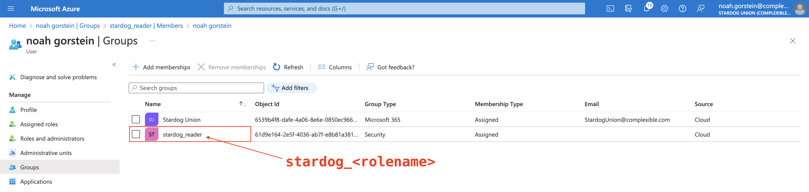
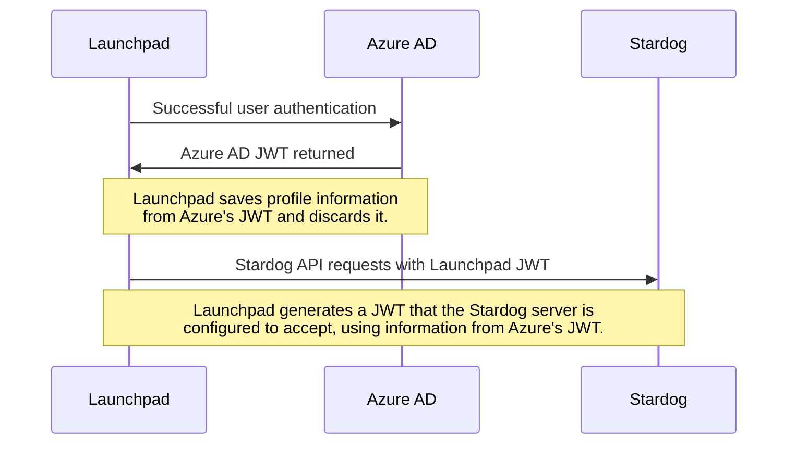
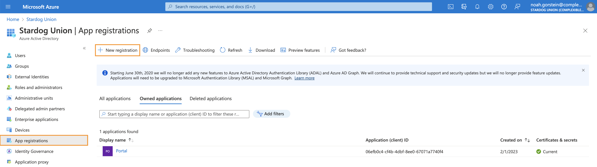
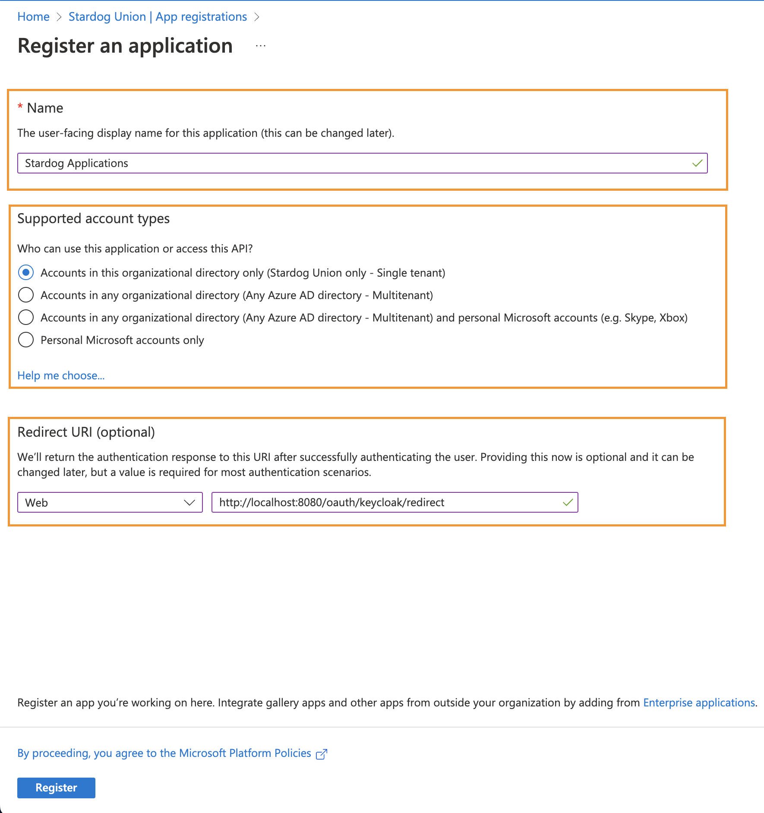
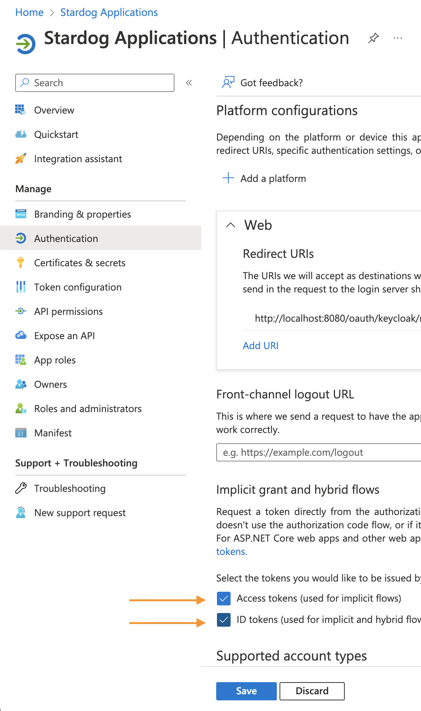
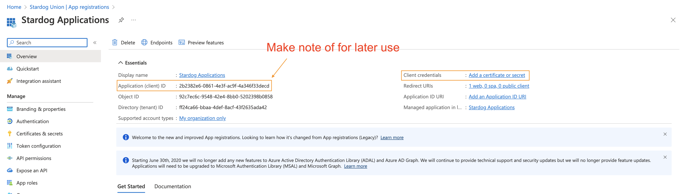
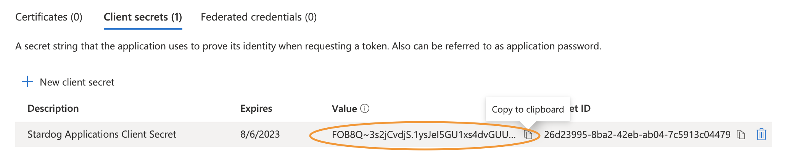
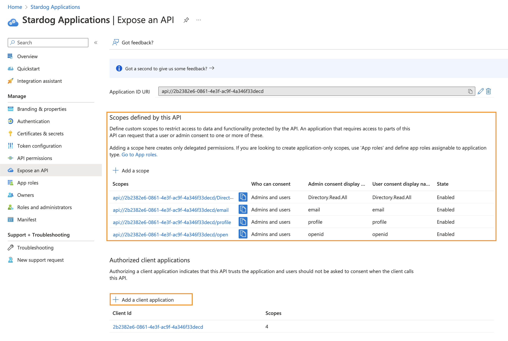
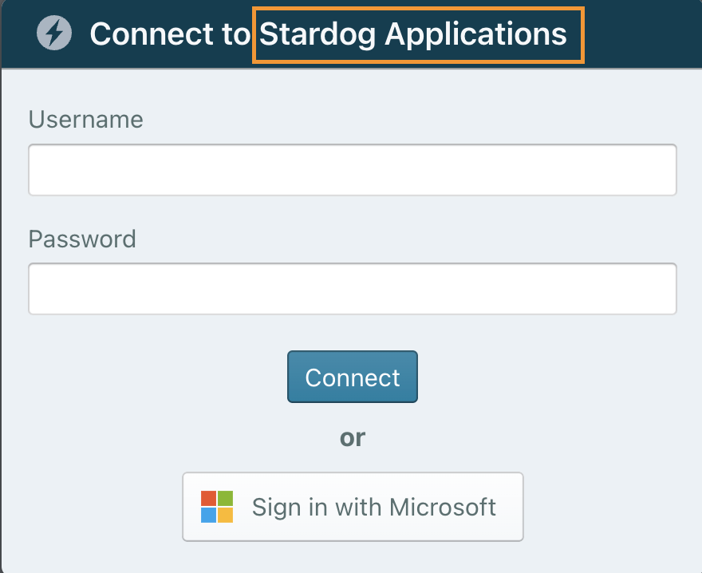

# Azure AD Example (Basic mode)

The purpose of this example is to demonstrate how to deploy and configure Launchpad to allow users to sign in with [Azure Active Directory](https://azure.microsoft.com/en-us/products/active-directory) and access the configured Stardog server via Stardog Applications.

The example below describes how to configure Launchpad and Stardog to work in basic mode, using Azure AD as an OIDC identity provider. Basic mode is enabled by default.

We also support an access token passthrough mode, wherein Launchpad requests an identity token from Azure AD for the purpose of authenticating the user, but it also requests an access token that is passed through to the Stardog server. An example of configuring access token passthrough mode is provided [here](./access-token-passthrough-mode.md).


This integration is built on top of the Stardog Platform’s [Role Mapping](https://docs.stardog.com/operating-stardog/security/oauth-integration#role-mapping) feature as part of its OAuth 2.0 integration. In short, as long as users in Azure AD have membership in groups that conform to the naming structure of `stardog_<rolename>`, and the `<rolename>`(s) are pre-defined in Stardog, the users will be auto-created in Stardog and assigned permissions that correspond to their role assignment(s). This allows an administrator to have a single source of truth for managing the roles (and thus permissions) of a user, since auto-created users cannot be explicitly assigned to a role.

```bash
$ stardog-admin role list
+--------+
|  Role  |
+--------+
| reader |
+--------+
```



## How This Works

1. A user clicks the "Sign in with Microsoft" button during login.

2. If the user successfully authenticates, they are redirected to the Launchpad home page where they can launch the Stardog Apps.

   > **Note**:
   > In order for the Azure AD user signing in to Launchpad to be auto-created in Stardog, the user must be a member of a group in Azure AD that follows the naming convention `stardog_<rolename>`. The `<rolename>` **must** be pre-defined in Stardog.

At a high level, when a user authenticates with Azure AD, a JWT is exchanged between Azure AD and Launchpad. Launchpad gets information from the Azure AD JWT (notably the user's email and group membership) and discards it. This information contained in the Azure AD JWT is then used by Launchpad to encode the JWTs it issues to communicate with the Stardog server. In order for this flow to work, the Stardog server must be configured to accept JWTs issued by Launchpad.

Diagram demonstrating the flow described above:



## Prerequisites

- Docker installed

- Docker Compose installed

- A registered application with the [Microsoft Identity Platform](https://learn.microsoft.com/en-us/azure/active-directory/develop/quickstart-register-app#register-an-application). See [How to Register the Application](#how-to-register-the-application) for more details on configuration required.

- A Stardog server running locally on port `5820`. See [Stardog Server Requirements](#stardog-server-requirements) for additional info.

  > **Note**:
  > If you have a Stardog server running elsewhere (locally or not), this is fine, just modify the `STARDOG_INTERNAL_ENDPOINT` and `STARDOG_EXTERNAL_ENDPOINT` in the [`.env`](.env) file as needed.

### How to Register the Application

Below are steps with screenshots to create and register Launchpad as a Microsoft Application.

1. Create a new [App Registration](https://learn.microsoft.com/en-us/azure/active-directory/develop/quickstart-register-app#register-an-application) with the settings below:





- Provide a name for the application
- Select the supported account types
- Create a **Web** redirect URI of `<BASE_URL>/oauth/azure/redirect`

2. Under **Authentication > Implicit grant and hybrid flows**, select **Access** and **ID** Tokens and click **Save**.



3. Under **Certificates & secrets**, create a **Client Secret** for the newly registered application.



- Copy or make note of the **Application (client) ID**



- Copy or make note of the **Value** of the secret. This will be used later.

4. Under **Expose an API**, set the appropriate application scopes required by Launchpad and assigned them to the registered application.



- Add the following scopes

  - `openid`
  - `email`
  - `profile`
  - `Directory.Read.All`

- Using the Application (client) ID from (called out in Step 3), add a client application providing the ID.

### Stardog Server Requirements

- Stardog server must be v7.8 or above

- The following setting should be set in the Stardog’s server’s [`stardog.properties`](https://docs.stardog.com/operating-stardog/server-administration/server-configuration#stardogproperties) you want to authenticate against.

  ```properties
  jwt.disable=false
  ```

  > **Note**:
  > By default this property is set to `false`, so you can likely omit this.

- The JWT configuration for the Stardog server needs to be customized. To provide a configuration file for JWT configuration to Stardog, set the following property in the `stardog.properties` file:

   ```properties
   jwt.conf=/path/to/jwt.yaml
   ```

   The `jwt.conf` property must point to a valid YAML file. More information about the schema the YAML file should adhere to can be found in the [Stardog docs](https://docs.stardog.com/operating-stardog/security/oauth-integration#configuring-stardog). For Stardog to accept tokens issued by Launchpad, the following section must be added to the `issuers` section in the config file.

   ```yaml
   issuers:
     <JWT_ISSUER>:
       usernameField: username
       audience: <STARDOG_EXTERNAL_ENDPOINT> 
       algorithms:
         RS256:
           keyUrl: <BASE_URL>/.well-known/jwks.json
       autoCreateUsers: True
       allowedGroupIdentifiers:
         - azure.microsoft.com/<AZURE_TENANT_ID>
   ```

   - Be sure to replace `<JWT_ISSUER>`,`<STARDOG_EXTERNAL_ENDPOINT>` and `<BASE_URL>` with the values set in the [`.env`](./.env) file and `<AZURE_TENANT_ID>` with the [Azure Tenant ID](https://learn.microsoft.com/en-us/azure/active-directory/fundamentals/active-directory-how-to-find-tenant#find-tenant-id-through-the-azure-portal) belonging to the users authenticating.

     > **Note**:
     > `JWT_ISSUER` by default is set to the value of `BASE_URL`. There is no need to provide the `JWT_ISSUER` environment variable if you are fine using the default. In this case provide the value of `BASE_URL` as `JWT_ISSUER` in the above yaml.
     > 
     > Suppose the BASE_URL was set to http://localhost:8080, and `JWT_ISSUER` was not set. The jwt.yaml for the Stardog server would look  like:
     > ```yaml
     > issuers:
     >   http://localhost:8080:
     >     usernameField: username
     >     audience: http://localhost:5820 
     >     algorithms:
     >       RS256:
     >         keyUrl: http://localhost:8080/.well-known/jwks.json
     >     autoCreateUsers: True
     >     allowedGroupIdentifiers:
     >       - azure.microsoft.com/aa12bb22-ccdd-3fff-4ggg-55h6666iii77
     > ```

## Run the Example

1. Execute the following command from this directory to bring up the Launchpad service.

   ```
   docker-compose up
   ```

2. Visit [http://localhost:8080](http://localhost:8080) in your browser.

3. Click the "Sign in with Microsoft" button.

> **Note**:
> In order for the Azure AD user signing in to Launchpad to be auto-created in Stardog, the user must be a member of a group in Azure AD that follows the naming convention `stardog_<rolename>`. The `<rolename>` **must** be pre-defined in Stardog.
>
> To add a role and grant permissions to it using the Stardog CLI:
>
> ```bash
> $ stardog-admin role add writer
> Successfully added role writer.
>
> $ stardog-admin role grant -a "write" -o "*:*" writer
> Successfully granted the permission.
> ```
>
> See [Managing Users and Roles](https://docs.stardog.com/operating-stardog/security/managing-users-and-roles#create-a-role) in the Stardog Docs for additional information on how to create roles.

## About the Example

In the example's [configuration](./.env):

- `AZURE_AUTH_ENABLED` enables Azure AD authentication.

  - `AZURE_CLIENT_ID` is the Azure client ID of the client being used for authentication.
  - `AZURE_CLIENT_SECRET` is the client secret for the registered Azure app being used for authentication.
  - `AZURE_TENANT` is the Azure tenant type. You can limit the types of accounts that may log into your instance. The default `organizations` will limit users that are in the Azure AD that the application belongs too. See the possible values in the [Azure docs](https://docs.microsoft.com/en-us/azure/active-directory/develop/active-directory-v2-protocols#endpoints).

- `JWK_LOCATION` is the location inside the Docker container where a public/private key pair should be. Note how in the [`docker-compose.yml`](./docker-compose.yml) a volume containing an RSA public/private key pair is mounted. There is a `README` contained in the [`jwk`](./jwk) directory containing instructions on how to generate a new public/private key pair. The private key is used by the application to sign JWTs, which will be sent for Stardog API requests. The public key is used by the Stardog server to verify the tokens sent by the application.

- The image is being run and used locally for demo purposes. `BASE_URL` is set to `http://localhost:8080`. As a result, `SECURE` is set to `false` since the `BASE_URL` is a non-https URL. The login service assumes `https` and will not work properly without this flag being set to false. Port `8080` is used in the `BASE_URL` because it is mapped to the container's port `8080` in the `ports` section of the [`docker-compose.yml`](docker-compse.yml). If the container's port `8080` was mapped to port `9000` on the Docker host, `BASE_URL` would be set equal to `http://localhost:9000`.

- `STARDOG_EXTERNAL_ENDPOINT` is set to `http://localhost:5820`. This is the address your browser will make Stardog API requests to.

- `STARDOG_INTERNAL_ENDPOINT` is set to `http://host.docker.internal:5820`. This is the address the Launchpad container will make Stardog API requests to. This is required in this case in order for the Docker container to distinguish between what's running on the Docker host and the container itself. See the [Docker documentation](https://docs.docker.com/desktop/networking/#i-want-to-connect-from-a-container-to-a-service-on-the-host) for additional information.

  > **Note:**
  > If you have a Stardog server running remotely, set the `STARDOG_INTERNAL_ENDPOINT` to the same value as `STARDOG_EXTERNAL_ENDPOINT` in the [`.env`](.env) file.

- `COOKIE_SECRET` is set to `some-secret`. In production, this should actually be set to something secure and much more random. This secret is used to sign cookies used by the application.

- `FRIENDLY_NAME` is set to `Stardog Applications`. This is just optional text to display to the user on the login dialog. This text will be inserted after `Connect to`.

  
