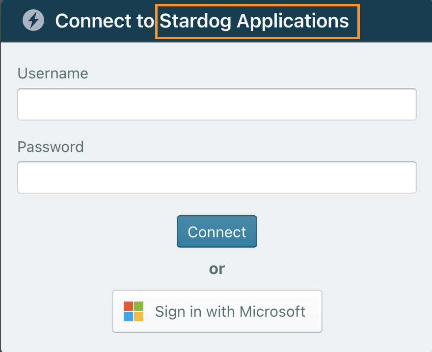

# Azure AD Example (Access Token Passthrough mode)

This example builds on the [basic mode example](./README.md), adding support for access token passthrough mode, wherein Launchpad requests an identity token from Azure AD for the purpose of authenticating the user, but it also requests an access token that it passes through to the Stardog server.

The access token from Azure AD, as opposed to the launchpad-generated token used in basic mode, is required for the virtual graph passthrough feature. The virtual graph passthrough feature allows Stardog to exchange its access token for a data source access token so that the data source can be accessed with the credentials of the logged-in user when querying a virtual graph. In this example, the data source is hosted in Databricks.

The Pass-Through Authentication mode for Stardog is documented [here](https://docs.stardog.com/virtual-graphs/data-sources/passthrough-authentication). Note that this feature was added in the [9.1.0](https://docs.stardog.com/release-notes/stardog-platform#910-release-2023-07-06) release of the Stardog Platform.

## A Little More Detail

In [basic mode](./README.md), Launchpad uses Azure AD as an OIDC identity provider, requesting an identity token for an authenticated user. Launchpad receives a JSON Web Token (JWT) from Azure AD, extracts some information from the token, determines the user's group membership by calling the Microsoft Graph API, and then constructs a new JWT that is used to interact with Stardog.

In **access token passthrough mode**, Launchpad requests both an identity token and an access token from Azure AD for an authenticated user. Launchpad uses the identity token to verify that the user has properly authenticated with Azure AD, and then the identity token is discarded. The access token is used as-is in all interactions with the Stardog server (both from Launchpad and from the Stardog Applications). This access token passthrough mode allows Stardog to act on behalf of the Azure AD user when connecting to a data source.

## How This Works

1. A user clicks the "Sign in with Microsoft" button during login.

2. If the user successfully authenticates, they are redirected to the Launchpad home page where they can launch the Stardog Apps.

   > **Note:**
   > In order for the Azure AD user signing in to Launchpad to be auto-created in Stardog, the user must be a member of a group in Azure AD that Stardog can map to one of its pre-defined groups. The mechanism Stardog uses to map a group in a JWT to one of its pre-defined groups is configured in the `jwt.conf` file referenced in the `stardog.properties` file. See the [configuring Stardog for OAuth integration](https://docs.stardog.com/operating-stardog/security/oauth-integration#configuring-stardog) documentation for more details.

As mentioned above, when a user authenticates with Azure AD, Launchpad receives an identity token (a JWT with audience set to Launchpad) and an access token (a JWT with audience set to Stardog). Launchpad uses the identity token to ensure that the user is authenticated by Azure ID and then discards the token. The access token is then used for all subsequent communication with the Stardog server. In order for this flow to work, the Stardog server must be configured to accept JWTs issued by Azure AD.

Diagram depicting the flow described above:


## Configuration Steps

### Prerequisites

- Docker installed
- Docker Compose installed
- Two registered applications with the [Microsoft Identity Platform](https://learn.microsoft.com/en-us/azure/active-directory/develop/quickstart-register-app#register-an-application), one for Launchad and one for the Stardog server. More details are provided below.
- A Stardog server running locally on port `5820` and configured to accept access tokens from the registered Stardog Azure AD application. See [Stardog Server Requirements](#stardog-server-requirements) for additional info.

   > **Note:**
   > If you have a Stardog server running elsewhere (locally or not), this is fine, just modify the `STARDOG_INTERNAL_ENDPOINT` and `STARDOG_EXTERNAL_ENDPOINT` in the [`.env`](.env) file as needed.

### How to Register the Launchpad Application

Here are steps to create and register Launchpad as a Microsoft Web Application. Note that these are almost identical to the steps in the [basic mode example](./README.md#how-to-register-the-application), except that the `Directory.Read.All` scope is not required for the Launchpad registered application when using access token passthrough mode.

For reference, here is a Microsoft [quickstart guide](https://learn.microsoft.com/en-us/azure/active-directory/develop/quickstart-register-app#register-an-application) about registering an application.

1. **Register:** Create a new application registration with the settings:

   - Provide a **Name** for the application, for example, `My Launchpad`
   - Select the supported account types, for example, `Accounts in this organizational directory only`
   - Create a **Web** redirect URI of `<BASE_URL>/oauth/azure/redirect`
      - Note this value of `<BASE_URL>` must match the value set in the Docker Compose `.env` file, which is the URL you will use to access Launchpad. For a locally-hosted test deployment, this is typically `http://localhost:8080`.

   After clicking the **Register** button:

   - Make note of the **Application (client) ID**
   - Make note of the **Directory (tenant) ID**

2. **Client Secret:** Under **Certificates & secrets**, create a **New client secret**.

   - Make note of the **Value** of the secret. You will not be able to view or copy the value of the secret after you leave this page.

   > **Note**:
   > If you want to authenticate Launchpad to Azure using a client certificate (instead of a client secret), see [Using a Certificate](./client-certificate-config.md) for details.

3. **Scopes:** Under **Expose an API**, use the default suggested Application ID URI (`api://<client-id>` where `<client-id>` is the **Application (client) ID** noted in Step 1) and add the following scopes. For each scope, set **Admins and users** in the **Who can consent?** option, enter the required display names and descriptions, and then click the **Add scope** button.

   - `openid`
   - `email`
   - `profile`

   After adding the scopes listed above, click the **Add a client application** button and specify the **Application (client) ID** (noted in Step 1). Select all of the scopes added above and click the **Add application** button.

### How to Register the Stardog Application

Here are steps to create and register Stardog as a Microsoft Application. Instead of creating a **Web** app like we did for Launchpad, we will create the Stardog app in Azure as a **Mobile and desktop application**.

1. **Register:** Create a new application registration with the settings:

   - Provide a **Name** for the application, for example, `My Stardog`
   - Select the supported account types, for example, `Accounts in this organizational directory only`
   - Create a **mobile & desktop** redirect URI to your Stardog server, for example, `http://localhost`
      - Note this value assumes the Stardog server is running on the local test system as a stand-alone application. If it is running elsewhere, you will need to adjust this accordingly.

   After clicking the **Register** button:

   - Make note of the **Application (client) ID**
   - Make note of the **Directory (tenant) ID**

2. **Client Secret:** Under **Certificates & secrets**, create a **New client secret**.

   - Make note of the **Value** of the secret. You will not be able to view or copy the value of the secret after you leave this page.

3. **API Permissions:** Under **API permissions**, add the following permissions (if not already present). For each permission, choose **Delegated permssions**, select the permssion and click the **Add permissions** button.

   - **AzureDatabricks** API, permission name `user_impersonation`
   - **Microsoft Graph** API, permission name `User.Read`

4. **Scopes:** Under **Expose an API**, use the default suggested Application ID URI (`api://<client-id>` where `<client-id>` is the **Application (client) ID** noted in Step 1) and add the following scopes. For each scope, set **Admins and users** in the **Who can consent?** option, enter the required display names and descriptions, and then click the **Add scope** button.

   - `user_login`

5. **Roles Claim:** Under **App roles** click **Create app role**, enter the required settings, and click the **Apply** button:

   - Provide a **Display name**, for example, `App Reader/Writer`
   - Select the **Allowed member types** of `Users/Groups`
   - Provide a **Value**, for example, `app_reader_writer`
   - Provide a **Description**
   - Click the **Apply** button
   
   Next configure the Azure AD user to be used when logging in to Launchpad, adding the `app_reader_writer` claim to the user's access token:
   - Click the **How do I assign App roles** link and click the **Enterprise applications** link
   - Click the **Assign users and groups** link and click the **Add user/group** button
   - Click the **None Selected** link and search for the user to granted the new app role
   - Click the checkbox next to the user's name and click the **Select** button
   - The **Add Assignment** page should now show `1 user selected`, and the new role (`App Reader/Writer`) listed under **Select a role**; click the **Assign** button

   > **Note:**
   > This is one way of including a roles claim in the access token that Azure AD generates for an authenticated user. In an enterprise deployment, you would likely want users to present a groups claim, which you can add in the **Token configuration** section.

6. **Token Version 2:** Under **Manifest**, change the value of `"accessTokenAcceptedVersion"` from `null` to `2`.

   > **Note**:
   > This is required for the access token's `"iss"` (issuer) field to match the setting we will use in the Stardog server's `jwt.conf` file.

### Stardog Server Requirements

- Stardog server must be v9.1.0 or above

- The following setting should be set in the Stardog’s server’s [`stardog.properties`](https://docs.stardog.com/operating-stardog/server-administration/server-configuration#stardogproperties) you want to authenticate against.

   ```properties
   jwt.disable=false
   ```

   > **Note:**
   > By default this property is set to `false`, so you can likely omit this.

- The JWT configuration for the Stardog server needs to be customized. To provide a configuration file for JWT configuration to Stardog, set the following property in the `stardog.properties` file:

   ```properties
   jwt.conf=/path/to/jwt.yaml
   ```

   The `jwt.conf` property must point to a valid YAML file. More information about the schema the YAML file should adhere to can be found in the [Stardog docs](https://docs.stardog.com/operating-stardog/security/oauth-integration#configuring-stardog). For Stardog to accept access tokens issued by Azure AD, the following section must be added to the `issuers` section in the config file.

   ```yaml
   confVersion: "1.0"
   deploymentName: stardog-server

   signer:
      algorithm: HS256
      secret: "some-kind-of-secret-key-here"
      issuer: http://localhost:5820

   issuers:
     https://login.microsoftonline.com/<AZURE_TENANT_ID>/v2.0:
       usernameField: preferred_username
      audience: <AZURE_CLIENT_ID>
      algorithms:
        RS256:
          keyUrl: https://login.microsoftonline.com/<AZURE_TENANT_ID>/discovery/v2.0/keys
      autoCreateUsers: True
      rolesClaimPath: roles
   ```

   - You will need to replace `<AZURE_TENANT_ID>` and `<AZURE_CLIENT_ID>` with the values noted in step 1 of the instructions for registering the Stardog Application.

   > **Note:**
   > The `signer:` section configures the Stardog server to issue tokens for basic auth users. You can omit this section if you do not want users to be able to sign in to Stardog via Launchpad using a username and password.

### Launchpad Environment Settings

We provide an example Docker [configuration .env file](./.env) that you will need to update as follows:

   - For the line `AZURE_CLIENT_ID=<client-id>`, replace `<client-id>` with the value noted in step 1 of the instructions for registering the Launchpad Application.
   - For the line `AZURE_CLIENT_SECRET=<client-secret>`, replace `<client-secret>` with the value noted in step 3 of the instructions for registering the Launchpad Application.
   - Un-comment the line `AZURE_AUTH_TOKEN_TYPE` and set its value to `access_token`.
   - Un-comment the line `AZURE_STARDOG_SCOPE` and replace `<Stardog-Client-ID>` with the value noted in step 1 of the instructions for registering the Stardog Application, so that it is set to `AZURE_STARDOG_SCOPE=api://<Stardog-Client-ID>/user_login`.

## Run the Example

1. Execute the following command from this directory to bring up the Launchpad service.

   ```bash
   docker-compose up
   ```

2. Visit [http://localhost:8080](http://localhost:8080) in your browser.

3. Click the "Sign in with Microsoft" button.

> **Note**:
> In order for the Azure AD user signing in to Launchpad to be auto-created in Stardog, the user must be a member of a group in Azure AD such that the name of the group matches a role that is already created in Stardog.
>
> To add a role and grant permissions to it using the Stardog CLI:
>
> ```bash
> $ stardog-admin role add writer
> Successfully added role writer.
>
> $ stardog-admin role grant -a "write" -o "*:*" writer
> Successfully granted the permission.
> ```
>
> See [Managing Users and Roles](https://docs.stardog.com/operating-stardog/security/managing-users-and-roles#create-a-role) in the Stardog Docs for additional information on how to create roles.

## About the Example

In the example's [configuration](./.env):

- `AZURE_AUTH_ENABLED` enables Azure AD authentication.

   - `AZURE_CLIENT_ID` is the Azure client ID of the client being used for authentication.
   - `AZURE_CLIENT_SECRET` is the client secret for the registered Azure app being used for authentication.
   - `AZURE_TENANT` is the Azure tenant type. You can limit the types of accounts that may log into your instance. The default `organizations` will limit users that are in the Azure AD that the application belongs too. See the possible values in the [Azure docs](https://docs.microsoft.com/en-us/azure/active-directory/develop/active-directory-v2-protocols#endpoints).
   - `AZURE_AUTH_TOKEN_TYPE` must be un-commented and set to `access_token`.
   - `AZURE_STARDOG_SCOPE` must be un-commented and have the `<Stardog-Client-ID>` part replaced with the **Application (client) ID** value for the Stardog Application, so that it is set to `AZURE_STARDOG_SCOPE=api://<Stardog-Client-ID>/user_login`.

- The image is being run and used locally for demo purposes. `BASE_URL` is set to `http://localhost:8080`. As a result, `SECURE` is set to `false` since the `BASE_URL` is a non-https URL. The login service assumes `https` and will not work properly without this flag being set to false. Port `8080` is used in the `BASE_URL` because it is mapped to the container's port `8080` in the `ports` section of the [`docker-compose.yml`](docker-compse.yml). If the container's port `8080` was mapped to port `9000` on the Docker host, `BASE_URL` would be set equal to `http://localhost:9000`.

- `STARDOG_EXTERNAL_ENDPOINT` is set to `http://localhost:5820`. This is the address your browser will make Stardog API requests to.

- `STARDOG_INTERNAL_ENDPOINT` is set to `http://host.docker.internal:5820`. This is the address the Launchpad container will make Stardog API requests to. This is required in this case in order for the Docker container to distinguish between what's running on the Docker host and the container itself. See the [Docker documentation](https://docs.docker.com/desktop/networking/#i-want-to-connect-from-a-container-to-a-service-on-the-host) for additional information.

   > **Note:**
   > If you have a Stardog server running remotely, set the `STARDOG_INTERNAL_ENDPOINT` to the same value as `STARDOG_EXTERNAL_ENDPOINT` in the [`.env`](.env) file.

- `FRIENDLY_NAME` is set to `Stardog Applications`. This is just optional text to display to the user on the login dialog. This text will be inserted after `Connect to`.

   
