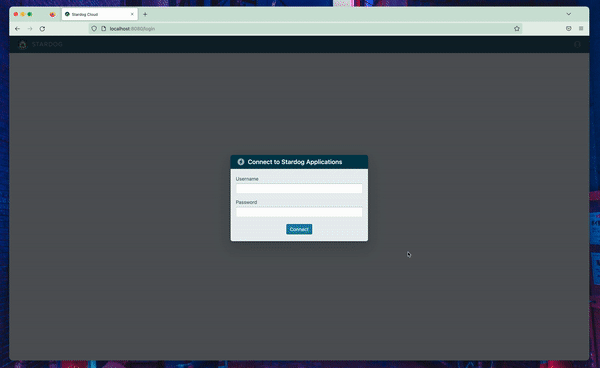

# Basic Authentication Example

The purpose of this example configuration is to demonstrate how to deploy and configure On-Prem for a Stardog instance to allow users to sign in with a Stardog username and password.



## How This Works

The way this configuration works is a user provides their Stardog username and password to the login dialog. The application validates the user’s provided credentials and attempts to fetch a JWT token from Stardog. This JWT token from Stardog is then used for all subsequent calls against the Stardog server. For example, when a user is authenticated and then decides to open Stardog Studio, the JWT will be used for all authenticated calls against the Stardog server (e.g. listing all databases in the Stardog server, running a query, etc).

## Prerequisites

- Docker installed
- Docker Compose installed
- A Stardog server running locally on port `5820`.

  > **Note**:
  > If you have a Stardog server running elsewhere (locally or not), this is fine, just modify the `STARDOG_INTERNAL_ENDPOINT` and `STARDOG_EXTERNAL_ENDPOINT` in the [`.env`](.env) file as needed.

### Stardog Server Requirements

- Stardog server must be v7.8 or above
- The following setting should be set in the Stardog’s server’s [`stardog.properties`](https://docs.stardog.com/operating-stardog/server-administration/server-configuration#stardogproperties) you want to authenticate against.

  ```properties
  jwt.disable=false
  ```

  > **Note**:
  > By default this property is set to `false`, so you can likely omit this.

## Run the Example

1. Execute the following command from this directory to bring up the On-Prem service.

    ```bash
    docker-compose up -d
    ```

2. Visit [http://localhost:8080](http://localhost:8080) in your browser.

## About the Example

In the example:

- The image is being run and used locally for demo purposes. `BASE_URL` is set to `http://localhost:8080`. As a result, `SECURE` is set to `false` since the `BASE_URL` is a non-https URL. The login service assumes `https` and will not work properly without this flag being set to false. Port `8080` is used in the `BASE_URL` because it is mapped to the container's port `8080` in the `ports` section of the [`docker-compose.yml`](docker-compse.yml). If the container's port `8080` was mapped to port `9000` on the Docker host, `BASE_URL` would be set equal to `http://localhost:9000`
- `STARDOG_EXTERNAL_ENDPOINT` is set to `http://localhost:5820`. This is the address your browser will make Stardog API requests to.
- `STARDOG_INTERNAL_ENDPOINT` is set to `http://host.docker.internal:5820`. This is the address the on-prem container will make Stardog API requests to. This is required in this case in order for the Docker container to distinguish between what's running on the Docker host and the container itself. See the [Docker documentation](https://docs.docker.com/desktop/networking/#i-want-to-connect-from-a-container-to-a-service-on-the-host) for additional information.

  > **Note:**
  > If you have a Stardog server running remotely, set the `STARDOG_INTERNAL_ENDPOINT` to the same value as `STARDOG_EXTERNAL_ENDPOINT` in the [`.env`](.env) file.

- `PASSWORD_AUTH_ENABLED` is set to `true`. This allows users to provide a Stardog username and password for authentication in the login dialog. This is actually the default setting, but is included here for completeness.
- `COOKIE_SECRET` is set to `some-secret`. In production, this should actually be set to something secure and much more random. This secret is used to sign cookies used by the application.
- `FRIENDLY_NAME` is set to `Stardog Applications`. This is just optional text to display to the user on the login dialog. This text will be inserted after `Connect to`.
