# Google SSO Example

The purpose of this example configuration is to demonstrate how to deploy and configure Launchpad for a Stardog instance to allow users to sign in with Google SSO as their auth provider.

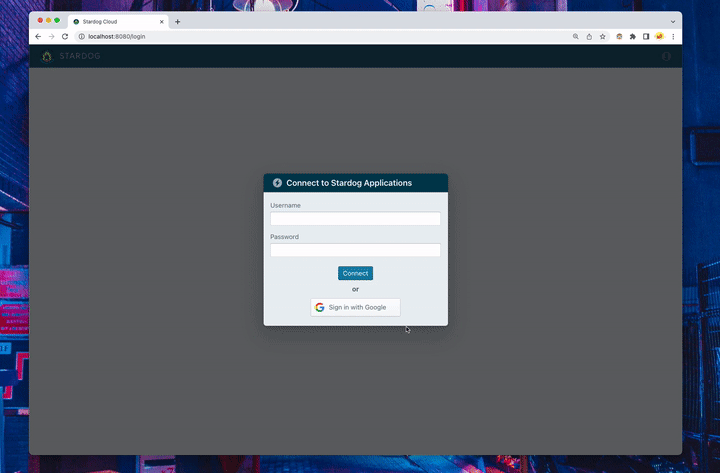

## How This Works

1. A user clicks the "Sign in with Google" button during login.
2. If the user successfully authenticates, they are redirected to the Launchpad home page, where they can enter the Stardog Apps.
   > **Note**:
   > A Stardog user **must** exist on the server with a username matching the email that the Google user is authenticating with.

At a high level, when a user authenticates with Google, a JWT is exchanged between Google and Launchpad. Launchpad gets information from the Google JWT (notably the user's email) and discards it. This information contained in the Google JWT is then used by Launchpad to encode the JWTs it issues to communicate with the Stardog server. In order for this flow to work, the Stardog server must be configured to accept JWTs issued by Launchpad.

Diagram demonstrating the flow described above:

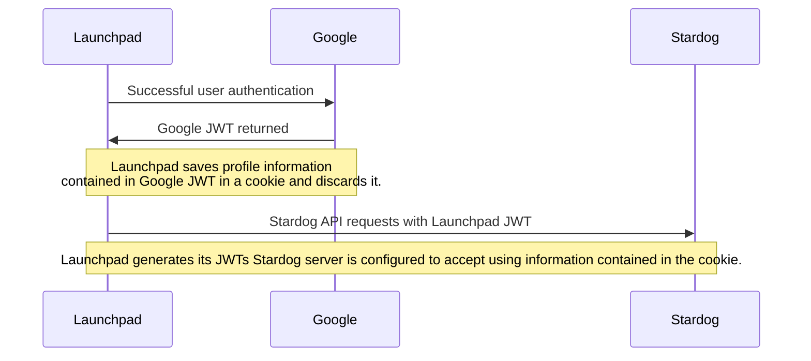

## Prerequisites

- Docker installed
- Docker Compose installed
- A configured [Google Oauth 2.0 Client](https://developers.google.com/identity/protocols/oauth2). See [Setting up the Google OAuth 2.0 Client](#setting-up-the-google-oauth-2.0-client) for more details on configuration required.
- A Stardog server running locally on port `5820`. See [Stardog Server Requirements](#stardog-server-requirements) for additional info.

  > **Note**:
  > If you have a Stardog server running elsewhere (locally or not), this is fine, just modify the `STARDOG_INTERNAL_ENDPOINT` and `STARDOG_EXTERNAL_ENDPOINT` in the [`.env`](.env) file as needed.

### Setting up the Google OAuth 2.0 Client

Below are steps with screenshots to create a Google OAuth 2.0 Client. This client is required for Launchpad to authenticate users who wish to sign in with Google.

1. Create a project:

  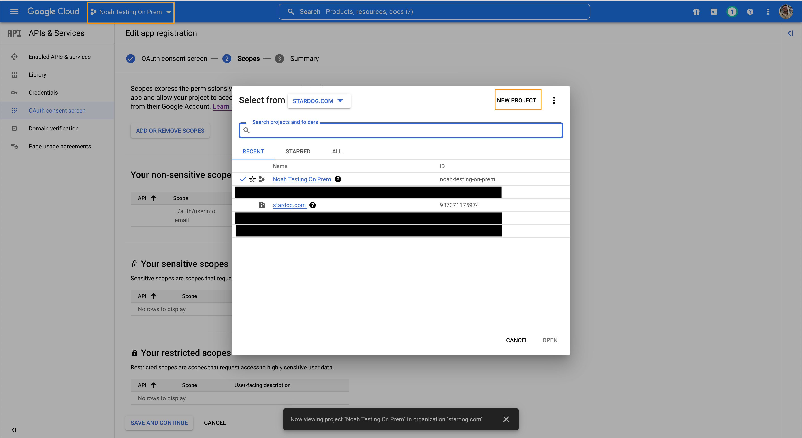

  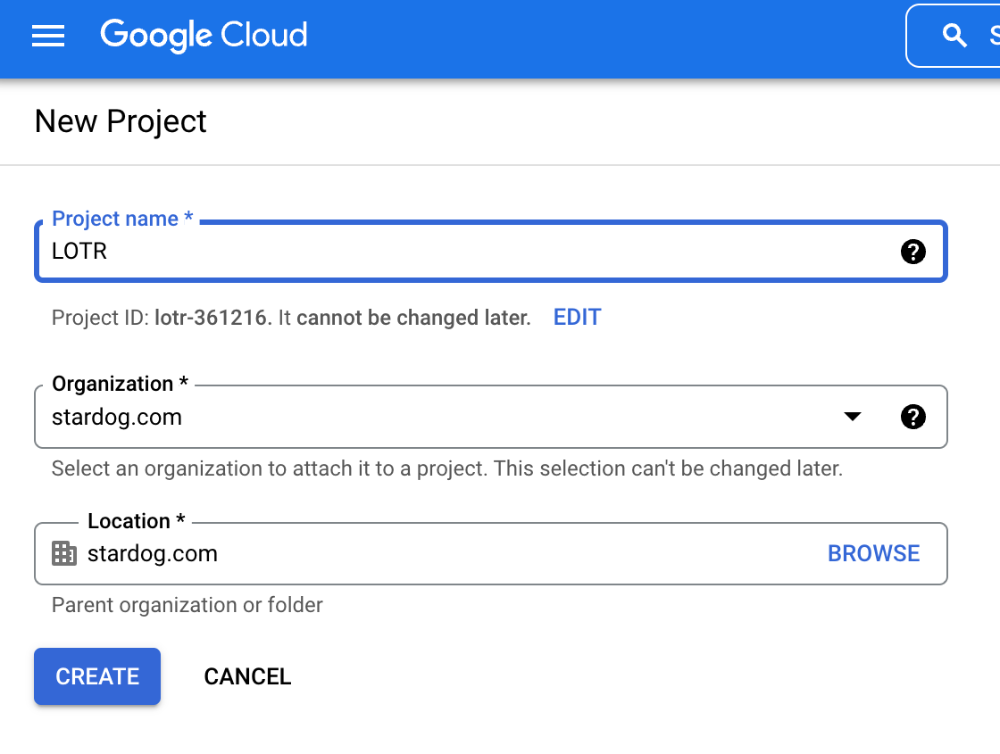

2. Customize OAuth Consent Screen. Internal users for "User Type" was selected in the screenshot to only permit users in the Stardog organization to login to this app.

  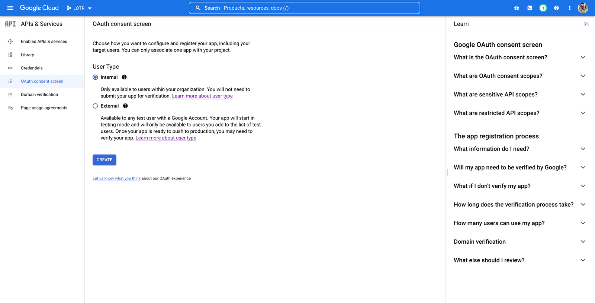

3. Enter app information.

  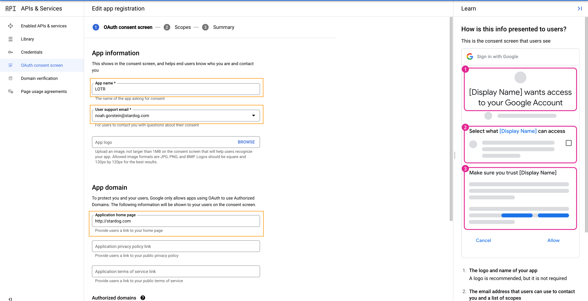

  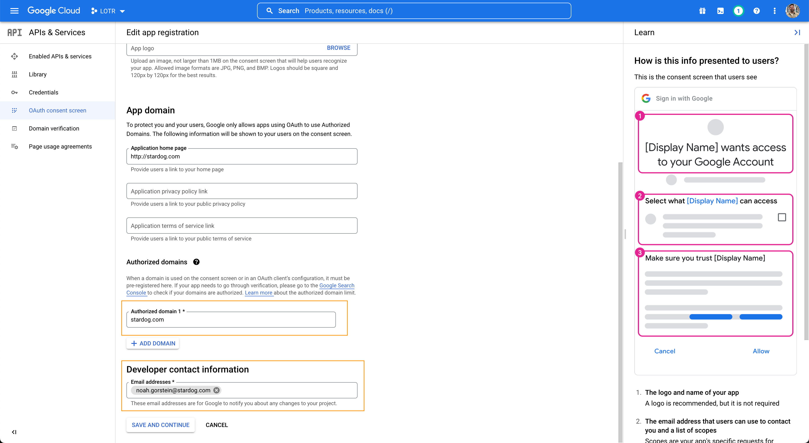

4. Edit scopes for the application. Ensure `/auth/userinfo.email` is selected.

  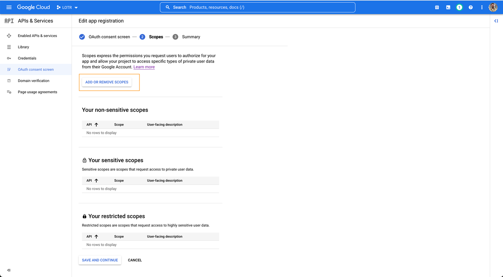

  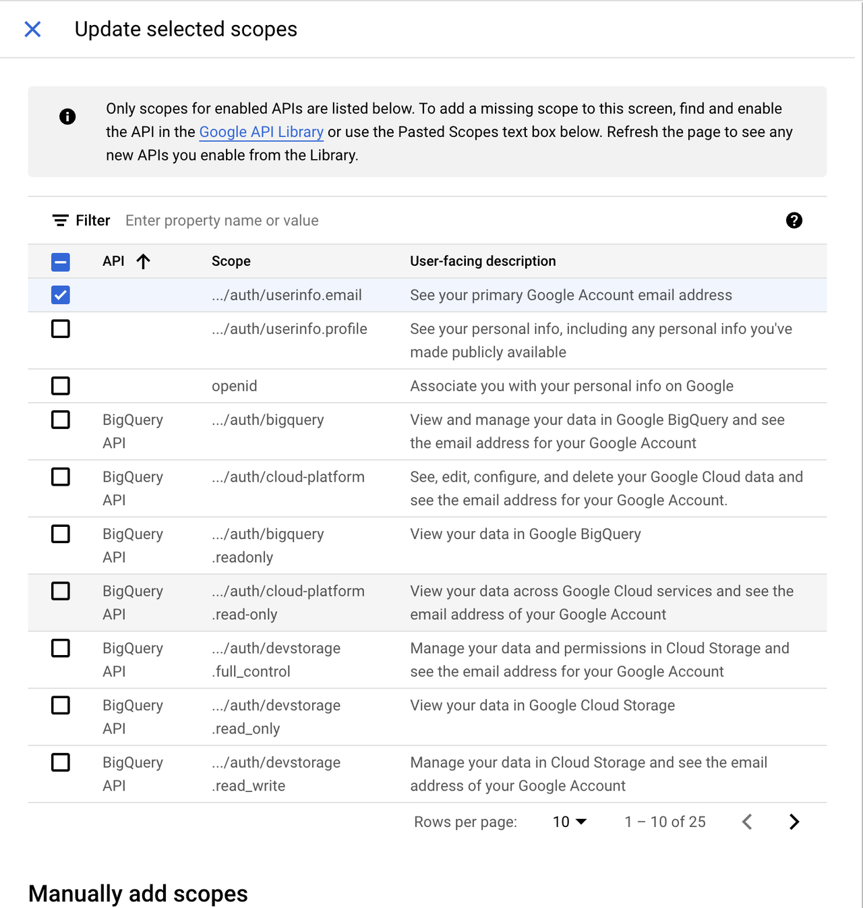

5. Create the OAuth 2.0 Client. Be sure to add an "Authorized Redirect URI" with `<BASE_URL>/oauth/google/redirect`

  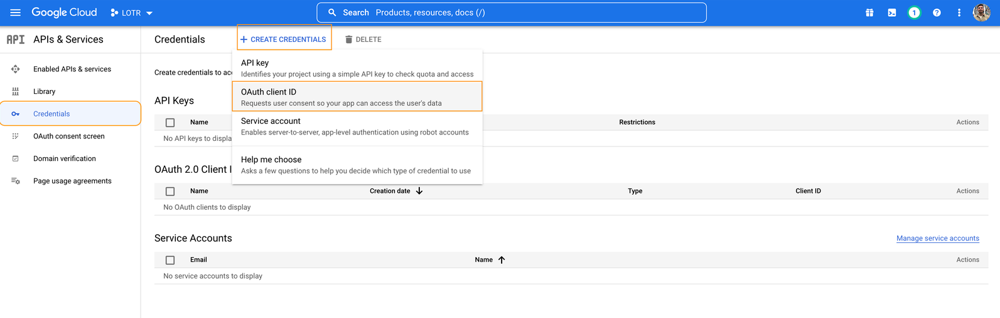

  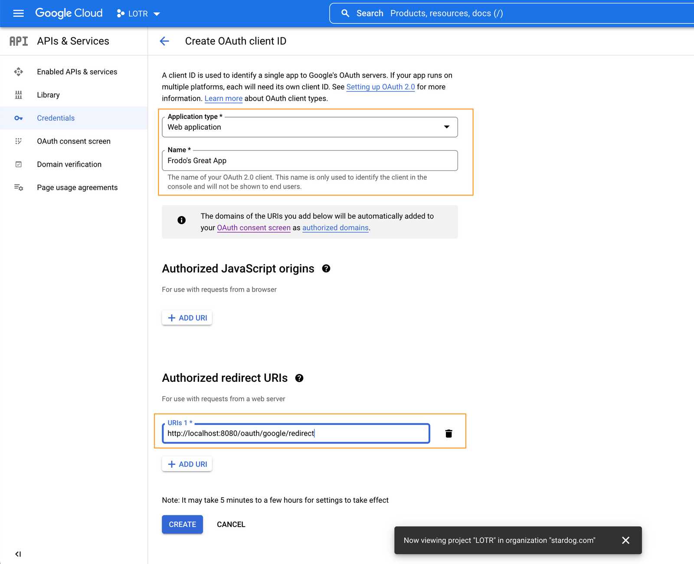

### Stardog Server Requirements

- Stardog server must be v7.8 or above
- The following setting should be set in the Stardog’s server’s [`stardog.properties`](https://docs.stardog.com/operating-stardog/server-administration/server-configuration#stardogproperties) you want to authenticate against.

  ```properties
  jwt.disable=false
  ```

  > **Note**:
  > By default this property is set to `false`, so you can likely omit this.

- The JWT configuration for the Stardog server needs to be customized. To provide a configuration file for JWT configuration to Stardog set the following property in the `stardog.properties` file:

```properties
jwt.conf=/path/to/jwt.yaml
```

The `jwt.conf` property must point to a valid YAML file. More information about the schema the YAML file should adhere to can be found in the [Stardog docs](https://docs.stardog.com/operating-stardog/security/oauth-integration#configuring-stardog). For Stardog to accept tokens issued by Launchpad, the following section must be added to the `issuers` section in the config file.

```yaml
issuers:
  <JWT_ISSUER>:
    usernameField: email
    audience: <STARDOG_EXTERNAL_ENDPOINT>
    algorithms:
      RS256:
        keyUrl: <BASE_URL>/.well-known/jwks.json
```

- Be sure to replace `<JWT_ISSUER>`,`<STARDOG_EXTERNAL_ENDPOINT>` and `<BASE_URL>` with the values set in the [`.env`](./.env) file.

  > **Note**:
  > `JWT_ISSUER` by default is set to the value of `BASE_URL`. There is no need to provide the `JWT_ISSUER` environment variable if you are fine using the default.
  > 
  > Here is an example config file:
  > ```yaml
  > issuers:
  >   http://localhost:8080:
  >     usernameField: email
  >     audience: http://localhost:5820 
  >     algorithms:
  >       RS256:
  >         keyUrl: http://localhost:8080/.well-known/jwks.json
  > ```

## Run the Example

1. Execute the following command from this directory to bring up the Launchpad service.

   ```
   docker-compose up
   ```

2. Visit [http://localhost:8080](http://localhost:8080) in your browser.

3. Click the "Sign in with Google" button.

  > **Note**:
  > The Google user you are signing in with must exist on the Stardog server with a username of the email you are signing in with.
  > 
  > To add a user using the Stardog CLI:
  > ```bash
  > stardog-admin user add someone@company.com
  > ```
  > See [Managing Users and Roles](https://docs.stardog.com/operating-stardog/security/managing-users-and-roles#create-a-user) in the Stardog Docs for additional information on how to create users.

## About the Example

In the example's [configuration](./.env):

- `GOOGLE_AUTH_ENABLED` enables Google authentication. `GOOGLE_CLIENT_ID` is the Google OAuth 2.0 Client ID of the client being used for authentication. `GOOGLE_CLIENT_SECRET` is the client secret for the Google Oauth 2.0 Client being used for authentication.
- `JWK_LOCATION` is the location inside the Docker container where a public/private key pair should be. Note how in the [`docker-compose.yml`](./docker-compose.yml) a volume containing an RSA public/private key pair is mounted. There is a `README` contained in the [`jwk`](./jwk) directory containing instructions on how to generate a new public/private key pair. The private key is used by the application to sign JWTs, which will be sent for Stardog API requests. The public key is used by the Stardog server to verify the tokens sent by the application.
- The image is being run and used locally for demo purposes. `BASE_URL` is set to `http://localhost:8080`. As a result, `SECURE` is set to `false` since the `BASE_URL` is a non-https URL. The login service assumes `https` and will not work properly without this flag being set to false. Port `8080` is used in the `BASE_URL` because it is mapped to the container's port `8080` in the `ports` section of the [`docker-compose.yml`](docker-compse.yml). If the container's port `8080` was mapped to port `9000` on the Docker host, `BASE_URL` would be set equal to `http://localhost:9000`
- `STARDOG_EXTERNAL_ENDPOINT` is set to `http://localhost:5820`. This is the address your browser will make Stardog API requests to.
- `STARDOG_INTERNAL_ENDPOINT` is set to `http://host.docker.internal:5820`. This is the address the Launchpad container will make Stardog API requests to. This is required in this case in order for the Docker container to distinguish between what's running on the Docker host and the container itself. See the [Docker documentation](https://docs.docker.com/desktop/networking/#i-want-to-connect-from-a-container-to-a-service-on-the-host) for additional information.

  > **Note:**
  > If you have a Stardog server running remotely, set the `STARDOG_INTERNAL_ENDPOINT` to the same value as `STARDOG_EXTERNAL_ENDPOINT` in the [`.env`](.env) file.

- `PASSWORD_AUTH_ENABLED` is set to `true`. This allows users to provide a Stardog username and password for authentication in the login dialog. This is actually the default setting, but is included here for completeness.
- `COOKIE_SECRET` is set to `some-secret`. In production, this should actually be set to something secure and much more random. This secret is used to sign cookies used by the application.
- `FRIENDLY_NAME` is set to `Stardog Applications`. This is just optional text to display to the user on the login dialog. This text will be inserted after `Connect to`.

  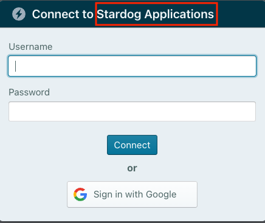

