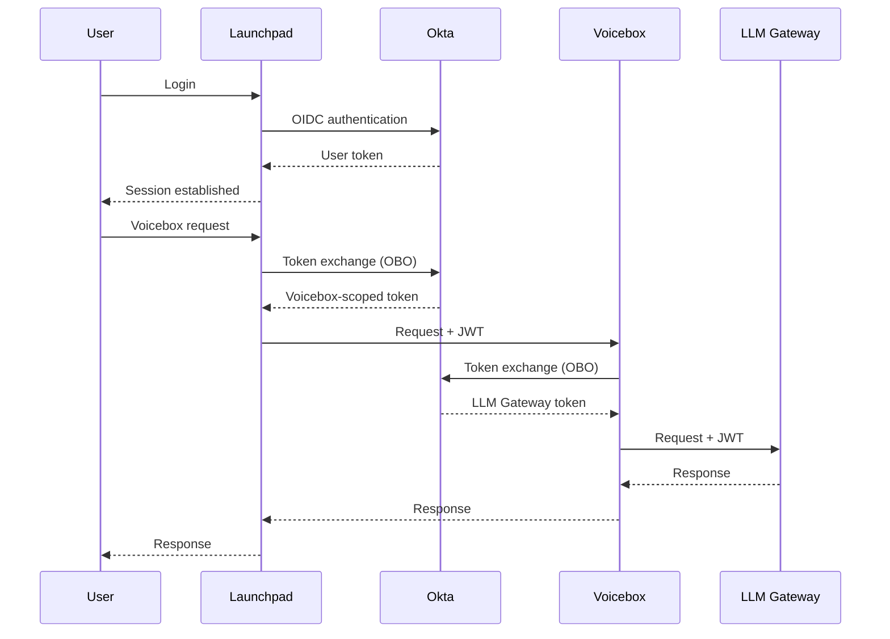
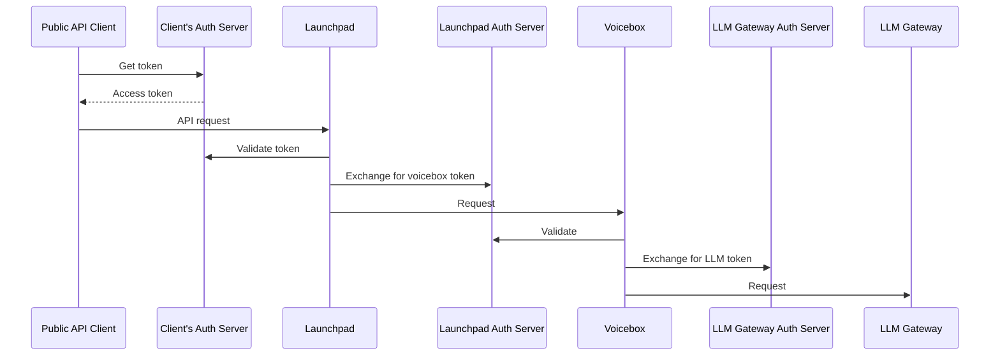

# JWT Authentication with Okta

This guide walks through configuring JWT-based authentication for Voicebox using Okta's On-Behalf-Of (OBO) token exchange flow.

## Is This Guide For You?

Use JWT authentication if you need:

- **Audit trail** — Track which user made each LLM request through the entire service chain
- **Scoped tokens** — Each service receives only the permissions it needs
- **Corporate security requirements** — Your LLM Gateway requires OAuth bearer tokens

**If you don't have these requirements**, skip this guide and use the standard [Voicebox App Key authentication](../voicebox.md#using-voicebox-programmatically).

> [!IMPORTANT]
> This JWT authentication flow is currently only supported with **Okta** as the identity provider.

## Prerequisites

Before starting, ensure you have:

- [ ] Okta account with **API Access Management** (required for custom authorization servers)
- [ ] Launchpad already deployed with [Okta login](../providers/okta.md) working
- [ ] Voicebox Service deployed
- [ ] An LLM Gateway/proxy that accepts OAuth bearer tokens (required for token exchange to the LLM)

## Quick Start

If you're familiar with Okta and OAuth token exchange, here's the minimal configuration. The [full walkthrough](#okta-setup) below explains how to obtain each value.

**Launchpad:**

```bash
# Existing Okta login config (you should already have these)
OKTA_AUTH_ENABLED=true
OKTA_DOMAIN=your-domain.okta.com
OKTA_CLIENT_ID=0oaLoginApp123
OKTA_CLIENT_SECRET=<login-app-secret>

# JWT Authentication (add these)
OKTA_AUTHORIZATION_SERVER_ID=aus123abc
OKTA_AUTHORIZATION_SERVER_AUDIENCE=stardog-services
OKTA_BACKEND_CLIENT_ID=0oaBackendApp456
OKTA_BACKEND_CLIENT_SECRET=<backend-app-secret>
VOICEBOX_SERVICE_ENDPOINT=http://voicebox-service:8000
VOICEBOX_SERVICE_SCOPE=voicebox
```

**Voicebox Service:**

```bash
# JWT validation (tokens from Launchpad)
REQUIRE_JWT_AUTH=true
JWT_ISSUER=https://your-domain.okta.com/oauth2/aus123abc
JWT_JWKS_URI=https://your-domain.okta.com/oauth2/aus123abc/v1/keys
JWT_AUDIENCE=stardog-services
JWT_REQUIRED_SCOPE=voicebox

# Token exchange (for LLM Gateway)
TOKEN_EXCHANGE_PROVIDER=okta
OKTA_CLIENT_ID=0oaVoiceboxApp789
OKTA_CLIENT_SECRET=<voicebox-app-secret>
OKTA_DISCOVERY_URL=https://your-domain.okta.com/oauth2/aus123abc/.well-known/openid-configuration
OKTA_LLM_GATEWAY_AUDIENCE=stardog-services
OKTA_LLM_GATEWAY_SCOPE=llm-gateway
```

**Voicebox config file** (`vbx-config.json`):

```json
{
  "default_llm_config": {
    "llm_provider": "openai",
    "llm_name": "gpt-4o",
    "server_url": "https://your-llm-gateway.example.com/v1/"
  }
}
```

> [!IMPORTANT]
> Token exchange is currently supported with `llm_provider: openai` only.

---

## How It Works

JWT authentication creates a chain of trust from the user through to the LLM:

```
User → Launchpad → Voicebox Service → LLM Gateway
```

1. **User logs in** to Launchpad via Okta
2. **Launchpad exchanges** the user's token for a Voicebox-scoped token (OBO flow)
3. **Voicebox validates** the token and exchanges it for an LLM Gateway token
4. **LLM Gateway** receives a scoped token traceable to the original user



> [!NOTE]
> This diagram shows the simple case where all components use the same authorization server. For multi-authorization-server setups, see [Advanced Configuration](#using-multiple-authorization-servers).

---

## Okta Setup

### Step 1: Create a Custom Authorization Server

1. In Okta Admin Console, go to **Security** → **API** → **Authorization Servers**
2. Click **Add Authorization Server**
3. Configure:
   - **Name**: e.g., "Stardog Services"
   - **Audience**: e.g., `stardog-services` — note this value, you'll use it in multiple places
4. After saving, note the **Authorization Server ID** from the Metadata URI:
   ```
   https://{domain}/oauth2/{AUTHORIZATION_SERVER_ID}/.well-known/oauth-authorization-server
   ```


**Verify:** The authorization server appears in your list and you can access its settings.

### Step 2: Create Scopes

1. In your authorization server, go to **Scopes** tab
2. Click **Add Scope** for each:

| Scope Name | Description |
|------------|-------------|
| `voicebox` | Access to Voicebox service |
| `llm-gateway` | Access to LLM Gateway |

> [!NOTE]
> You can name these scopes whatever you prefer. Just ensure consistency across your configuration.

**Verify:** Both scopes appear in the Scopes tab.


### Step 3: Create the Launchpad Backend Application

Okta requires a separate API Services application for token exchange (different from the web app used for login).

1. Go to **Applications** → **Applications**
2. Click **Create App Integration**
3. Select **API Services**
4. Configure:
   - **Name**: e.g., "Launchpad Backend"
5. After creation, note:
   - **Client ID** → `OKTA_BACKEND_CLIENT_ID`
   - **Client Secret** → `OKTA_BACKEND_CLIENT_SECRET`
6. Under **General** → **Advanced** → **Non-interactive grants**:
   - Check **Token Exchange**
7. Do NOT enable "Require DPoP header"


**Verify:** The application shows "Token Exchange" enabled under grants.

### Step 4: Create the Voicebox Service Application

1. **Applications** → **Create App Integration** → **API Services**
2. Configure:
   - **Name**: e.g., "Voicebox Service"
3. Note:
   - **Client ID** → Voicebox's `OKTA_CLIENT_ID`
   - **Client Secret** → Voicebox's `OKTA_CLIENT_SECRET`
4. Enable **Token Exchange** under Non-interactive grants
5. Do NOT enable "Require DPoP header"


**Verify:** The application shows "Token Exchange" enabled.

### Step 5: Configure Access Policies

Create policies to control which applications can request which scopes.

#### Policy 1: User Login

Allows users to log into Launchpad.

1. In your authorization server, go to **Access Policies**
2. **Add Policy**:
   - **Name**: "Launchpad Login"
   - **Assign to**: Your Launchpad login web application
3. **Add Rule**:
   - **Name**: "Allow login"
   - **Scopes**: `openid`, `profile`, `email`, `offline_access`

#### Policy 2: Launchpad Token Exchange

Allows Launchpad backend to exchange tokens for Voicebox access.

1. **Add Policy**:
   - **Name**: "Launchpad Token Exchange"
   - **Assign to**: Launchpad Backend app (from Step 3)
2. **Add Rule**:
   - **Name**: "Exchange for Voicebox"
   - Under **Advanced** → **Core grants**: Check **Token Exchange**
   - **Scopes**: `voicebox`


#### Policy 3: Voicebox Token Exchange

Allows Voicebox to exchange tokens for LLM Gateway access.

1. **Add Policy**:
   - **Name**: "Voicebox Token Exchange"
   - **Assign to**: Voicebox Service app (from Step 4)
2. **Add Rule**:
   - **Name**: "Exchange for LLM Gateway"
   - Under **Advanced** → **Core grants**: Check **Token Exchange**
   - **Scopes**: `llm-gateway`


**Verify:** Use Okta's **Token Preview** tab to test token exchange with each application.

---

## Launchpad Configuration

Add these environment variables to your Launchpad deployment:

```bash
# Custom Authorization Server
OKTA_AUTHORIZATION_SERVER_ID=<from-step-1>
OKTA_AUTHORIZATION_SERVER_AUDIENCE=<from-step-1>

# Backend Application (for token exchange)
OKTA_BACKEND_CLIENT_ID=<from-step-3>
OKTA_BACKEND_CLIENT_SECRET=<from-step-3>

# Voicebox
VOICEBOX_SERVICE_ENDPOINT=http://voicebox-service:8000
VOICEBOX_SERVICE_SCOPE=voicebox
```

| Variable | Description |
|----------|-------------|
| `OKTA_AUTHORIZATION_SERVER_ID` | ID of your custom authorization server |
| `OKTA_AUTHORIZATION_SERVER_AUDIENCE` | Audience value from the authorization server |
| `OKTA_BACKEND_CLIENT_ID` | Client ID of the Launchpad Backend app |
| `OKTA_BACKEND_CLIENT_SECRET` | Client secret (or use `OKTA_BACKEND_CLIENT_PRIVATE_KEY_FILE`) |
| `VOICEBOX_SERVICE_SCOPE` | Scope to request for Voicebox access |

> [!NOTE]
> If using private key authentication instead of client secret, set `OKTA_BACKEND_CLIENT_PRIVATE_KEY_FILE` to the path of the PEM file in the container. Private key takes precedence if both are configured.

---

## Voicebox Service Configuration

### JWT Validation

Configure Voicebox to validate tokens from Launchpad:

```bash
REQUIRE_JWT_AUTH=true
JWT_ISSUER=https://{domain}/oauth2/{authorization-server-id}
JWT_JWKS_URI=https://{domain}/oauth2/{authorization-server-id}/v1/keys
JWT_AUDIENCE=<same-as-OKTA_AUTHORIZATION_SERVER_AUDIENCE>
JWT_REQUIRED_SCOPE=<same-as-VOICEBOX_SERVICE_SCOPE>
```

Optional settings:

| Variable | Default | Description |
|----------|---------|-------------|
| `JWT_SCOPE_CLAIM_NAME` | `scp` | Claim containing scopes |
| `JWT_ALLOWED_ALGORITHMS` | `RS256` | Allowed signing algorithms |
| `JWT_LEEWAY_SECONDS` | `60` | Clock skew tolerance |
| `JWKS_CACHE_TTL` | `3600` | JWKS cache duration (seconds) |

### Token Exchange (for LLM Gateway)

Configure Voicebox to exchange tokens for LLM Gateway access:

```bash
TOKEN_EXCHANGE_PROVIDER=okta
OKTA_CLIENT_ID=<voicebox-app-client-id>
OKTA_CLIENT_SECRET=<voicebox-app-client-secret>
OKTA_DISCOVERY_URL=https://{domain}/oauth2/{auth-server-id}/.well-known/openid-configuration
OKTA_LLM_GATEWAY_AUDIENCE=<llm-gateway-audience>
OKTA_LLM_GATEWAY_SCOPE=llm-gateway
```

Optional settings:

| Variable | Default | Description |
|----------|---------|-------------|
| `TOKEN_CACHE_TTL_SECONDS` | `3600` | Max cache time for exchanged tokens |
| `TOKEN_CACHE_EXPIRY_BUFFER_SECONDS` | `300` | Refresh tokens before expiry |

### Voicebox Config File

Token exchange requires the `openai` LLM provider:

```json
{
  "enable_external_llm": true,
  "default_llm_config": {
    "llm_provider": "openai",
    "llm_name": "gpt-4o",
    "server_url": "https://your-llm-gateway.example.com/v1/",
    "provider_args": {
      "headers": {
        "X-Custom-Header": "value"
      }
    }
  }
}
```

The exchanged token is automatically added to the `Authorization` header for LLM Gateway requests.

---

## Public API Authentication

External applications can access the Voicebox API using their own OAuth tokens (instead of session cookies).

### Enable Public API JWT Auth

Add to Launchpad:

```bash
API_AUTH_JWT_ENABLED=true
API_AUTH_JWKS_URI=https://{domain}/oauth2/{auth-server-id}/v1/keys
API_AUTH_ISSUER=https://{domain}/oauth2/{auth-server-id}
API_AUTH_AUDIENCE=<audience>

# Optional
API_AUTH_REQUIRED_SCOPES=openid,profile
API_AUTH_ACCESS_TOKEN_IDP=okta  # Required if multiple login providers enabled
```

### Making API Requests

```bash
curl -X POST "https://launchpad.example.com/api/v1/voicebox/ask" \
  -H "Authorization: Bearer $ACCESS_TOKEN" \
  -H "X-Voicebox-App-Key: your-app-key" \
  -H "X-Client-Id: my-client" \
  -H "Content-Type: application/json" \
  -d '{"message": "Who is Bob?"}'
```

Required headers:
- `Authorization: Bearer <token>` — User's access token from your IDP
- `X-Voicebox-App-Key` — Voicebox application API key
- `X-Client-Id` — Client identifier

The OAuth token identifies the **user** making the request. The Voicebox App Key identifies the **application** and determines which Voicebox configuration (connection, database) to use.

---

## Advanced Configuration

### Using Multiple Authorization Servers

In some architectures, different components use different authorization servers:

| Component | Can Use Different Auth Server? |
|-----------|-------------------------------|
| Launchpad Login | Yes (this is your base server) |
| Launchpad Backend | **No** — must match Login |
| Voicebox Service | **No** — must match Launchpad |
| Public API Client | Yes |
| LLM Gateway | Yes |

When using different servers, you must configure **trusted server** relationships. The downstream server must trust the upstream server's tokens.

**To add a trusted server in Okta:**
In your authorization server settings, add the upstream authorization server to the trusted servers list.

#### Multi-Server Flow Diagram



If your LLM Gateway uses a different authorization server:
- Set Voicebox's `OKTA_DISCOVERY_URL` to that server's discovery endpoint
- Set `OKTA_LLM_GATEWAY_AUDIENCE` to match that server's audience
- Add Voicebox's auth server as a trusted server in the LLM Gateway's auth server

### Private Key Authentication

Instead of client secrets, you can use private key JWT authentication:

**Launchpad:**
```bash
OKTA_BACKEND_CLIENT_PRIVATE_KEY_FILE=/path/to/key.pem
# Omit OKTA_BACKEND_CLIENT_SECRET
```

**Voicebox:**
```bash
OKTA_PRIVATE_KEY_PATH=/path/to/key.pem
# Omit OKTA_CLIENT_SECRET
```

Mount the key file into the container and ensure the path is accessible.
