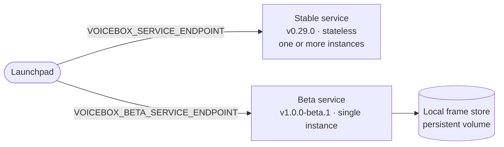
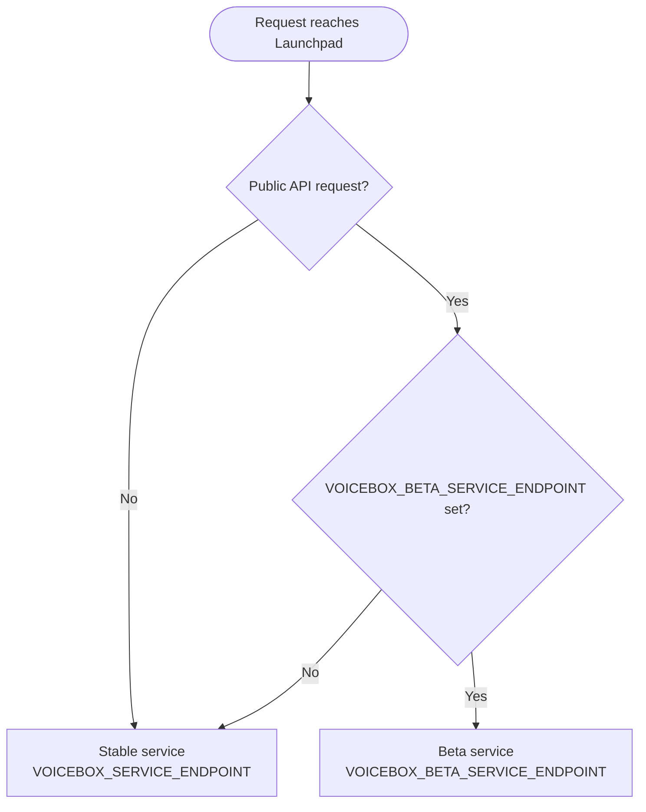

# Deploying the Voicebox Service (Public API Beta)

> [!IMPORTANT]
> **Applies to:** Launchpad v3.11.0+ · Voicebox Service `v1.0.0-beta.1` (beta)
>
> Routing public API traffic to the beta service requires **Launchpad v3.11.0 or later** - earlier versions have no `VOICEBOX_BETA_SERVICE_ENDPOINT` routing, so the beta service receives no traffic.

A practical guide for deploying the Voicebox Service that powers the Launchpad beta: what the frame store is, what changes versus a stateless service, what you need to set, and what logs to watch.

> [!NOTE]
> The beta runs on a dedicated **beta** build of the Voicebox Service, tagged `v1.0.0-beta.1`. It is internal only and intended to be temporary while the beta is in progress. The **stable** service (the `0.x` line, currently `v0.29.0`) is unaffected by everything in this guide.

## Background

The beta Voicebox Service produces **frames**: the tabular results of the queries it runs against Stardog to answer a conversation turn. It persists them so a later turn can reuse a previous result without re-querying Stardog. Frames are written as snappy-compressed Parquet files on local disk, one file per frame, laid out as `{frame_store_path}/{conversation_id}/{frame_id}.parquet`.

Conversation memory is separate from frames. Launchpad resends the conversation lineage on every turn, so the server holds no per-conversation memory between turns. The practical upshot is that **frames are an optimization, not a source of truth**. If a frame is missing (disk full, volume lost, expired), the service recomputes it from Stardog. Nothing is corrupted; you pay recompute time.

### Beta Deployment Shape

The beta runs **two Voicebox Service deployments side by side from the same image at different tags**:

- **stable** (the `0.x` line, currently `v0.29.0`): the existing service serving today's Voicebox endpoints. Runs as one or more instances and keeps no local frame store.
- **beta** (`v1.0.0-beta.1`): the new service. It persists result frames to local disk, so it runs as a **single instance**, and for the beta serves public API requests only.

Both are internal only. Launchpad talks to each through its own endpoint:

| | stable (`v0.29.0`) | beta (`v1.0.0-beta.1`) |
| :--- | :--- | :--- |
| Instances | one or more | exactly 1 (local-disk store) |
| Persisted results | none (recomputed from Stardog) | local frame store on a volume |
| Traffic | default Voicebox traffic | public API requests (when endpoint is set) |

### How Traffic Is Routed

Launchpad routes **per request**. A request only reaches the beta service when it is a public API request *and* `VOICEBOX_BETA_SERVICE_ENDPOINT` is set. Everything else falls back to the stable service, so leaving the endpoint unset simply means all traffic keeps flowing to stable:

This is not a new public API. The endpoints and response format are unchanged - the beta only swaps the backend service that handles these existing public API requests, so no client changes are needed.

The practical upshot: the beta is opt-in and safe to leave unconfigured. Until you set `VOICEBOX_BETA_SERVICE_ENDPOINT`, the beta service receives no traffic.

The rest of this guide covers the **beta service**, which carries the storage requirements.

## What Changes Versus a Stateless Deployment

- **A persistent volume is now required.** Frames must outlive container restarts, so mount a volume at the frame store path. Without it, frames land in the container's writable layer and vanish on restart (the service still works, it just re-fetches from Stardog).
- **It runs as a single instance.** Its store is the pod's own disk; a second replica would read an empty store. The stable service scales normally.
- **Eviction is built in.** A background sweeper deletes frames older than a TTL (7 days by default) and reaps orphaned `.tmp` files after 1 hour. No external cron or cleanup job is needed.
- **Disk-full is non-fatal.** When the volume fills, the user still gets their answer; the frame just isn't written and a `local_disk.disk_full` warning is logged. Recover by growing the volume or lowering the TTL.
- **A readiness endpoint exists.** `GET /system/storage-ready` reports whether the frame path is actually writable, so a bad mount surfaces at startup rather than at first query.

## Configuration

> [!NOTE]
> This section covers **only** the storage settings the beta adds. Everything else about running the Voicebox Service is unchanged: the `vbx-config.json` configuration file, the supported LLM providers (Azure AI, AWS Bedrock, OpenAI, Anthropic, Databricks, Vertex AI, Fireworks), and the standard environment variables all still apply. See [Voicebox Service Configuration](../voicebox.md#configuration) and the [Voicebox Configuration File](../voicebox.md#voicebox-configuration-file) reference.

### Required: mount a volume

Mount a writable volume at the frame store path (default `/var/lib/voicebox/frames`):

- **Docker (named volume):** Mount it at the frame store path. The image pre-creates that directory owned by the non-root container user, and a named volume inherits that ownership, so no extra steps are needed. Prefer a named volume over a bind mount.
- **Kubernetes:** Use a single-replica deployment with a `ReadWriteOnce` persistent volume mounted at the frame store path, a `Recreate` update strategy, and a security context that makes the mount writable by the non-root container user.

### Commonly Tuned Settings

Most deployments only touch these. Leave the rest at their defaults.

| Environment Variable | Default | When to change |
| :--- | :--- | :--- |
| `VOICEBOX_FRAME_STORE_LOCAL_TTL_DAYS` | `7` | Lower on a small volume to reclaim disk faster; raise for longer-lived conversations. Must be `> 0` while the sweeper is enabled. |
| `VOICEBOX_FRAME_STORE_SWEEPER_ENABLED` | `true` | Set to `false` to disable the background eviction sweeper entirely. |
| `VOICEBOX_FRAME_STORE_LARGE_FRAME_WARN_MB` | `10` | Lower for earlier oversized-frame warnings; `0` disables them. |

> [!TIP]
> **Sizing.** Rough disk need is `avg frame size × frames per turn × turns per day × TTL days`. 20 GB is a comfortable start for a small team at the 7-day default. Use the `frame_store.capacity` log (below) to trend real usage and resize from data.

## Health and Readiness Probes

- **Liveness:** `GET /system/health` (returns `204`).
- **Readiness:** `GET /system/storage-ready` (`200` when the frame path is writable, `503` otherwise).

Keep the disk-writability check on **readiness**, not liveness, so a transient full disk pulls the instance from traffic instead of restarting it into a crash loop.

## Log Events

Logs are emitted as structured JSON when `LOG_TYPE=JSON` (the default): each line is a JSON object keyed by an `event` field, so you can alert on the event name.

| Event | Level | Meaning / action |
| :--- | :--- | :--- |
| `local_disk.disk_full` | `WARNING` | A write ran out of disk space. Users still get answers; frames aren't persisting. Carries `disk_free_bytes` / `disk_total_bytes`. **Alert.** Grow the volume or shorten the TTL. |
| `frame_store.capacity` | `INFO` | Periodic volume telemetry: `disk_free_bytes`, `disk_total_bytes`, `file_count`. Alert proactively when free space drops below a threshold (for example 15 percent). |
| `frame_store.readiness` | `WARNING` (`ready=false`) / `INFO` (`ready=true`) | Frame path writability changed. `ready=false` means a missing or unwritable mount. **Alert on `ready=false`.** Carries `path`, `detail`. |
| `local_disk.large_frame` | `WARNING` | A single frame exceeded the warn threshold. Carries `size_bytes` / `threshold_bytes`. Informational; a spike can signal runaway result sizes. |
| `frame_store_sweep.cycle` | `INFO` | A sweep pass finished: `scanned`, `deleted`, `skipped_recent`, `tmp_deleted`, `errors`, `elapsed_ms`. Watch `errors` and `elapsed_ms`. |
| `voicebox_backends` | `INFO` | Startup banner: resolved backends, frame path, and `frame_local_writable`. Use it to confirm your config and mount took effect. |

The readiness monitor logs only on a **change**, so a healthy service stays quiet; a single `ready=false` is the signal that something changed.
