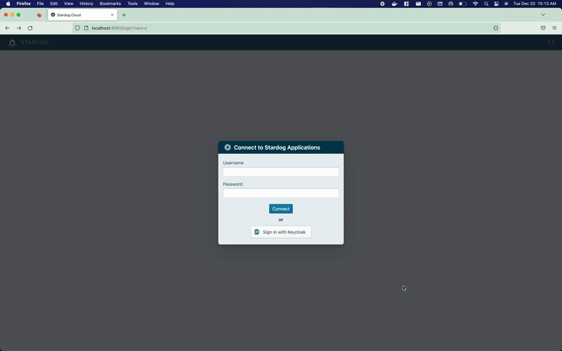
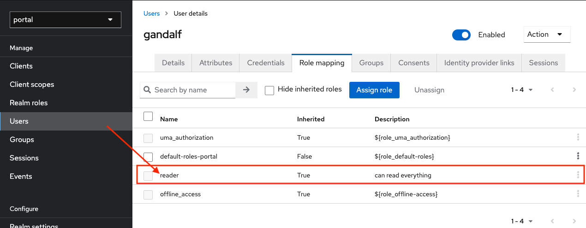
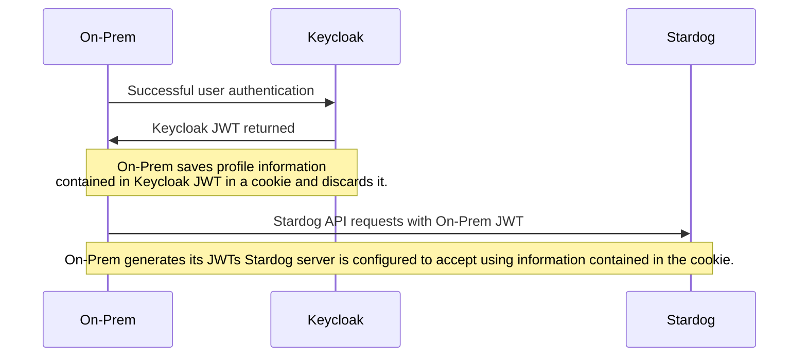
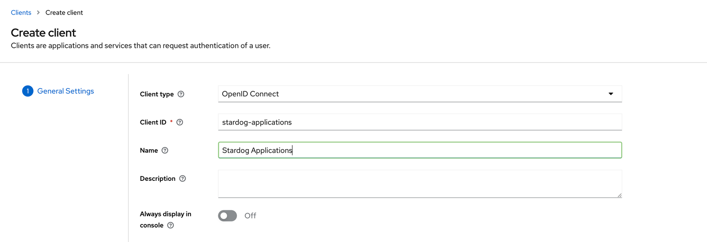
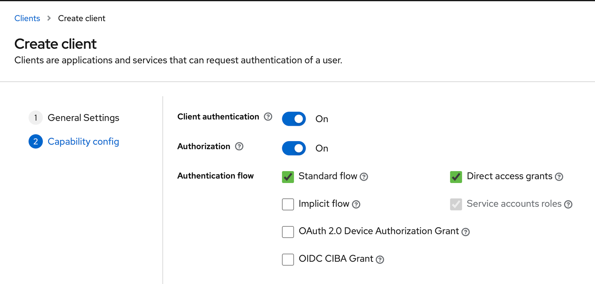
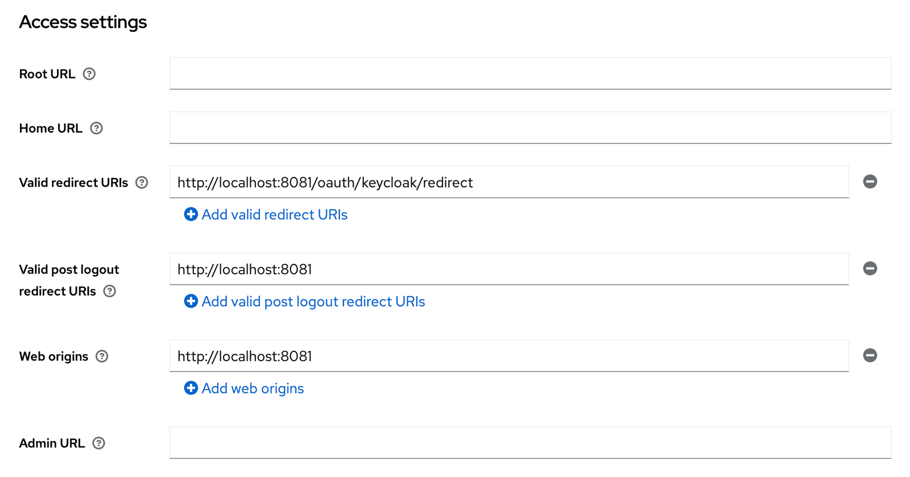
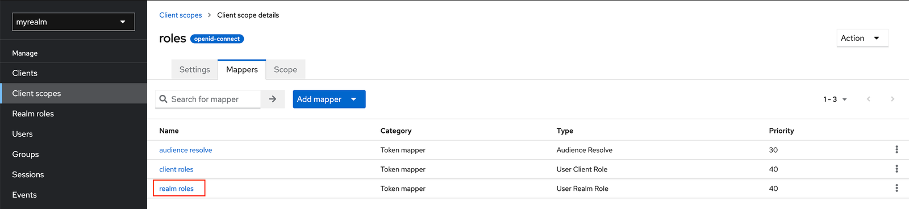
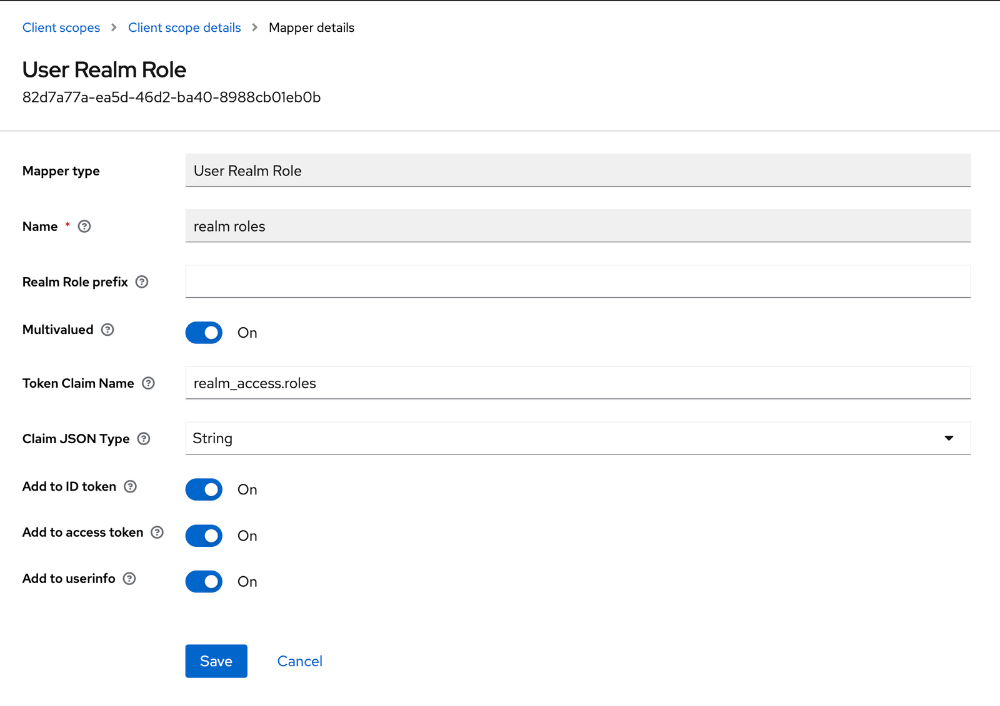
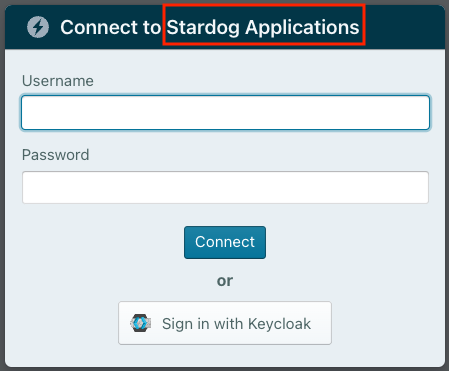

# Keycloak Example

The purpose of this example is to demonstrate how to deploy and configure On-Prem to allow users to sign in with [Keycloak](https://www.keycloak.org/) and access the configured Stardog server via Stardog Applications.



This integration is built on top of the Stardog Platform’s [Role Mapping](https://docs.stardog.com/operating-stardog/security/oauth-integration#role-mapping) feature as part of its OAuth 2.0 integration. As long as users in Keycloak are assigned roles that match pre-defined ones in Stardog, the users will be auto-created in Stardog and assigned permissions that correspond to their role assignment(s). This allows an administrator to have a single source of truth for managing the roles (and thus permissions) of a user since auto-created users cannot be explicitly assigned permissions.

```bash
$ stardog-admin role list
+--------+
|  Role  |
+--------+
| reader |
| writer |
+--------+
```



## How This Works

1. A user clicks the "Sign in with Keycloak" button during login
2. If the user successfully authenticates they are redirected the On-Prem home page where they can enter the Stardog Apps.
   > **Note**:
   > In order for the Keycloak user signing in to On-Prem to be auto-created in Stardog, the user must be assigned to a Keycloak role that is pre-defined in Stardog with the same name.

At a high level, when a user authenticates with Keycloak, a JWT is exchanged between Keycloak and On-Prem. On-Prem gets information from the Keycloak JWT (notably the user's email and roles) and discards it. This information contained in the Keycloak JWT is then used by On-Prem to encode the JWT tokens it issues to communicate with the Stardog server. In order for this flow to work, the Stardog server must be configured to accept JWT tokens issued by On-Prem.

Diagram demonstrating the flow described above:



## Prerequisites

- Docker installed
- Docker Compose installed
- A configured [Keycloak OpenID Connect client](https://www.keycloak.org/docs/latest/server_admin/#con-oidc_server_administration_guide). See [Setting up the Keycloak OpenID Connect Client](#setting-up-the-keycloak-openid-connect-client) for more details on configuration required.
- A Stardog server running locally on port `5820`. See [Stardog Server Requirements](#stardog-server-requirements) for additional info.

  > **Note**:
  > If you have a Stardog server running elsewhere (locally or not), this is fine, just modify the `STARDOG_INTERNAL_ENDPOINT` and `STARDOG_EXTERNAL_ENDPOINT` in the [`.env`](.env) file as needed.

### Setting up the Keycloak OpenID Connect Client

Below are steps with screenshots to create a Keycloak OpenID Connect Client.

1. In the Keycloak administration panel, create a new [OpenID Connect client](https://www.keycloak.org/docs/latest/server_admin/#con-oidc_server_administration_guide) with the settings below:





2. Once the client is created, configure these additional settings:

- Under **Settings > Access Settings**

| **Setting**                     | **Value**                            |
| :------------------------------ | :----------------------------------- |
| Valid redirect URIs             | `<BASE_URL>/oauth/keycloak/redirect` |
| Valid post logout redirect URIs | `<BASE_URL>`                         |
| Web Origins                     | `<BASE_URL>`                         |



- Under **Client Scopes > roles > Client Scope Details**, switch to the **Mappers** tab. Select the **realm roles** mapper.



- Ensure the following settings are set. These are the default:

  

  > **Note**:
  > By default, On-Prem expects the `realm_access.roles` claim to be included in the **ID token**. This can be configured with the `KEYCLOAK_TOKEN_ROLES_CLAIM` environment variable. See [Configuring the ID Token Role Claim](#configuring-the-id-token-role-claim) for additional details.
  >
  > Example Keycloak ID token with `realm_access.roles` claim:
  >
  > ```json
  > {
  >   "exp": 1678894749,
  >   "iat": 1678894449,
  >   "auth_time": 1678894448,
  >   "jti": "71ed7f0e-64db-4cfa-86a4-e89c05cb365f",
  >   "iss": "http://35.90.111.82:8080/realms/portal",
  >   "realm_access": {
  >       "roles": [
  >         "reader",
            "writer"
  >       ]
  >    },
  >   "scope": "openid profile email",
  >   ...more claims
  > }
  > ```

### Stardog Server Requirements

- Stardog server must be v7.8 or above
- The following setting should be set in the Stardog’s server’s [`stardog.properties`](https://docs.stardog.com/operating-stardog/server-administration/server-configuration#stardogproperties) you want to authenticate against.

  ```properties
  jwt.disable=false
  ```

  > **Note**:
  > By default this property is set to `false`, so you can likely omit this.

- The JWT configuration for the Stardog server needs to be customized. To provide a configuration file for JWT configuration to stardog set the following property in the `stardog.properties` file:

```properties
jwt.conf=/path/to/jwt.yaml
```

The `jwt.conf` property must point to a vaid YAML file. More information about the schema the YAML file should adhere to can be found in the [Stardog docs](https://docs.stardog.com/operating-stardog/security/oauth-integration#configuring-stardog). For Stardog to accept tokens issued by On-Prem the following section must be added to the `issuers` section in the config file.

```yaml
issuers:
  <JWT_ISSUER>:
    usernameField: username
    audience: <STARDOG_EXTERNAL_ENDPOINT>
    algorithms:
      RS256:
        keyUrl: <BASE_URL>/.well-known/jwks.json
    autoCreateUsers: True
    allowedGroupIdentifiers:
      - keycloakRoles
```

- Be sure to replace `<JWT_ISSUER>`,`<STARDOG_EXTERNAL_ENDPOINT>` and `<BASE_URL>` with the values set in the [`.env`](./.env) file.

  > **Note**:
  > `JWT_ISSUER` by default is set to the value of `BASE_URL`. There is no need to provide the `JWT_ISSUER` environment variable if you are fine using the default.

## Run the Example

1. Execute the following command from this directory to bring up the On-Prem service.

   ```
   docker-compose up
   ```

2. Visit [http://localhost:8080](http://localhost:8080) in your browser.

3. Click the "Sign in with Keycloak" button.

> **Note**:
> The user you are signing in with via Keycloak must be assigned a role with permissions that is pre-defined in the Stardog server with a username of the email of the account you are signing in with.
>
> To add a role and grant permissions to it using the Stardog CLI:
>
> ```bash
> $ stardog-admin role add writer
> Successfully added role writer.
>
> $ stardog-admin role grant -a "write" -o "*:*" writer
> Successfully granted the permission.
> ```
>
> See [Managing Users and Roles](https://docs.stardog.com/operating-stardog/security/managing-users-and-roles#create-a-role) in the Stardog Docs for additional information on how to create roles.

## About the Example

In the example's [configuration](./.env):

- `KEYCLOAK_AUTH_ENABLED` enables Keycloak authentication.
  - `KEYCLOAK_CLIENT_ID` is the Keycloak OpenID Connect Client ID of the client being used for authentication.
  - `KEYCLOAK_CLIENT_SECRET` is the client secret for the KEYCLOAK Oauth 2.0 Client being used for authentication.
  - `KEYCLOAK_ENDPOINT` is the URL of the Keycloak server
  - `KEYCLOAK_REALM` is the realm the client is located in
- `JWK_LOCATION` is the location inside the Docker container where a public/private key pair should be. Note how in the [`docker-compose.yml`](./docker-compose.yml) a volume containing an RSA public/private key pair is mounted. There is a `README` contained in the [`jwk`](./jwk) directory containing instructions on how to generate a new public/private key pair. The private key is used by the application to sign JWTs, which will be sent for Stardog API requests. The public key is used by the Stardog server to verify the tokens sent by the application.
- The image is being run and used locally for demo purposes. `BASE_URL` is set to `http://localhost:8080`. As a result, `SECURE` is set to `false` since the `BASE_URL` is a non-https URL. The login service assumes `https` and will not work properly without this flag being set to false. Port `8080` is used in the `BASE_URL` because it is mapped to the container's port `8080` in the `ports` section of the [`docker-compose.yml`](docker-compse.yml). If the container's port `8080` was mapped to port `9000` on the Docker host, `BASE_URL` would be set equal to `http://localhost:9000`
- `STARDOG_EXTERNAL_ENDPOINT` is set to `http://localhost:5820`. This is the address your browser will make Stardog API requests to.
- `STARDOG_INTERNAL_ENDPOINT` is set to `http://host.docker.internal:5820`. This is the address the on-prem container will make Stardog API requests to. This is required in this case in order for the Docker container to distinguish between what's running on the Docker host and the container itself. See the [Docker documentation](https://docs.docker.com/desktop/networking/#i-want-to-connect-from-a-container-to-a-service-on-the-host) for additional information.

  > **Note:**
  > If you have a Stardog server running remotely, set the `STARDOG_INTERNAL_ENDPOINT` to the same value as `STARDOG_EXTERNAL_ENDPOINT` in the [`.env`](.env) file.

- `PASSWORD_AUTH_ENABLED` is set to `true`. This allows users to provide a Stardog username and password for authentication in the login dialog. This is actually the default setting, but is included here for completeness.
- `COOKIE_SECRET` is set to `some-secret`. In production, this should actually be set to something secure and much more random. This secret is used to sign cookies used by the application.
- `FRIENDLY_NAME` is set to `Stardog Applications`. This is just optional text to display to the user on the login dialog. This text will be inserted after `Connect to`.

  

## Configuring the ID Token Role Claim

The environment variable `KEYCLOAK_TOKEN_ROLES_CLAIM` can be used to override the location in which On-Prem will search for the authenticating user's roles in the Keycloak ID token. By default, On-Prem will search in `realm_access.roles`

The Keycloak docs describe the token claim syntax with the following description:

> Name of the claim to insert into the token. This can be a fully qualified name like 'address.street'. In this case, a nested json object will be created. To prevent nesting and use dot literally, escape the dot with backslash (.).

On-Prem uses this same syntax for the `KEYCLOAK_TOKEN_ROLES_CLAIM`.

For example, suppose `KEYCLOAK_TOKEN_ROLES_CLAIM` was set to `the.best.roles` - On-Prem would expected the roles to be contained in the ID token like:

```json
{
  "exp": 1678894749,
  "iat": 1678894449,
  "auth_time": 1678894448,
  "jti": "71ed7f0e-64db-4cfa-86a4-e89c05cb365f",
  "iss": "http://35.90.111.82:8080/realms/portal",
  "the": {
      "best": {
          "roles": [
                "reader",
                "writer"
           ]
       },
   },
  "scope": "openid profile email",
  ...more claims
}
```

Here's another example where the escape syntax (`\.`) is used. Suppose `KEYCLOAK_TOKEN_ROLES_CLAIM` was set to `stardog\.com.great\.roles` - On-Prem would expected the roles to be contained in the ID token like:

```json
{
  "exp": 1678894749,
  "iat": 1678894449,
  "auth_time": 1678894448,
  "jti": "71ed7f0e-64db-4cfa-86a4-e89c05cb365f",
  "iss": "http://35.90.111.82:8080/realms/portal",
  "stardog.com": {
      "great.roles": [
            "reader",
            "writer"
       ]
   },
  "scope": "openid profile email",
  ...more claims
}
```

## Stardog API and Keycloak

If you access your Stardog server using its [HTTP API](https://stardog-union.github.io/http-docs/), you can also use tokens obtained from Keycloak to authenticate and authorize your API calls.

Continuing the example above, add another issuer to the jwt.yaml file that we use when configuring the Stardog server to accept signed tokens from Keycloak. This time we configure the Keycloak server as a token issuer:

```yaml
issuers:
  <ON-PREM_ISSUER_FROM_ABOVE>

  <KEYCLOAK_REALM_URL>:
    usernameField: preferred_username
    rolesField: realm_access
    audience: account
    algorithms:
      RS256:
        keyUrl: <KEYCLOAK_REALM_URL>/protocol/openid-connect/certs
    autoCreateUsers: True
    allowedGroupIdentifiers:
      - roles
```

In this case, `<KEYCLOAK_REALM_URL>` is the address of your Keycloak server and realm (e.g., `https://<IP>:<PORT>/realms/<REALM>`). Depending on how you have configured Keycloak to generate tokens, you may need to adjust the `usernameField` and `audience` values.

After making this change, you will need to restart your Stardog server for the change to take effect.
