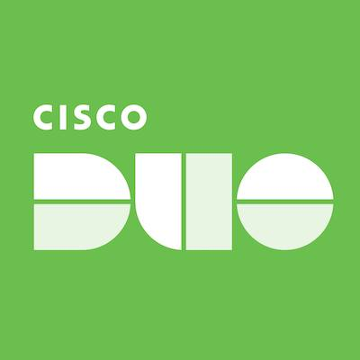

# Duo Configuration



Duo can be used as a login provider to authenticate users into Launchpad using OpenID Connect (OIDC).

## Login Provider Configuration

The following configuration options are available for Duo login provider.

> [!NOTE]
> See [How to Setup an OIDC App in Duo](#how-to-setup-an-oidc-app-in-duo) for instructions on creating a Duo OIDC application for Launchpad login.

### `DUO_AUTH_ENABLED`

The `DUO_AUTH_ENABLED` is used to enable or disable Duo authentication to log users into Launchpad.

- **Required:** Yes (if using Duo)
- **Default:** `false`

### `DUO_CLIENT_ID`

The `DUO_CLIENT_ID` is the client ID from your Duo OIDC application used to sign users into Launchpad.

- **Required:** Yes (if using Duo)
- **Default:** not set

### `DUO_CLIENT_SECRET`

The `DUO_CLIENT_SECRET` is the client secret from your Duo OIDC application used to sign users into Launchpad.

- **Required:** Yes (if using Duo)
- **Default:** not set

### `DUO_DISCOVERY_URL`

The `DUO_DISCOVERY_URL` is the OpenID Connect discovery URL for your Duo application. 

- **Required:** Yes (if using Duo)
- **Default:** not set

### Example Configuration

```bash
##########
DUO_AUTH_ENABLED=true
DUO_CLIENT_ID=<your_client_id>
DUO_CLIENT_SECRET=<your_client_secret>
DUO_DISCOVERY_URL=https://some-url/.well-known/openid-configuration
```

## How to Setup an OIDC App in Duo

1. **Create a Duo Account**
   - If you don't already have a Duo account, create a trial account at [duo.com](https://duo.com)
   - Log in to the Duo Admin Panel

2. **Create OIDC Application**
   - Navigate to **Applications** > **Application Catalog** in the Duo Admin Panel
   - Search for and select **Generic OIDC Relying Party**
   - Click **Add**

3. **Configure Application Settings**
   - **Application name**: Enter a descriptive name (e.g., "Stardog Launchpad")
   - **Grant types**: Ensure **Authorization Code** is selected
   - **Scopes**: Grant the following scopes:
     - `openid`
     - `profile`
     - `email`

4. **Set Redirect URI**
   - **Sign-in redirect URI**: `{BASE_URL}/oauth/duo/redirect`
   - Replace `{BASE_URL}` with your Launchpad base URL (e.g., `http://localhost:8080/oauth/duo/redirect`)
   - See [`BASE_URL`](../README.md#base_url) for more information

5. **Collect Configuration Values**
   - **Client ID**: Found in the application details
   - **Client Secret**: Found in the application details
   - **Discovery URL**: Found in the application details. It should have the route `/.well-known/openid-configuration` appended to the base URL, e.g., `https://api-123456.duosecurity.com/.well-known/openid-configuration`
6. **Configure Launchpad Environment Variables**

   ```bash
   DUO_AUTH_ENABLED=true
   DUO_CLIENT_ID=<client_id>
   DUO_CLIENT_SECRET=<client_secret>
   DUO_DISCOVERY_URL=<discovery_url>
   ```

> [!NOTE]
> For more detailed information about configuring OIDC applications in Duo, see the [Duo documentation](https://duo.com/docs/sso-oidc-generic#create-your-cloud-application-in-duo).

