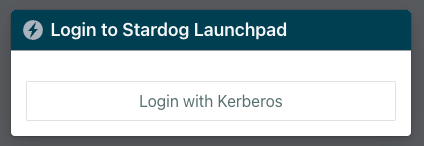
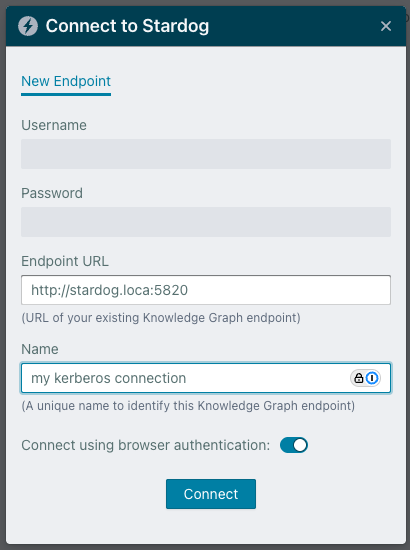

# Kerberos Configuration


Kerberos can be used as a login provider to authenticate users into Launchpad. Kerberos does not currently support SSO connections to Stardog endpoints.

## Login Provider Configuration

The following configuration options are available to use Kerberos authentication to log users into Launchpad. When users are successfully authenticated with Kerberos, they will be logged into Launchpad without needing to enter any credentials. Their username will be derived from the Kerberos principal name used to authenticate.

### `KERBEROS_AUTH_ENABLED`

The `KERBEROS_AUTH_ENABLED` is used to enable or disable Kerberos authentication to log users into Launchpad.

- **Required:** Yes (if using Kerberos)
- **Default:** `false`

### `KERBEROS_KEYTAB`

The `KERBEROS_KEYTAB` is the path (in the Docker container) to the Kerberos keytab file used to authenticate users with Kerberos. The keytab file should contain the credentials for the Kerberos service principal (e.g. `HTTP/launchpad-hostname@<REALM>`) that will be used to authenticate users.

- **Required:** Yes (if using Kerberos)
- **Default:** not set

### How to Configure Kerberos Authentication in Launchpad

Kerberos authentication provides secure, single sign-on access to Launchpad and connected Stardog endpoints without requiring users to enter credentials repeatedly.

1. Create the Launchpad service principal.

In a `kadmin` shell, run the following command to create the service principal:

```bash
addprinc -randkey HTTP/<launchpad-hostname>@<REALM>
```

> [!IMPORTANT]
> Replace `<launchpad-hostname>` with the hostname of the server where Launchpad is running (should match [`BASE_URL`](../README.md#base_url)), and `<REALM>` with your Kerberos realm (e.g. `MYCOMPANY.COM`).

2. Create a keytab file for the Launchpad service principal. This keytab file will be used to authenticate users with Kerberos.

```bash
ktadd -k /path/to/launchpad-mount/launchpad.keytab HTTP/<launchpad-hostname>@<REALM>
```

3. Configure Launchpad

Add the following environment variable to your Launchpad configuration:
```bash
KERBEROS_AUTH_ENABLED=true
KERBEROS_KEYTAB=/kerberos-config/launchpad.keytab
```

> [!NOTE]
> The `KERBEROS_KEYTAB` should point to the keytab file in the Docker container. It needs to mounted to the container at the path specified in the environment variable. For example, if you are using Docker, you can mount the keytab file to the container using the `-v` flag:
>
>```bash
>docker run \
>  --env-file /path/to/launchpad/.env.launchpad \
>  -p 8080:8080 \
>  -v /path/to/launchpad/data:/data \
>  -v /path/to/launchpad-mount/launchpad.keytab:/kerberos-config/launchpad.keytab \
>  stardog/launchpad:<tag>
>```

4. Configure your browser to negotiate Kerberos authentication with Launchpad. 
This step is browser-specific and involves adding the Launchpad URL to the list of trusted sites for Kerberos authentication. You may need to restart your browser after making these changes.

   **Firefox**
   - Navigate to about:config
   - Modify these settings:
      - `network.negotiate-auth.trusted-uris`: Add the value set for [`BASE_URL`](../README.md#base_url)
      - `network.negotiate-auth.delegation-uris`: Add the value set for [`BASE_URL`](../README.md#base_url)
   - Restart Firefox for changes to take effect

   **Chrome**

   This varies between operating systems. On macOS, run the following commands in a terminal to add the Launchpad URL to the list of trusted sites for Kerberos authentication:
   ```bash
   defaults write com.google.Chrome AuthServerAllowlist "your-launchpad-url.com"
   defaults write com.google.Chrome AuthNegotiateDelegateAllowlist "your-launchpad-url.com"
   ```
   - Restart Chrome for changes to take effect

>[!NOTE]
> If you are using a different browser, please refer to the browser's documentation on how to configure Kerberos authentication. Most (if not all) browsers by default do not allow Kerberos authentication for arbitrary URLs, so you must configure the browser to trust your Launchpad URL.

5. Obtain a Kerberos ticket for a regular user account.

This may involve running the `kinit` command in a terminal, or using a Kerberos client application to obtain a ticket.

```bash
kinit <username>@<REALM>
```

6. Access Launchpad and click on the **"Login with Kerberos"** button. You should be automatically logged in.


7. Connect to Stardog endpoints using Kerberos authentication.
   
   a. Ensure the user account has access to your Stardog endpoints and that your browser is configured to trust those endpoint URLs for Kerberos authentication.
   
   b. In Launchpad, click **"Add an Endpoint"**.
   
   c. Toggle the **Connect using browser authentication** switch. This will use the Kerberos ticket you obtained earlier to authenticate with the Stardog endpoint.



### Troubleshooting

**Authentication fails:**
- Verify your Kerberos ticket is valid by running `klist`
- Ensure the browser is configured to trust the Launchpad URL
- Check that the service principal was created correctly
- Confirm the keytab file is accessible by the Launchpad container
