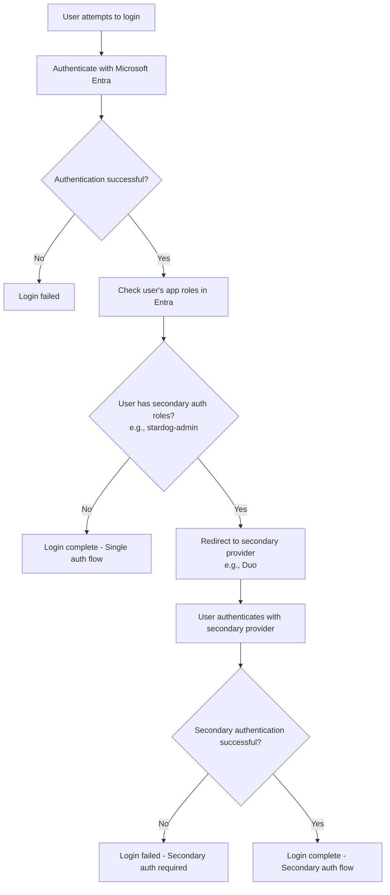
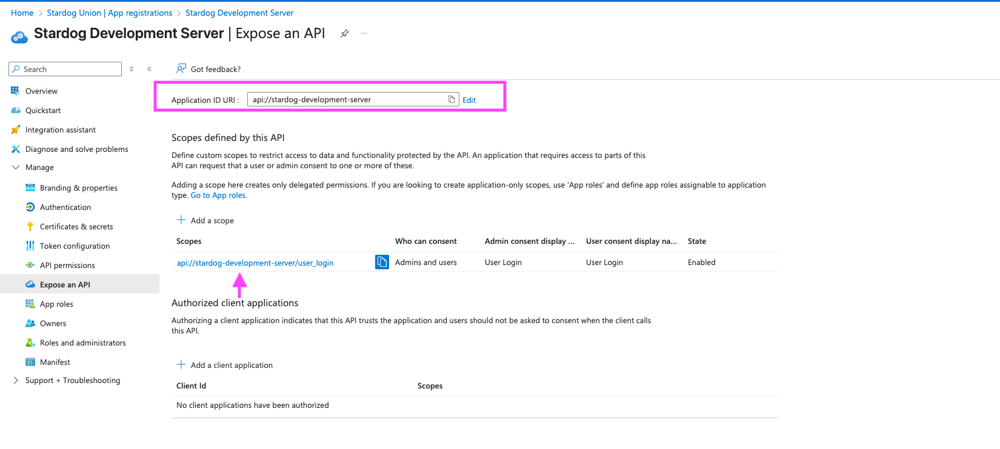

# Microsoft Entra Configuration


Microsoft Entra can be used both as a login provider to authenticate users into Launchpad and as an SSO connection provider to authenticate users against Stardog endpoints.

## Table of Contents

- [Login Provider Configuration](#login-provider-configuration)
- [SSO Connection Configuration](#sso-connection-configuration)
  - [Interactive (Traditional) SSO Connections](#interactive-traditional-sso-connections)
  - [On-Behalf-Of (OBO) Flow SSO Connections](#on-behalf-of-obo-flow-sso-connections)
- [How To Create an Entra App Registration to login with Microsoft Entra in Launchpad](#how-to-create-an-entra-app-registration-to-login-with-microsoft-entra-in-launchpad)
- [Setting up Interactive (Traditional) Microsoft Entra SSO Connections](#setting-up-interactive-traditional-microsoft-entra-sso-connections)
- [Setting up On-Behalf-Of (OBO) Flow SSO Connections](#setting-up-on-behalf-of-obo-flow-sso-connections) *(Available in Launchpad v3.4.0+)*

## Login Provider Configuration

The following configuration options are available for Microsoft Entra login provider.

> [!NOTE]
> See [How to Create an Entra App Registration to Login with Microsoft Entra in Launchpad](#how-to-create-an-entra-app-registration-to-login-with-microsoft-entra-in-launchpad) for instructions on 
> how to create an Entra App Registration to login with Microsoft Entra in Launchpad.

### `AZURE_AUTH_ENABLED`

The `AZURE_AUTH_ENABLED` is used to enable or disable Microsoft Entra authentication to log users into Launchpad.

- **Required:** Yes (if using Microsoft Entra)
- **Default:** `false`

### `AZURE_CLIENT_ID`

The `AZURE_CLIENT_ID` is the client id of the Entra App Registration used to sign users into Launchpad.

- **Required:** Yes (if using Microsoft Entra)
- **Default:** not set

### `AZURE_CLIENT_SECRET`

The `AZURE_CLIENT_SECRET` is the client secret of the Entra App Registration used to sign users into Launchpad.

> [!NOTE]
> This should be used if not using a client certificate (`AZURE_CLIENT_CERTIFICATE_FILE` or `AZURE_CLIENT_CERTIFICATE_THUMBPRINT`).

- **Required:** Yes (if using Microsoft Entra)
- **Default:** not set

### `AZURE_TENANT`

The `AZURE_TENANT` is the tenant id of the Entra App Registration used to sign users into Launchpad.

- **Required:** Yes (if using Microsoft Entra)
- **Default:** `organizations`


### `AZURE_CLIENT_PRIVATE_KEY_FILE`

The `AZURE_CLIENT_PRIVATE_KEY_FILE` is the path (in the Docker container) to the private key file corresponding to the certificate used as a credential with Entra App Registration;

> [!NOTE]
> This should be used if not using a client secret (`AZURE_CLIENT_SECRET`). The private key must **not** be password protected.

- **Required:** Yes (if using client certificate with Microsoft Entra)
- **Default:** not set

### `AZURE_CLIENT_CERTIFICATE_FILE`

The `AZURE_CLIENT_CERTIFICATE_FILE` is the path (in the Docker container) to the certificate file used as a credential with the Entra App Registration. 

> [!NOTE]
> This should be set if `AZURE_CLIENT_CERTIFICATE_THUMBPRINT` not specified.

- **Required:** Yes (if using client certificate with Microsoft Entra and not using `AZURE_CLIENT_CERTIFICATE_THUMBPRINT`)
- **Default:** not set

### `AZURE_CLIENT_CERTIFICATE_THUMBPRINT`

Thumbprint of the certificate used as a credential with the Entra App Registration. 

> [!NOTE]
> This should be set if `AZURE_CLIENT_CERTIFICATE_FILE` not specified)

- **Required:** Yes (if using client certificate with Microsoft Entra and not using `AZURE_CLIENT_CERTIFICATE_FILE`)
- **Default:** not set

### `AZURE_GOV_CLOUD_US`

The `AZURE_GOV_CLOUD_US` is used to set the Azure cloud environment to the Azure US Government Cloud.

- **Required:** Yes (if using Azure US Government Cloud)
- **Default:** `false`

### `AZURE_AUTH_BASE_URL`

The `AZURE_AUTH_BASE_URL` is used to set the base URL for Microsoft Entra. This is the URL that users will use to authenticate with Microsoft Entra.

> [!NOTE]
> If `AZURE_GOV_CLOUD_US` is set to `true`, this will be automatically set to `https://login.microsoftonline.us`

- **Required:** No
- **Default:** `https://login.microsoftonline.com`

### `AZURE_GRAPH_BASE_URL`

The `AZURE_GRAPH_BASE_URL` is used to set the base URL for the Microsoft Graph API. This is used to retrieve user information from Microsoft Entra.

> [!NOTE]
> If `AZURE_GOV_CLOUD_US` is set to `true`, this will be automatically set to `https://graph.microsoft.us`

- **Required:** No
- **Default:** `https://graph.microsoft.com`

### `AZURE_ON_BEHALF_OF_USER_FLOW_ENABLED`

The `AZURE_ON_BEHALF_OF_USER_FLOW_ENABLED` option enables the [Entra OAuth 2.0 On-Behalf-Of (OBO) flow](https://learn.microsoft.com/en-us/entra/identity-platform/v2-oauth2-on-behalf-of-flow) for all Azure SSO connections. The OBO flow means that once you log in to Launchpad with the Azure login provider, you can then authenticate to SSO connections automatically without additional login prompts. When enabled, users authenticate once via Azure and gain non-interactive access to all connected Stardog instances without interactive sign-in prompts for individual connections.

> [!IMPORTANT]
> Before enabling this flag, ensure you have completed the Microsoft Entra setup required for the OBO flow, as it depends on properly configured API permissions and exposed scopes between your Launchpad and Stardog app registrations. See [Setting up On-Behalf-Of (OBO) Flow SSO Connections](#setting-up-on-behalf-of-obo-flow-sso-connections) for detailed configuration instructions.

**When enabled (`true`):**
- All Azure SSO connections automatically use the OBO flow
- Users authenticate once via logging into Launchpad and gain non-interactive access to all connected Stardog instances
- Interactive sign-in prompts for individual connections are eliminated
- Client secrets are not required for SSO connections
- Requires corresponding Entra app registration changes (see [Setting up On-Behalf-Of (OBO) Flow SSO Connections](#setting-up-on-behalf-of-obo-flow-sso-connections))

> [!NOTE]
> SSO connection registrations and environment variables are still required - OBO eliminates interactive prompts, not the underlying SSO connection setup

**When disabled (`false`, default):**
- Maintains existing behavior where users interactively sign into each Azure SSO connection
- Client secrets are required for each SSO connection
- No additional Entra configuration required
- Provides backward compatibility for existing deployments

This configuration applies globally to all Azure SSO connections within the Launchpad instance.

- **Required:** No
- **Default:** `false`

### Secondary Authentication Provider

Launchpad's Entra login provider supports using a secondary authentication provider for users with specific app roles. This feature allows you to require certain users to authenticate with an additional provider (such as Duo) after successfully authenticating with Microsoft Entra, providing an extra layer of security.

#### `AZURE_SECONDARY_AUTH_PROVIDER`

The `AZURE_SECONDARY_AUTH_PROVIDER` specifies which secondary authentication provider to use. When a user with the required app roles logs in with Microsoft Entra, they will be redirected to authenticate with this secondary provider.

> [!IMPORTANT]
> Only OIDC (OpenID Connect) providers can be used as secondary authentication providers.

Supported secondary OIDC providers:
- `duo`
- `okta` 
- `ping`
- `google`

> [!NOTE]
> When a provider is configured as a secondary auth provider for Azure, it can no longer be used as a primary login provider.

- **Required:** No
- **Default:** not set

#### `AZURE_SECONDARY_AUTH_ROLES`

The `AZURE_SECONDARY_AUTH_ROLES` is a comma-separated list of app roles assigned to users in the Microsoft Entra app registration. Users with these roles will be required to authenticate with the secondary provider after successful Microsoft Entra authentication.

For example, if set to `stardog-admin,security-team`, users assigned either the `stardog-admin` or `security-team` app roles in Microsoft Entra will need to complete secondary authentication.

- **Required:** Yes (if using secondary auth provider)
- **Default:** not set

#### Secondary Authentication Flow

The secondary authentication flow works as follows:



1. User attempts to log into Launchpad
2. User authenticates with Microsoft Entra (primary provider)
3. Launchpad checks if the user has any of the configured `AZURE_SECONDARY_AUTH_ROLES`
4. If the user has required roles:
   - User is redirected to the secondary authentication provider
   - User must successfully authenticate with the secondary provider
   - Login is completed only after both authentications succeed
5. If the user does not have required roles:
   - Login is completed after Microsoft Entra authentication

#### Demo

Demo of the secondary authentication flow with Microsoft Entra and Duo:

https://github.com/user-attachments/assets/b70170c9-d76d-49fa-99af-8d082b8485ac

#### Example Configuration

Here's an example configuration using Duo as a secondary authentication provider:

```bash
# Microsoft Entra Login Provider (Primary)
AZURE_AUTH_ENABLED=true
AZURE_CLIENT_ID=<azure_client_id>
AZURE_CLIENT_SECRET=<azure_client_secret>
AZURE_TENANT=<tenant_id>
AZURE_SECONDARY_AUTH_PROVIDER=duo
AZURE_SECONDARY_AUTH_ROLES=stardog-admin,security-team

# Duo Secondary Authentication Provider (OIDC)
DUO_AUTH_ENABLED=true
DUO_CLIENT_ID=<duo_client_id>
DUO_CLIENT_SECRET=<duo_client_secret>
DUO_DISCOVERY_URL=https://sso-<your-account>.sso.duosecurity.com/oidc/<client_id>/.well-known/openid-configuration
```

#### Setting Up Secondary Authentication

To configure secondary authentication with Microsoft Entra:

1. **Create App Roles in Microsoft Entra**
   - Navigate to your Launchpad app registration in Azure Portal
   - Go to **"App roles"** 
   - Create roles that indicate users requiring secondary authentication (e.g., `stardog-admin`)
   - Assign these roles to appropriate users in **"Enterprise applications"**

2. **Configure Secondary OIDC Provider**
   - Configure your secondary provider using the same setup process as you would for a primary login provider
   - For example, if using Duo as a secondary provider, follow the [Duo provider configuration](./duo.md) steps
   - The configuration variables and setup process are identical to primary provider setup

3. **Update Launchpad Configuration**
   - Enable the secondary provider using the same configuration variables as you would for a primary login provider
   - Set `AZURE_SECONDARY_AUTH_PROVIDER` to the provider name (e.g. `duo`)
   - Configure `AZURE_SECONDARY_AUTH_ROLES` with the comma separated list of app roles requiring secondary auth
   - Once you specify a provider as secondary for Azure, it can no longer be used as a primary login provider

## How To Create an Entra App Registration to login with Microsoft Entra in Launchpad

1. **Create App Registration**
   - Open Azure Portal ([https://portal.azure.com](https://portal.azure.com))
   - Navigate to **Microsoft Entra ID** > **App registrations**
   - Click **"New registration"**
   - Name application (e.g., "Stardog Launchpad")
   - Select **"Accounts in this organizational directory only"**
   - Click **"Register"**

2. **Configure Authentication**
   - Go to app's **"Authentication"**
   - Add web platform redirect URI:
     - **Type**: Web
     - **Redirect URI**: `{BASE_URL}/oauth/azure/redirect`
      - See [`BASE_URL`](../README.md#base_url) for more information on what the value should.
   - Enable "ID tokens (used for implicit and hybrid flows)"

3. **Generate Credentials**
   - *Option 1: Client Secret*
     - Go to **"Certificates & secrets"**
     - Click **"New client secret"**
     - Set expiration
     - **Copy secret value immediately** - this is only shown while creating a secret. It cannot be retrieved later.
   
   - *Option 2: Certificate*
     - Go to **"Certificates & secrets"**
     - Upload certificate to app registration
      - If you don't have a certificate, you can create a self-signed certificate using [`openssl`](https://github.com/openssl/openssl), however, it is recommended to use a certificate from a trusted certificate authority.
     - Note certificate thumbprint in the web interface

4. **Collect Configuration Values**
   - **Client ID**: Found in "Overview"
   - **Tenant ID**: Found in "Overview"
   - **Client Secret** or Certificate details

5. **Configure Launchpad Environment Variables**

   - Using Client Secret:

   ```bash
   AZURE_AUTH_ENABLED=true
   AZURE_CLIENT_ID=<client_id>
   AZURE_TENANT=<tenant_id>
   AZURE_CLIENT_SECRET=<client_secret>
   ```

   - Using Certificate:

   ```bash
   AZURE_AUTH_ENABLED=true
   AZURE_CLIENT_ID=<client_id>
   AZURE_TENANT=<tenant_id>
   # Use AZURE_CLIENT_CERTIFICATE_FILE or AZURE_CLIENT_CERTIFICATE_THUMBPRINT. See note below.
   # AZURE_CLIENT_CERTIFICATE_FILE=<path_to_certificate_file-in-docker-image>
   AZURE_CLIENT_CERTIFICATE_THUMBPRINT=<certificate_thumbprint>
   AZURE_CLIENT_PRIVATE_KEY_FILE=<path_to_private_key_file-in-docker-image>
   ```

> [!NOTE]
There is no need to set both `AZURE_CLIENT_CERTIFICATE_FILE` and `AZURE_CLIENT_CERTIFICATE_THUMBPRINT`. Use one or the other. If both are set, `AZURE_CLIENT_CERTIFICATE_THUMBPRINT` will be used.

> [!NOTE]
> If your tenant is in the Azure US Government Cloud, set `AZURE_GOV_CLOUD_US=true`.

## SSO Connection Configuration

Microsoft Entra supports two distinct methods for configuring SSO connections to authenticate users against Stardog endpoints:

1. **Interactive (Traditional) SSO Connections** - Users interactively sign into each SSO connection individually
2. **On-Behalf-Of (OBO) Flow SSO Connections** - Users authenticate once during login and gain non-interactive access to all connected Stardog instances without additional prompts

## SSO Connection Methods Comparison

### Interactive (Traditional) SSO Connections
- **Architecture**: Each Stardog app registration configured for interactive OAuth flows
- **Stardog Setup**: App registrations with redirect URIs (`{BASE_URL}/auth/sso-connection`)
- **Launchpad Setup**: Standard login provider configuration
- **User Experience**: Users authenticate separately for each Stardog connection
- **Client Secrets**: Required for each Stardog connection
- **Global Setting**: Works with `AZURE_ON_BEHALF_OF_USER_FLOW_ENABLED=false` (default)
- **When to Use**: Launchpad version <`3.4.0`, mixed authentication needs

### On-Behalf-Of (OBO) Flow SSO Connections  
- **Architecture**: Launchpad acts as intermediary, requesting tokens on behalf of users
- **Stardog Setup**: App registrations expose APIs (scopes) instead of redirect flows
- **Launchpad Setup**: Requires delegated permissions to access each Stardog API
- **User Experience**: Single login, automatic access to all configured connections
- **Client Secrets**: Not required (uses delegated permissions)
- **Global Setting**: Requires `AZURE_ON_BEHALF_OF_USER_FLOW_ENABLED=true`
- **When to Use**: Streamlined user experience, Launchpad version >=`3.4.0`

### Interactive (Traditional) SSO Connections

The following configuration options are available for interactive (traditional) Microsoft Entra SSO Connections, where users authenticate interactively for each connection.

For step-by-step setup instructions, see [Setting up Interactive (Traditional) Microsoft Entra SSO Connections](#setting-up-interactive-traditional-microsoft-entra-sso-connections) below.

### `SSOCONNECTION_<unique_identifier>_AZURE_CLIENT_ID`

The `SSOCONNECTION_<unique_identifier>_AZURE_CLIENT_ID` is the client id of the Entra App Registration used to authenticate and authorize users to connect to the Stardog endpoint.

- **Required:** Yes
- **Default:** not set

### `SSOCONNECTION_<unique_identifier>_AZURE_CLIENT_SECRET`

The `SSOCONNECTION_<unique_identifier>_AZURE_CLIENT_SECRET` is the client secret of the Entra App Registration used to authenticate and authorize users to connect to the Stardog endpoint.

> [!NOTE]
> Client secrets are not required when using the Entra On-Behalf-Of (OBO) flow (`AZURE_ON_BEHALF_OF_USER_FLOW_ENABLED=true`).

- **Required:** Yes (when OBO flow is disabled)
- **Default:** not set

### `SSOCONNECTION_<unique_identifier>_AZURE_TENANT`

The `SSOCONNECTION_<unique_identifier>_AZURE_TENANT` is the tenant id of the Entra App Registration used to authenticate and authorize users to connect to the Stardog endpoint.

- **Required:** Yes
- **Default:** not set

### `SSOCONNECTION_<unique_identifier>_AZURE_STARDOG_ENDPOINT`

The `SSOCONNECTION_<unique_identifier>_AZURE_STARDOG_ENDPOINT` is the URL of the Stardog endpoint that users will connect to using this SSO Connection. This is not required. If not set, users will need to manually enter the Stardog endpoint URL when creating an SSO connection. If provided, it will be pre-filled in the SSO Connection form.

- **Required:** No
- **Default:** not set

### `SSOCONNECTION_<unique_identifier>_AZURE_STARDOG_INTERNAL_ENDPOINT`

The `SSOCONNECTION_<unique_identifier>_AZURE_STARDOG_INTERNAL_ENDPOINT` is an additional internal or private endpoint URL for the Stardog server. When configured, this endpoint is used by Launchpad for server-side operations, particularly for the Voicebox service container. This is useful in architectures where backend services cannot access Stardog on the public endpoint but can communicate using an internal endpoint.

> [!NOTE]
> When both endpoints are configured, Voicebox requests automatically use the internal endpoint while browser-based requests (Studio, Explorer, etc.) continue using the public endpoint. The internal endpoint can be overridden by users under "Advanced Options" in the SSO connection dialog.

- **Required:** No
- **Default:** not set

### `SSOCONNECTION_<unique_identifier>_AZURE_DISPLAY_NAME`

The `SSOCONNECTION_<unique_identifier>_AZURE_DISPLAY_NAME` is the user-facing display name for this SSO Connection. This is the name that will be displayed to users when they are selecting an SSO Connection to connect to a Stardog endpoint. If not set, the unique identifier will be used as the display name.

- **Required:** No
- **Default:** <unique_identifier>

### `SSOCONNECTION_<unique_identifier>_AZURE_GOV_CLOUD_US`

The `SSOCONNECTION_<unique_identifier>_AZURE_GOV_CLOUD_US` is used to set the Azure cloud environment. If set to `true`, it's assumed that the Entra App Registration is in your tenant in the Azure US Government Cloud.

- **Required:** Yes (if using Azure US Government Cloud)
- **Default:** `false`

### `SSOCONNECTION_<unique_identifier>_AZURE_AUTH_BASE_URL`

The `SSOCONNECTION_<unique_identifier>_AZURE_AUTH_BASE_URL` is used to set the base URL for Microsoft Entra. This is the URL that users will use to authenticate with Microsoft Entra.

> [!NOTE]
> If `SSOCONNECTION_<unique_identifier>_AZURE_GOV_CLOUD_US` is set to `true`, this will be automatically set to `https://login.microsoftonline.us`

- **Required:** No
- **Default:** `https://login.microsoftonline.com`

### `SSOCONNECTION_<unique_identifier>_AZURE_GRAPH_BASE_URL`

The `SSOCONNECTION_<unique_identifier>_AZURE_GRAPH_BASE_URL` is used to set the base URL for the Microsoft Graph API. This is used to retrieve user information from Microsoft Entra.

> [!NOTE]
> If `SSOCONNECTION_<unique_identifier>_AZURE_GOV_CLOUD_US` is set to `true`, this will be automatically set to `https://graph.microsoft.us`

- **Required:** No
- **Default:** `https://graph.microsoft.com`

## Setting up Interactive (Traditional) Microsoft Entra SSO Connections

Setting up an interactive (traditional) Microsoft Entra SSO connection consists of 3 main steps:

1. [Creating the Microsoft Entra App Registration](#1-creating-the-microsoft-entra-app-registration)
2. [Configuring the Launchpad environment variables using the App Registration details](#2-configuring-the-launchpad-environment-variables-using-the-app-registration-details)
3. [Configuring the Stardog endpoint to accept JWT tokens from Microsoft Entra App Registration](#3-configuring-the-stardog-endpoint-to-accept-jwt-tokens-from-the-microsoft-entra-app-registration)

> [!NOTE]
> SSO connections leverage Stardog's JWT token authentication. This means that the Stardog endpoint must be configured to accept JWT tokens from the SSO provider. Stardog is able to auto-create users and assign roles based on the claims in the JWT token, provided that the roles claimed in the JWT token are valid roles in Stardog. This is explained in more detail below, but see the [Stardog Documentation](https://docs.stardog.com/operating-stardog/security/oauth-integration) for more information.


### 1. Creating the Microsoft Entra App Registration

1. **Create App Registration**
   - Open Azure Portal ([https://portal.azure.com](https://portal.azure.com))
   - Navigate to **Microsoft Entra ID** > **App registrations**
   - Click **"New registration"**
   - Name application (e.g., "Stardog Development Endpoint")
   - Select **"Accounts in this organizational directory only"**
   - Click **"Register"**
2. **Configure Authentication**
   - Go to app's **"Authentication"**
   - Add web platform redirect URI:
     - **Type**: Web
     - **Redirect URI**: `{BASE_URL}/auth/sso-connection`
      - See [`BASE_URL`](../README.md#base_url) for more information on what the value should.
3. **Generate Credentials**
   - Go to **"Certificates & secrets"**
   - Click **"New client secret"**
   - Set expiration     - **Copy secret value immediately** - this is only shown while creating a secret. It cannot be retrieved later.
4. **Modify Manifest**
   - Go to **"Manifest"**
   - Set `requestedAccessTokenVersion` under `api` to `2`
5. **Create and Assign App Roles**
   - Go to **"App roles"**
   - Click **"Create app role"**
   - Create roles that you want to assign to users connecting to the Stardog endpoint. **These roles should match the roles in Stardog.**
   - Assign roles to users in the **"Enterprise applications"** service.
6. **Collect Configuration Values**
   - **Client ID**: Found in "Overview"
   - **Tenant ID**: Found in "Overview"
   - **Client Secret**: From Step 3. 

### 2. Configuring the Launchpad environment variables using the App Registration details

```bash
SSOCONNECTION_<unique-identifier>_AZURE_CLIENT_ID=<client_id>
SSOCONNECTION_<unique-identifier>_AZURE_CLIENT_SECRET=<client>
SSOCONNECTION_<unique-identifier>_AZURE_TENANT=<tenant_id>
SSOCONNECTION_<unique-identifier>_AZURE_STARDOG_ENDPOINT=<stardog_endpoint> # optional
SSOCONNECTION_<unique-identifier>_AZURE_DISPLAY_NAME=<user-facing-display-name> # optional
```

> [!NOTE]
> If your tenant is in the Azure US Government Cloud, set `SSOCONNECTION_<unique-identifier>_AZURE_GOV_CLOUD_US=true`.


### 3. Configuring the Stardog endpoint to accept JWT tokens from the Microsoft Entra App Registration

1. **Add the Microsoft Entra issuer entry to the Stardog endpoint's JWT configuration**
   - The JWT configuration for the Stardog server needs to be customized. To provide a configuration file for JWT configuration to Stardog, set the following property in the [`stardog.properties`](https://docs.stardog.com/operating-stardog/server-administration/server-configuration#stardogproperties) file:

   ```properties
   jwt.conf=/path/to/jwt.yaml
   ```

   - The `jwt.yaml` file should contain the following configuration:

   ```yaml
   issuers:
     https://login.microsoftonline.com/<SSOCONNECTION_$uid_AZURE_TENANT>/v2.0:
       usernameField: preferred_username
       audience: <AZURE_CLIENT_ID>
       algorithms:
       RS256:
         keyUrl: https://login.microsoftonline.com/<SSOCONNECTION_$uid_AZURE_TENANT>/discovery/v2.0/keys
       autoCreateUsers: True
       rolesClaimPath: roles
   ```

   - `https://login.microsoftonline.com/<SSOCONNECTION_$uid_AZURE_TENANT>/v2.0` is the issuer URL for Microsoft Entra. Replace `<SSOCONNECTION_$uid_AZURE_TENANT>` with the tenant id of the Entra App Registration for the SSO connection.
   - `usernameField` is the claim in the JWT token that contains the username of the user. This should be set to `preferred_username`.
   - `audience` is the client id of the Entra App Registration.
   - `algorithms` is the algorithm used to sign the JWT token. In this case, it is `RS256`. The `keyUrl` is the URL to the public key used to verify the JWT token.
   - `autoCreateUsers` is set to `True` to allow Stardog to auto-create users based on the `roles` claim in the JWT token.
   - `rolesClaimPath` is the path to the claim in the JWT token that contains the app roles assigned to the user. 

> [!NOTE]
> If you are using Microsoft Entra in the Azure US Government Cloud, the issuer URL should be `https://login.microsoftonline.us/<SSOCONNECTION_$uid_AZURE_TENANT>/v2.0` and the `keyUrl` should be `https://login.microsoftonline.us/<SSOCONNECTION_$uid_AZURE_TENANT>/discovery/v2.0/keys`.

2. **Make sure to restart the Stardog server after making these changes.**

3. **Create the roles in Stardog that match the app roles in the Entra App Registration.**
   - *This is required for Stardog to auto-create users and assign roles based on the claims in the JWT token.*

### On-Behalf-Of (OBO) Flow SSO Connections

When the global OBO flow is enabled (`AZURE_ON_BEHALF_OF_USER_FLOW_ENABLED=true`), all Microsoft Entra SSO connections automatically use the on behalf of authentication flow. The following configuration options are available for OBO flow SSO connections:

For step-by-step setup instructions, see [Setting up On-Behalf-Of (OBO) Flow SSO Connections](#setting-up-on-behalf-of-obo-flow-sso-connections).

> [!IMPORTANT]
> Before using OBO flow SSO connections, you must first enable the global OBO flow setting and complete the Microsoft Entra setup described in the setup guide above.

The same `SSOCONNECTION_<unique_identifier>_AZURE_*` environment variables are used as with traditional SSO connections, with these key differences:
- **Client secrets are not required** (`SSOCONNECTION_<unique_identifier>_AZURE_CLIENT_SECRET` can be omitted)  
- **Interactive authentication prompts are eliminated** - users authenticate automatically
- **Additional scope configuration** is available via `SSOCONNECTION_<unique_identifier>_AZURE_OBO_SCOPE`

For complete environment variable documentation, see the [Interactive (Traditional) SSO Connections](#interactive-traditional-sso-connections) section above. The OBO-specific configuration option is:

#### `SSOCONNECTION_<unique_identifier>_AZURE_OBO_SCOPE`

The `SSOCONNECTION_<unique_identifier>_AZURE_OBO_SCOPE` allows you to customize the OAuth 2.0 scope used for the On-Behalf-Of (OBO) flow for this specific SSO connection. By default, the OBO flow uses the scope format `api://{client_id}/user_login` for Stardog servers. This is the scope Launchpad will request when fetching an access token on behalf of the user to access the Stardog endpoint.

This allows you to:
- Use different scope formats for different Stardog servers
- Customize the scope to match your specific Microsoft Entra app registration setup

> [!NOTE]
> This setting only applies when the Entra OBO flow is enabled (`AZURE_ON_BEHALF_OF_USER_FLOW_ENABLED=true`). Microsoft Entra uses your "Application ID URI" as the base of the exposed scope, which by default is `api://<client-id>`, but this is configurable in your app registration.
>
>


Example usage:
```bash
SSOCONNECTION_CUSTOM_AZURE_CLIENT_ID="e067faf1-f720-4459-94ba-796ef91225a2"
SSOCONNECTION_CUSTOM_AZURE_TENANT="ff24ca66-bbaa-4def-8acf-43f2635ada42"
SSOCONNECTION_CUSTOM_AZURE_DISPLAY_NAME="Custom Stardog Server"
SSOCONNECTION_CUSTOM_AZURE_STARDOG_ENDPOINT="http://localhost:5825"
SSOCONNECTION_CUSTOM_AZURE_OBO_SCOPE="api://custom-stardog-server/advanced_access"
```

- **Required:** No
- **Default:** `api://{client_id}/user_login`

## Setting up On-Behalf-Of (OBO) Flow SSO Connections

> [!NOTE]
> Entra On-Behalf-Of (OBO) flow support was added in **Launchpad v3.4.0**.

The Entra OAuth 2.0 On-Behalf-Of (OBO) flow means that once you log in to Launchpad with the Entra login provider, you can then authenticate to SSO connections without being prompted to interactively sign into each Stardog connection separately. 

> [!IMPORTANT]
> SSO connection registrations (app registrations and environment variables) are still required. The OBO flow eliminates interactive authentication prompts but does not remove the need for properly configured SSO connections.

### OBO Flow Configuration Requirements

The OBO flow requires configuring two separate app registrations in Microsoft Entra ID:

1. **Launchpad App Registration** - The main application that users authenticate with initially
2. **Stardog App Registration** - Represents each downstream Stardog instance that Launchpad will access on behalf of users

The key relationship is that the Launchpad app registration needs delegated permissions to access the API scopes exposed by each Stardog app registration.

### Step-by-Step OBO Setup

#### 1. Configure Launchpad App Registration

This should follow the same setup as [documented above](#how-to-create-an-entra-app-registration-to-login-with-microsoft-entra-in-launchpad), however you'll need to adjust the **API Permissions** to give it delegated access to the API exposed by each Stardog app registration:

1. In **"API Permissions"** in the left sidebar navigation, click **"Add a Permission"**
2. When the modal opens, select the **"My APIs"** tab
3. Select the app registration for your Stardog server
4. Select the `user_login` permission (or custom scope) exposed by that app registration
5. Repeat for each Stardog server you want to connect to

#### 2. Configure Stardog App Registration

For each Stardog server, create a separate app registration:

1. **Create App Registration**
   - [Register a new application](https://learn.microsoft.com/en-us/entra/identity-platform/quickstart-register-app) for your Stardog server
   - **Name**: "Stardog Development Server" (or appropriate name)
   - **Supported account types**: "Accounts in this organizational directory only"
   - **Redirect URI**: No redirect URI needed

2. **Expose an API**
   - In **"Expose an API"** in the left sidebar navigation, click **"Add a scope"** under the **"Scopes defined by this API"** section
   - **Scope name**: `user_login`
   - **Who can consent?**: "Admins and users"
   - You can use whatever descriptions and display names you like

3. **Configure App Roles**
   - Add **"App Roles"** to the app registration that match roles that exist on the actual Stardog server
   - This step is identical to the standard SSO connection setup
   - The JWT configuration for Stardog should also look the same

4. **Modify Manifest**
   - Go to **"Manifest"**
   - Set `requestedAccessTokenVersion` under `api` to `2`

5. **Configure Launchpad Environment Variables**
   - Add `SSOCONNECTION` environment variables for Launchpad so users can create connections to Stardog using OBO SSO
   - **Note**: No client secret is required when using OBO flow

##### Example On-Behalf-Of (OBO) Flow SSO Connection Configuration

With the below configuration, users will authenticate once via the Launchpad Entra login provider and gain automatic access to the Stardog server without additional prompts. User's will click the "Add SSO Endpoint" button in Launchpad, and select the SSO connection "registration" named "Entra Development" to connect to the Stardog server. That's the name defined as the `DISPLAY_NAME` for the connection registration.

```bash
AZURE_AUTH_ENABLED=true
AZURE_CLIENT_ID=<launchpad_client_id>
AZURE_TENANT=<tenant_id>
AZURE_CLIENT_SECRET=<launchpad_client_secret>
# Enable OBO flow globally
AZURE_ON_BEHALF_OF_USER_FLOW_ENABLED=true

# You would have multiple SSO connection "registrations" for each Stardog server
# so your users can select which Stardog server to connect to
SSOCONNECTION_ENTRA1_AZURE_CLIENT_ID=<stardog_client_id>
SSOCONNECTION_ENTRA1_AZURE_TENANT=<tenant_id>
SSOCONNECTION_ENTRA1_AZURE_DISPLAY_NAME="Entra Staging"
SSOCONNECTION_ENTRA1_AZURE_STARDOG_ENDPOINT="http://localhost:5825"
# Optional: Custom OBO scope. By default it will use `api://<stardog_client_id>/user_login`
SSOCONNECTION_ENTRA1_AZURE_OBO_SCOPE="api://custom-stardog/user_login"
```

https://github.com/user-attachments/assets/33b62c89-0101-4fa3-947d-ca2838f685cb

#### 3. Configure Stardog Server JWT Authentication

Even with the OBO flow enabled, each Stardog server must still be configured to accept JWT tokens from Microsoft Entra. The JWT configuration process is identical for both traditional SSO connections and OBO flow connections.

> [!IMPORTANT]
> This step is required for OBO flow to work. The OBO flow changes how tokens are obtained (automatically vs. interactively), but Stardog still needs to be configured to validate and accept those JWT tokens.

For detailed instructions on configuring Stardog's JWT authentication, see:
- [Configuring the Stardog endpoint to accept JWT tokens from Microsoft Entra App Registration](#3-configuring-the-stardog-endpoint-to-accept-jwt-tokens-from-the-microsoft-entra-app-registration)

The JWT configuration will use the same client ID and tenant ID from your Stardog app registration (step 2 above).

### Migrating from Standard SSO Connections to OBO Flow

To migrate existing Azure SSO connections to use the Entra OBO flow:

1. **Enable the OBO flow**: Set `AZURE_ON_BEHALF_OF_USER_FLOW_ENABLED=true`
2. **Update app registrations**: Follow the OBO setup steps above for your existing app registrations
3. **Remove client secrets**: Client secrets are no longer required for SSO connection environment variables
4. **Verify Stardog JWT configuration**: The existing JWT configuration on your Stardog servers remains the same - no changes needed
5. **Test the migration**: Verify that users can authenticate and connect to Stardog instances without interactive prompts

> [!WARNING]
> Existing SSO connections that relied on interactive authentication will fail once OBO is enabled, since the interactive authentication flow is disabled. Complete the OBO app registration setup before enabling this feature to ensure a non-interactive user experience.
