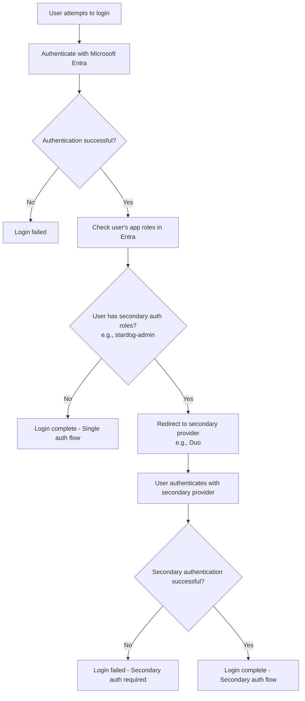

# Microsoft Entra Configuration


Microsoft Entra can be used both as a login provider to authenticate users into Launchpad and as an SSO connection provider to authenticate users against Stardog endpoints.

## Login Provider Configuration

The following configuration options are available for Microsoft Entra login provider.

> [!NOTE]
> See [How to Create an Azure App Registration to Login with Microsoft Entra in Launchpad](#how-to-create-an-azure-app-registration-to-login-with-microsoft-entra-in-launchpad) for instructions on 
> how to create an Azure App Registration to login with Microsoft Entra in Launchpad.

### `AZURE_AUTH_ENABLED`

The `AZURE_AUTH_ENABLED` is used to enable or disable Microsoft Entra authentication to log users into Launchpad.

- **Required:** Yes (if using Microsoft Entra)
- **Default:** `false`

### `AZURE_CLIENT_ID`

The `AZURE_CLIENT_ID` is the client id of the Azure App Registration used to sign users into Launchpad.

- **Required:** Yes (if using Microsoft Entra)
- **Default:** not set

### `AZURE_CLIENT_SECRET`

The `AZURE_CLIENT_SECRET` is the client secret of the Azure App Registration used to sign users into Launchpad.

> [!NOTE]
> This should be used if not using a client certificate (`AZURE_CLIENT_CERTIFICATE_FILE` or `AZURE_CLIENT_CERTIFICATE_THUMBPRINT`).

- **Required:** Yes (if using Microsoft Entra)
- **Default:** not set

### `AZURE_TENANT`

The `AZURE_TENANT` is the tenant id of the Azure App Registration used to sign users into Launchpad.

- **Required:** Yes (if using Microsoft Entra)
- **Default:** `organizations`


### `AZURE_CLIENT_PRIVATE_KEY_FILE`

The `AZURE_CLIENT_PRIVATE_KEY_FILE` is the path (in the Docker container) to the private key file corresponding to the certificate used as a credential with Application Registration;

> [!NOTE]
> This should be used if not using a client secret (`AZURE_CLIENT_SECRET`). The private key must **not** be password protected.

- **Required:** Yes (if using client certificate with Microsoft Entra)
- **Default:** not set

### `AZURE_CLIENT_CERTIFICATE_FILE`

The `AZURE_CLIENT_CERTIFICATE_FILE` is the path (in the Docker container) to the certificate file used as a credential with the Application Registration. 

> [!NOTE]
> This should be set if `AZURE_CLIENT_CERTIFICATE_THUMBPRINT` not specified.

- **Required:** Yes (if using client certificate with Microsoft Entra and not using `AZURE_CLIENT_CERTIFICATE_THUMBPRINT`)
- **Default:** not set

### `AZURE_CLIENT_CERTIFICATE_THUMBPRINT`

Thumbprint of the certificate used as a credential with the Application Registration. 

> [!NOTE]
> This should be set if `AZURE_CLIENT_CERTIFICATE_FILE` not specified)

- **Required:** Yes (if using client certificate with Microsoft Entra and not using `AZURE_CLIENT_CERTIFICATE_FILE`)
- **Default:** not set

### `AZURE_GOV_CLOUD_US`

The `AZURE_GOV_CLOUD_US` is used to set the Azure cloud environment to the Azure US Government Cloud.

- **Required:** Yes (if using Azure US Government Cloud)
- **Default:** `false`

### `AZURE_AUTH_BASE_URL`

The `AZURE_AUTH_BASE_URL` is used to set the base URL for Microsoft Entra. This is the URL that users will use to authenticate with Microsoft Entra.

> [!NOTE]
> If `AZURE_GOV_CLOUD_US` is set to `true`, this will be automatically set to `https://login.microsoftonline.us`

- **Required:** No
- **Default:** `https://login.microsoftonline.com`

### `AZURE_GRAPH_BASE_URL`

The `AZURE_GRAPH_BASE_URL` is used to set the base URL for the Microsoft Graph API. This is used to retrieve user information from Microsoft Entra.

> [!NOTE]
> If `AZURE_GOV_CLOUD_US` is set to `true`, this will be automatically set to `https://graph.microsoft.us`

- **Required:** No
- **Default:** `https://graph.microsoft.com`

### Secondary Authentication Provider

Microsoft Entra supports using a secondary authentication provider for users with specific app roles. This feature allows you to require certain users to authenticate with an additional provider (such as Duo) after successfully authenticating with Microsoft Entra, providing an extra layer of security.

#### `AZURE_SECONDARY_AUTH_PROVIDER`

The `AZURE_SECONDARY_AUTH_PROVIDER` specifies which secondary authentication provider to use. When a user with the required app roles logs in with Microsoft Entra, they will be redirected to authenticate with this secondary provider.

> [!IMPORTANT]
> Only OIDC (OpenID Connect) providers can be used as secondary authentication providers.

Supported secondary OIDC providers:
- `duo`
- `okta` 
- `ping`
- `google`

> [!NOTE]
> When a provider is configured as a secondary auth provider for Azure, it can no longer be used as a primary login provider.

- **Required:** No
- **Default:** not set

#### `AZURE_SECONDARY_AUTH_ROLES`

The `AZURE_SECONDARY_AUTH_ROLES` is a comma-separated list of app roles assigned to users in the Microsoft Entra app registration. Users with these roles will be required to authenticate with the secondary provider after successful Microsoft Entra authentication.

For example, if set to `stardog-admin,security-team`, users assigned either the `stardog-admin` or `security-team` app roles in Microsoft Entra will need to complete secondary authentication.

- **Required:** Yes (if using secondary auth provider)
- **Default:** not set

#### Secondary Authentication Flow

The secondary authentication flow works as follows:



1. User attempts to log into Launchpad
2. User authenticates with Microsoft Entra (primary provider)
3. Launchpad checks if the user has any of the configured `AZURE_SECONDARY_AUTH_ROLES`
4. If the user has required roles:
   - User is redirected to the secondary authentication provider
   - User must successfully authenticate with the secondary provider
   - Login is completed only after both authentications succeed
5. If the user does not have required roles:
   - Login is completed after Microsoft Entra authentication

#### Demo

Demo of the secondary authentication flow with Microsoft Entra and Duo:

https://github.com/user-attachments/assets/b70170c9-d76d-49fa-99af-8d082b8485ac

#### Example Configuration

Here's an example configuration using Duo as a secondary authentication provider:

```bash
# Microsoft Entra Login Provider (Primary)
AZURE_AUTH_ENABLED=true
AZURE_CLIENT_ID=<azure_client_id>
AZURE_CLIENT_SECRET=<azure_client_secret>
AZURE_TENANT=<tenant_id>
AZURE_SECONDARY_AUTH_PROVIDER=duo
AZURE_SECONDARY_AUTH_ROLES=stardog-admin,security-team

# Duo Secondary Authentication Provider (OIDC)
DUO_AUTH_ENABLED=true
DUO_CLIENT_ID=<duo_client_id>
DUO_CLIENT_SECRET=<duo_client_secret>
DUO_DISCOVERY_URL=https://sso-<your-account>.sso.duosecurity.com/oidc/<client_id>/.well-known/openid-configuration
```

#### Setting Up Secondary Authentication

To configure secondary authentication with Microsoft Entra:

1. **Create App Roles in Microsoft Entra**
   - Navigate to your Launchpad app registration in Azure Portal
   - Go to **"App roles"** 
   - Create roles that indicate users requiring secondary authentication (e.g., `stardog-admin`)
   - Assign these roles to appropriate users in **"Enterprise applications"**

2. **Configure Secondary OIDC Provider**
   - Configure your secondary provider using the same setup process as you would for a primary login provider
   - For example, if using Duo as a secondary provider, follow the [Duo provider configuration](./duo.md) steps
   - The configuration variables and setup process are identical to primary provider setup

3. **Update Launchpad Configuration**
   - Enable the secondary provider using the same configuration variables as you would for a primary login provider
   - Set `AZURE_SECONDARY_AUTH_PROVIDER` to the provider name (e.g. `duo`)
   - Configure `AZURE_SECONDARY_AUTH_ROLES` with the comma separated list of app roles requiring secondary auth
   - Once you specify a provider as secondary for Azure, it can no longer be used as a primary login provider

### How To Create an Azure App Registration to login with Microsoft Entra in Launchpad

1. **Create App Registration**
   - Open Azure Portal ([https://portal.azure.com](https://portal.azure.com))
   - Navigate to **Microsoft Entra ID** > **App registrations**
   - Click **"New registration"**
   - Name application (e.g., "Stardog Launchpad")
   - Select **"Accounts in this organizational directory only"**
   - Click **"Register"**

2. **Configure Authentication**
   - Go to app's **"Authentication"**
   - Add web platform redirect URI:
     - **Type**: Web
     - **Redirect URI**: `{BASE_URL}/oauth/azure/redirect`
      - See [`BASE_URL`](../README.md#base_url) for more information on what the value should.
   - Enable "ID tokens (used for implicit and hybrid flows)"

3. **Generate Credentials**
   - *Option 1: Client Secret*
     - Go to **"Certificates & secrets"**
     - Click **"New client secret"**
     - Set expiration
     - **Copy secret value immediately** - this is only shown while creating a secret. It cannot be retrieved later.
   
   - *Option 2: Certificate*
     - Go to **"Certificates & secrets"**
     - Upload certificate to app registration
      - If you don't have a certificate, you can create a self-signed certificate using [`openssl`](https://github.com/openssl/openssl), however, it is recommended to use a certificate from a trusted certificate authority.
     - Note certificate thumbprint in the web interface

4. **Collect Configuration Values**
   - **Client ID**: Found in "Overview"
   - **Tenant ID**: Found in "Overview"
   - **Client Secret** or Certificate details

5. **Configure Launchpad Environment Variables**

   - Using Client Secret:

   ```bash
   AZURE_AUTH_ENABLED=true
   AZURE_CLIENT_ID=<client_id>
   AZURE_TENANT=<tenant_id>
   AZURE_CLIENT_SECRET=<client_secret>
   ```

   - Using Certificate:

   ```bash
   AZURE_AUTH_ENABLED=true
   AZURE_CLIENT_ID=<client_id>
   AZURE_TENANT=<tenant_id>
   # Use AZURE_CLIENT_CERTIFICATE_FILE or AZURE_CLIENT_CERTIFICATE_THUMBPRINT. See note below.
   # AZURE_CLIENT_CERTIFICATE_FILE=<path_to_certificate_file-in-docker-image>
   AZURE_CLIENT_CERTIFICATE_THUMBPRINT=<certificate_thumbprint>
   AZURE_CLIENT_PRIVATE_KEY_FILE=<path_to_private_key_file-in-docker-image>
   ```

> [!NOTE]
There is no need to set both `AZURE_CLIENT_CERTIFICATE_FILE` and `AZURE_CLIENT_CERTIFICATE_THUMBPRINT`. Use one or the other. If both are set, `AZURE_CLIENT_CERTIFICATE_THUMBPRINT` will be used.

> [!NOTE]
> If your tenant is in the Azure US Government Cloud, set `AZURE_GOV_CLOUD_US=true`.

## SSO Connection Configuration

The following configuration options are available for Microsoft Entra SSO Connections, which allow users to authenticate against Stardog endpoints using Microsoft Entra tokens.

### `SSOCONNECTION_<unique_identifier>_AZURE_CLIENT_ID`

The `SSOCONNECTION_<unique_identifier>_AZURE_CLIENT_ID` is the client id of the Azure App Registration used to authenticate and authorize users to connect to the Stardog endpoint.

- **Required:** Yes
- **Default:** not set

### `SSOCONNECTION_<unique_identifier>_AZURE_CLIENT_SECRET`

The `SSOCONNECTION_<unique_identifier>_AZURE_CLIENT_SECRET` is the client secret of the Azure App Registration used to authenticate and authorize users to connect to the Stardog endpoint.

- **Required:** Yes
- **Default:** not set

### `SSOCONNECTION_<unique_identifier>_AZURE_TENANT`

The `SSOCONNECTION_<unique_identifier>_AZURE_TENANT` is the tenant id of the Azure App Registration used to authenticate and authorize users to connect to the Stardog endpoint.

- **Required:** Yes
- **Default:** not set

### `SSOCONNECTION_<unique_identifier>_AZURE_STARDOG_ENDPOINT`

The `SSOCONNECTION_<unique_identifier>_AZURE_STARDOG_ENDPOINT` is the URL of the Stardog endpoint that users will connect to using this SSO Connection. This is not required. If not set, users will need to manually enter the Stardog endpoint URL when creating an SSO connection. If provided, it will be pre-filled in the SSO Connection form.

- **Required:** No
- **Default:** not set

### `SSOCONNECTION_<unique_identifier>_AZURE_DISPLAY_NAME`

The `SSOCONNECTION_<unique_identifier>_AZURE_DISPLAY_NAME` is the user-facing display name for this SSO Connection. This is the name that will be displayed to users when they are selecting an SSO Connection to connect to a Stardog endpoint. If not set, the unique identifier will be used as the display name.

- **Required:** No
- **Default:** <unique_identifier>

### `SSOCONNECTION_<unique_identifier>_AZURE_GOV_CLOUD_US`

The `SSOCONNECTION_<unique_identifier>_AZURE_GOV_CLOUD_US` is used to set the Azure cloud environment. If set to `true`, it's assumed that the Azure App Registration is in your tenant in the Azure US Government Cloud.

- **Required:** Yes (if using Azure US Government Cloud)
- **Default:** `false`

### `SSOCONNECTION_<unique_identifier>_AZURE_AUTH_BASE_URL`

The `SSOCONNECTION_<unique_identifier>_AZURE_AUTH_BASE_URL` is used to set the base URL for Microsoft Entra. This is the URL that users will use to authenticate with Microsoft Entra.

> [!NOTE]
> If `SSOCONNECTION_<unique_identifier>_AZURE_GOV_CLOUD_US` is set to `true`, this will be automatically set to `https://login.microsoftonline.us`

- **Required:** No
- **Default:** `https://login.microsoftonline.com`

### `SSOCONNECTION_<unique_identifier>_AZURE_GRAPH_BASE_URL`

The `SSOCONNECTION_<unique_identifier>_AZURE_GRAPH_BASE_URL` is used to set the base URL for the Microsoft Graph API. This is used to retrieve user information from Microsoft Entra.

> [!NOTE]
> If `SSOCONNECTION_<unique_identifier>_AZURE_GOV_CLOUD_US` is set to `true`, this will be automatically set to `https://graph.microsoft.us`

- **Required:** No
- **Default:** `https://graph.microsoft.com`

### Setting up a Microsoft Entra SSO Connection

Setting up a Microsoft Entra SSO connection consists of 3 main steps:

1. [Creating the Microsoft Entra App Registration](#1-creating-the-microsoft-entra-app-registration)
2. [Configuring the Launchpad environment variables using the App Registration details](#2-configuring-the-launchpad-environment-variables-using-the-app-registration-details)
3. [Configuring the Stardog endpoint to accept JWT tokens from Microsoft Entra App Registration](#3-configuring-the-stardog-endpoint-to-accept-jwt-tokens-from-the-microsoft-entra-app-registration)

> [!NOTE]
> SSO connections leverage Stardog's JWT token authentication. This means that the Stardog endpoint must be configured to accept JWT tokens from the SSO provider. Stardog is able to auto-create users and assign roles based on the claims in the JWT token, provided that the roles claimed in the JWT token are valid roles in Stardog. This is explained in more detail below, but see the [Stardog Documentation](https://docs.stardog.com/operating-stardog/security/oauth-integration) for more information.


#### 1. Creating the Microsoft Entra App Registration

1. **Create App Registration**
   - Open Azure Portal ([https://portal.azure.com](https://portal.azure.com))
   - Navigate to **Microsoft Entra ID** > **App registrations**
   - Click **"New registration"**
   - Name application (e.g., "Stardog Development Endpoint")
   - Select **"Accounts in this organizational directory only"**
   - Click **"Register"**
2. **Configure Authentication**
   - Go to app's **"Authentication"**
   - Add web platform redirect URI:
     - **Type**: Web
     - **Redirect URI**: `{BASE_URL}/auth/sso-connection`
      - See [`BASE_URL`](../README.md#base_url) for more information on what the value should.
3. **Generate Credentials**
   - Go to **"Certificates & secrets"**
   - Click **"New client secret"**
   - Set expiration     - **Copy secret value immediately** - this is only shown while creating a secret. It cannot be retrieved later.
4. **Modify Manifest**
   - Go to **"Manifest"**
   - Set `requestedAccessTokenVersion` under `api` to `2`
5. **Create and Assign App Roles**
   - Go to **"App roles"**
   - Click **"Create app role"**
   - Create roles that you want to assign to users connecting to the Stardog endpoint. **These roles should match the roles in Stardog.**
   - Assign roles to users in the **"Enterprise applications"** service.
6. **Collect Configuration Values**
   - **Client ID**: Found in "Overview"
   - **Tenant ID**: Found in "Overview"
   - **Client Secret**: From Step 3. 

#### 2. Configuring the Launchpad environment variables using the App Registration details

```bash
SSOCONNECTION_<unique-identifier>_AZURE_CLIENT_ID=<client_id>
SSOCONNECTION_<unique-identifier>_AZURE_CLIENT_SECRET=<client>
SSOCONNECTION_<unique-identifier>_AZURE_TENANT=<tenant_id>
SSOCONNECTION_<unique-identifier>_AZURE_STARDOG_ENDPOINT=<stardog_endpoint> # optional
SSOCONNECTION_<unique-identifier>_AZURE_DISPLAY_NAME=<user-facing-display-name> # optional
```

> [!NOTE]
> If your tenant is in the Azure US Government Cloud, set `SSOCONNECTION_<unique-identifier>_AZURE_GOV_CLOUD_US=true`.


#### 3. Configuring the Stardog endpoint to accept JWT tokens from the Microsoft Entra App Registration

1. **Add the Microsoft Entra issuer entry to the Stardog endpoint's JWT configuration**
   - The JWT configuration for the Stardog server needs to be customized. To provide a configuration file for JWT configuration to Stardog, set the following property in the [`stardog.properties`](https://docs.stardog.com/operating-stardog/server-administration/server-configuration#stardogproperties) file:

   ```properties
   jwt.conf=/path/to/jwt.yaml
   ```

   - The `jwt.yaml` file should contain the following configuration:

   ```yaml
   issuers:
     https://login.microsoftonline.com/<SSOCONNECTION_$uid_AZURE_TENANT>/v2.0:
       usernameField: preferred_username
       audience: <AZURE_CLIENT_ID>
       algorithms:
       RS256:
         keyUrl: https://login.microsoftonline.com/<SSOCONNECTION_$uid_AZURE_TENANT>/discovery/v2.0/keys
       autoCreateUsers: True
       rolesClaimPath: roles
   ```

   - `https://login.microsoftonline.com/<SSOCONNECTION_$uid_AZURE_TENANT>/v2.0` is the issuer URL for Microsoft Entra. Replace `<SSOCONNECTION_$uid_AZURE_TENANT>` with the tenant id of the Azure App Registration for the SSO connection.
   - `usernameField` is the claim in the JWT token that contains the username of the user. This should be set to `preferred_username`.
   - `audience` is the client id of the Azure App Registration.
   - `algorithms` is the algorithm used to sign the JWT token. In this case, it is `RS256`. The `keyUrl` is the URL to the public key used to verify the JWT token.
   - `autoCreateUsers` is set to `True` to allow Stardog to auto-create users based on the `roles` claim in the JWT token.
   - `rolesClaimPath` is the path to the claim in the JWT token that contains the app roles assigned to the user. 

> [!NOTE]
> If you are using Microsoft Entra in the Azure US Government Cloud, the issuer URL should be `https://login.microsoftonline.us/<SSOCONNECTION_$uid_AZURE_TENANT>/v2.0` and the `keyUrl` should be `https://login.microsoftonline.us/<SSOCONNECTION_$uid_AZURE_TENANT>/discovery/v2.0/keys`.

2. **Make sure to restart the Stardog server after making these changes.**

3. **Create the roles in Stardog that match the app roles in the Azure App Registration.**
   - *This is required for Stardog to auto-create users and assign roles based on the claims in the JWT token.*
