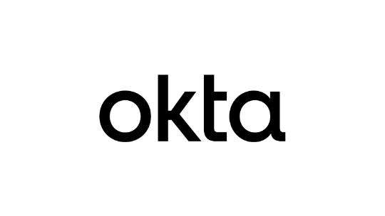

# Okta Configuration



Okta can be used both as a login provider to authenticate users into Launchpad and as an SSO connection provider to authenticate users against Stardog endpoints.

## Login Provider Configuration

The following configuration options are available for Okta SSO.

> [!NOTE]
> See [How to Create an Okta Application to login with Okta in Launchpad](#how-to-create-an-okta-application-to-login-with-okta-in-launchpad) for additional information.

### `OKTA_AUTH_ENABLED`

The `OKTA_AUTH_ENABLED` setting is used to enable or disable Okta authentication to log users into Launchpad.

- **Required:** Yes (if using Okta)
- **Default:** `false`

### `OKTA_CLIENT_ID`

The `OKTA_CLIENT_ID` is the client id of the Okta Application used to log users into Launchpad.

- **Required:** Yes (if using Okta)
- **Default:** not set

### `OKTA_DOMAIN`

The `OKTA_DOMAIN` is the domain of the Okta Application used to log users into Launchpad.

- **Required:** Yes (if using Okta)
- **Default:** not set

### `OKTA_CLIENT_SECRET`

The `OKTA_CLIENT_SECRET` is the client secret of the Okta Application used to log users into Launchpad.

- **Required:** Yes (if using Okta and not using `OKTA_CLIENT_PRIVATE_KEY_FILE`)
- **Default:** not set

### `OKTA_CLIENT_PRIVATE_KEY_FILE`

The `OKTA_CLIENT_PRIVATE_KEY_FILE` is the path (in the Docker container) to the private key file corresponding to the certificate used as a credential with the Okta Application.

> [!NOTE]
> This should be used if not using a client secret (`OKTA_CLIENT_SECRET`).

- **Required:** Yes (if using `private_key_jwt` auth with Okta)
- **Default:** not set

### `OKTA_REQUIRE_PKCE`

The `OKTA_REQUIRE_PKCE` is used to require Proof Key for Code Exchange (PKCE) for the Okta Application.

- **Required:** Yes (if this setting is checked in the Okta Application)
- **Default:** `false`

### `OKTA_POST_LOGOUT_REDIRECT_URI`

The `OKTA_POST_LOGOUT_REDIRECT_URI` is the URL that users will be redirected to after logging out of Launchpad.

> [!IMPORTANT]
> The URL must be registered in the Okta Application or the user will not be redirected.

- **Required:** No
- **Default:** not set

### How to Create an Okta Application to login with Okta in Launchpad

#### 1. Create a new application in Okta
   - Sign into your Okta Admin Dashboard
   - Navigate to **Applications** > **Applications**
   - Click **"Create App Integration"**
   - Choose **"OIDC - OpenID Connect"** as the Sign-in method
   - Click **"Next"**

#### 2. Configure the application
   - **General Settings**
     - **App Integration Name**: Name your application (e.g. "Stardog Launchpad")
   - **Sign-in redirect URIs**: `{BASE_URL}/oauth/okta/redirect`
      - See [`BASE_URL`](../README.md#base_url) for more information on what the value should.
   - **Sign out redirect URIs**: This can be set to `BASE_URL` if you want users to be redirected to the Launchpad home page after logging out. You will need to set the `OKTA_POST_LOGOUT_REDIRECT_URI` environment variable to this value.
      - See [`BASE_URL`](../README.md#base_url) for more information on what the value should.
   - **Assignments**: Assign the application to users or groups
   - Click **"Save"**

#### 3. Configure Application Client Credentials

After creating the application, you will need to decide between using a *client secret* or *public/private key pair* for authentication. These are for `client_secret_basic` and `private_key_jwt` authentication methods, respectively.

> [!NOTE]
> Aside from the client authentication method, there is an option to "Require Proof Key for Code Exchange (PKCE) as additional verification" in the Okta Application. If you enable this setting, you will need to set `OKTA_REQUIRE_PKCE=true` when configuring Launchpad.

##### Client Secret

This is the simpler method, however it is less secure than using private key JWT authentication. It is also the default method used for Okta when creating an application through their wizard.

1. Navigate to the **"General"** tab of the application
2. Under **Client Credentials**
   - Make note of your **Client ID** - you will need this later when configuring Launchpad
   - Click **"Show Client Secret"** and copy the value to somewhere safe. You will need this later when configuring Launchpad.

##### Public/Private Key (Private Key JWT)

1. Navigate to the **"General"** tab of the application
2. Under **Client Credentials**, click **"Edit"** to change the **Client Authentication** method to **Public/Private Key**
3. A new section will appear within the **Client Credentials** section called **Public/Private Key**
   - You can choose to upload a public key or generate a new key pair in Okta. If you choose to generate a new key pair, you will need to copy the private key **in PEM format** to a safe location. You will need this later when configuring Launchpad.
4. Make note of your **Client ID** - you will need this later when configuring Launchpad.

#### 4. Configure Launchpad

```
OKTA_AUTH_ENABLED=true
OKTA_CLIENT_ID=<client_id>
OKTA_DOMAIN=<okta_domain>

# optional
OKTA_POST_LOGOUT_REDIRECT_URI=<post_logout_uri>

# required if setting checked in Okta Application
OKTA_REQUIRE_PKCE=true
```

Depending on the authentication method you chose, you will need to set either `OKTA_CLIENT_SECRET` or `OKTA_CLIENT_PRIVATE_KEY_FILE`.

```
# Using client secret
OKTA_CLIENT_SECRET=<client_secret>

# Using private key JWT
OKTA_CLIENT_PRIVATE_KEY_FILE=/path/to/private-key/in/container.pem
```

> [!NOTE]
> The Okta domain can be found in the right side of the upper navigation bar after clicking on your username.
>
> 


> [!IMPORTANT]
> If using `OKTA_CLIENT_PRIVATE_KEY_FILE`, the private key must be accessible in the Docker container. This can be done by mounting a volume to the path specified in the environment variable.

## SSO Connection Configuration

The following configuration options are available for Okta SSO Connections, which allow users to authenticate against Stardog endpoints using Okta tokens.

### `SSOCONNECTION_<unique_identifier>_OKTA_CLIENT_ID`

The `SSOCONNECTION_<unique_identifier>_OKTA_CLIENT_ID` is the client id of the Okta application used to authenticate and authorize users to connect to the Stardog endpoint.

- **Required:** Yes
- **Default:** not set

### `SSOCONNECTION_<unique_identifier>_OKTA_DOMAIN`

The `SSOCONNECTION_<unique_identifier>_OKTA_DOMAIN` is the domain of the Okta application used to authenticate and authorize users to connect to the Stardog endpoint.

- **Required:** Yes
- **Default:** not set

### `SSOCONNECTION_<unique_identifier>_OKTA_CLIENT_SECRET`

The `SSOCONNECTION_<unique_identifier>_OKTA_CLIENT_SECRET` is the client secret of the Okta application used to authenticate and authorize users to connect to the Stardog endpoint.

- **Required:** Yes (if not using `SSOCONNECTION_<unique_identifier>_OKTA_CLIENT_PRIVATE_KEY_FILE`)
- **Default:** not set

### `SSOCONNECTION_<unique_identifier>_OKTA_CLIENT_PRIVATE_KEY_FILE`

The `SSOCONNECTION_<unique_identifier>_OKTA_CLIENT_PRIVATE_KEY_FILE` is the path (in the Docker container) to the private key file corresponding to the certificate used as a credential with the Okta application.

- **Required:** Yes (if using Public/Private Key authentication with Okta)
- **Default:** not set

### `SSOCONNECTION_<unique_identifier>_OKTA_REQUIRE_PKCE`

The `SSOCONNECTION_<unique_identifier>_OKTA_REQUIRE_PKCE` is used to require Proof Key for Code Exchange (PKCE) for the Okta application.

- **Required:** Yes (if this setting is checked in the Okta application)
- **Default:** `false`

### `SSOCONNECTION_<unique_identifier>_OKTA_AUTHORIZATION_SERVER_ID`

The `SSOCONNECTION_<unique_identifier>_OKTA_AUTHORIZATION_SERVER_ID` is the ID of the custom authorization server in Okta. The [custom authorization server](https://developer.okta.com/docs/guides/customize-tokens-returned-from-okta/main/#add-a-custom-claim-to-a-token) is used to issue access tokens with custom claims for the Stardog endpoint. A custom claim is used to specify the Stardog roles assigned to the user in the Stardog endpoint. If not set, the default authorization server (with ID of `default`) will be used.

- **Required:** Yes
- **Default:** `default`

### `SSOCONNECTION_<unique_identifier>_OKTA_ROLES_SCOPE`

The `SSOCONNECTION_<unique_identifier>_OKTA_ROLES_SCOPE` is the scope used to retrieve the roles assigned to the user from the Okta application.

- **Required:** Yes
- **Default:** not set

### `SSOCONNECTION_<unique_identifier>_OKTA_STARDOG_ENDPOINT`

The `SSOCONNECTION_<unique_identifier>_OKTA_STARDOG_ENDPOINT` is the URL of the Stardog endpoint that users will connect to using this SSO Connection. This is not required. If not set, users will need to manually enter the Stardog endpoint URL when creating an SSO connection. If provided, it will be pre-filled in the SSO Connection form.

- **Required:** No
- **Default:** not set

### `SSOCONNECTION_<unique_identifier>_OKTA_STARDOG_INTERNAL_ENDPOINT`

The `SSOCONNECTION_<unique_identifier>_OKTA_STARDOG_INTERNAL_ENDPOINT` is an additional internal or private endpoint URL for the Stardog server. When configured, this endpoint is used by Launchpad for server-side operations, particularly for the Voicebox service container. This is useful in architectures where backend services cannot access Stardog on the public endpoint but can communicate using an internal endpoint.

> [!NOTE]
> When both endpoints are configured, Voicebox requests automatically use the internal endpoint while browser-based requests (Studio, Explorer, etc.) continue using the public endpoint. The internal endpoint can be overridden by users under "Advanced Options" in the SSO connection dialog.

- **Required:** No
- **Default:** not set

### `SSOCONNECTION_<unique_identifier>_OKTA_DISPLAY_NAME`

The `SSOCONNECTION_<unique_identifier>_OKTA_DISPLAY_NAME` is the user-facing display name for this SSO Connection. This is the name that will be displayed to users when they are selecting an SSO Connection to connect to a Stardog endpoint. If not set, the unique identifier will be used as the display name.

- **Required:** No
- **Default:** <unique_identifier>

### Setting up an Okta SSO Connection

These steps walk through how to configure Okta and Stardog to allow users to create SSO Connections in Launchpad to use Okta access tokens to authenticate and authorize against Stardog.

#### Step 1: Create a New OIDC Application in Okta

1. Sign in to your Okta Admin Dashboard
2. Navigate to **Applications** > **Applications**
3. Click **Create App Integration**
4. Select **OIDC - OpenID Connect** as the Sign-in method
5. Choose **Web Application** as the Application type
6. Click **Next**

#### Step 2: Configure Application Settings for Stardog SSO connection

1. **General Settings**:
   - **App integration name**: Enter a name for your SSO connection (e.g., "Stardog Developer Server SSO")

2. **Grant types**:
   - Ensure **Authorization Code** is selected
   - Additionally, select **Refresh Token** to enable token refresh capability

3. **Sign-in redirect URIs**:
   - Add your redirect URI: `{BASE_URL}/auth/sso-connection`
      - See [`BASE_URL`](../README.md#base_url) for more information on what the value should.

4. **Assignments**:
   - Choose who can access this integration

5. Click **Save**

6. Configure **_client credentials_**. After creating the application, you'll need to decide between using client secret or public key/private key JWT authentication.

#### Client Secret

This is the simpler approach and default but less secure than private key JWT authentication.

1. Navigate to the **General** tab of your application.
2. Under **Client Credentials**:
    - **Client secret** should be checked for **Client authentication**
    - Note your **Client ID**
    - Note your **Client Secret** by clicking on the "Eye" icon to unhide the **Client Secret** or copy it to your clipboard.

#### Private Key JWT Authentication

1. Navigate to the **General** tab of your application.
2. Under **Client Credentials**, click **Edit** to change the **Client authentication** mode to **Public Key / Private Key**
3. A new section should appear within **Client Credentials**, named **Public Keys**. You can choose how you want to configure your keys but for simplicity here, you can click **Add Key** which should open a modal asking you to paste your own public key or automatically generate a new key pair. Click **Generate new key**, and copy the _**PEM**_ format of your private key to a file. This will be used later and is only shown once by Okta for security.
4. Note your **Client ID** for later use.

#### Step 3: Configure Custom Authorization Server and Scopes

In order to auto-create users in Stardog and authorize them based on claims representing Stardog roles in access tokens issued from Okta, you need to utilize a **custom authorization server** in Okta to add custom claims into an access token.

> [!NOTE]
> Per Okta, an authorization server defines your security boundary, and is used to mint access and identity tokens for use with OIDC clients and OAuth 2.0 service accounts when accessing your resources via API. Within each authorization server you can define your own OAuth scopes, claims, and access policies. Read more [in the Okta docs](https://developer.okta.com/authentication-guide/implementing-authentication/set-up-authz-server.html)

1. Navigate to **Security** > **API** > **Authorization Servers**
2. You can either:
   - Use the default server (should be named "default")
   - Create a new authorization server by clicking **Add Authorization Server**

3. If creating a new server:
   - Provide a **Name** and **Description**
   - Set the **Audience** (this will be the `aud` claim for access tokens minted by this server). This audience should match the `audience` field in the [JWT configuration for Stardog](#step-7-configure-stardog-to-accept-okta-access-tokens).
   - Click **Save**

4. Select your authorization server (new or `default`)
5. Go to the **Scopes** tab
6. Click **Add Scope**
7. Complete the form:
   - **Name**: `sd-dev-roles` (or your preferred scope name)
   - **Description**: "Stardog Roles for Authorization"
   - Enable **Include in public metadata**
   - Click **Create**

#### Step 4: Create a Claim for Stardog Roles

1. Still in your authorization server, go to the **Claims** tab
2. Click **Add Claim**
3. Complete the form:
   - **Name**: `stardog-roles` (or your preferred claim name)
   - **Include in token type**: Select Access Token
   - **Value type**: Choose appropriate type (**Groups** or **Expression**)
   - **Value/Filter**: Enter an expression that maps some information about the user to Stardog roles
   - **Include in**: Select specific scopes including the `sd-dev-roles` scope (or whatever you named your custom scope) you created.
   - Click **Create**

> [!TIP]
> The **Value/Filter** field should be an expression that maps some information about the user to Stardog role names that exist in your Stardog instance. For example, if you have a groups in Okta that represent roles in Stardog that are prepended with `stardogDevelopment`, you can add a filter to make it such that only users in groups that start with `stardogDevelopment` are assigned the roles in Stardog. This is up to you how you want to map the roles in Okta to roles in Stardog.
>
> 
>

#### Step 5: Configure Custom Authorization Server's Access Policies

1. Still in your authorization server, go to the **Access Policies** tab
2. Click **Add Policy**
3. Complete the policy configuration:
    - **Name:** Enter a name for your policy (e.g. "Stardog SSO Connection Policy")
    - **Assign to:** Choose which clients this policy applies to. You'll want to select the client you created in Step 1.
4. Click **Create Policy**
5. Click **Add Rule**
6. Configure the new rule:
    - **Scopes**: Select which scopes can be requested, including: `openid`, `profile`, `email`, `offline_access` and `sd-dev-roles` (or whatever you named your custom scope)
7. Click **Create Rule**

#### Step 6: Configure Launchpad Settings

```
SSOCONNECTION_STAGING_OKTA_CLIENT_ID=your-client-id-from-okta
SSOCONNECTION_STAGING_OKTA_CLIENT_SECRET=your-client-secret-from-okta
SSOCONNECTION_STAGING_OKTA_DOMAIN=your-okta-domain.okta.com
SSOCONNECTION_STAGING_OKTA_AUTHORIZATION_SERVER_ID=default
SSOCONNECTION_STAGING_OKTA_ROLES_SCOPE=sd-dev-roles

# optional but recommended
SSOCONNECTION_STAGING_OKTA_DISPLAY_NAME=Stardog Staging
SSOCONNECTION_STAGING_OKTA_STARDOG_ENDPOINT=http://localhost:5825

# if using private_key_jwt_auth, set the path to the private key file
# make sure to remove the client secret if using private_key_jwt_auth
# SSOCONNECTION_STAGING_OKTA_CLIENT_PRIVATE_KEY_FILE=/path/to/key.pem

# if requiring PKCE
# SSOCONNECTION_STAGING_OKTA_REQUIRE_PKCE=true
```

- `STAGING` is the unique identifier for this SSO Connection. `OKTA` is the provider identifier for this SSO Connection.
- The `SSOCONNECTION_STAGING_OKTA_CLIENT_ID` and `SSOCONNECTION_DEVOKTA_OKTA_CLIENT_SECRET` are the client id and client secret of the Okta application you created.
- The `SSOCONNECTION_STAGING_OKTA_DOMAIN` is the domain of your Okta application.
- The `SSOCONNECTION_STAGING_OKTA_AUTHORIZATION_SERVER_ID` is the ID of the custom authorization server in Okta. If not set, the `default` authorization server will be used.
- The `SSOCONNECTION_STAGING_OKTA_DISPLAY_NAME` is the user-facing display name for this SSO Connection.
- The `SSOCONNECTION_STAGING_OKTA_STARDOG_ENDPOINT` is the URL of the Stardog endpoint that users will connect to using this SSO Connection. This is not required. If not set, users will need to manually enter the Stardog endpoint URL when creating an SSO connection.
- The `SSOCONNECTION_STAGING_OKTA_ROLES_SCOPE` is the additional scope used to retrieve the roles assigned to the user from the Okta application.

> [!NOTE]
> If you are using private key JWT authentication, set `SSOCONNECTION_STAGING_OKTA_CLIENT_PRIVATE_KEY_FILE` to the path of the private key file in the Docker container. You will need to mount a volume to the path specified in the environment variable.

> [!TIP]
> The custom authorization server ID can be found by navigating to **Security** > **API** > **Authorization Servers** in the Okta Admin Dashboard and selecting the custom authorization server you created or the default server. There should be a **Metadata URI** that contains the authorization server ID that follows the pattern:
>
>```
>https://{$DOMAIN}/oauth2/{$AUTHORIZATION_SERVER_ID}/.well-known/oauth-authorization-server
>```
>
> The authorization server ID is generally an alphanumeric string that is unique to the authorization server.

#### Step 7: Configure Stardog to accept Okta Access Tokens

Add the following entry to Stardog's `jwt.yml`, replacing all templated values.

```yaml
issuers:
  https://<domain>/oauth2/<custom-auth-server-id>:
    usernameField: sub
    autoCreateUsers: True
    audience: <custom-auth-server-audience>
    rolesClaimPath: <custom-claim>
    algorithms:
      RS256:
        keyUrl: https://<domain>/oauth2/<custom-auth-server-id>/v1/keys
```

- `https://<domain>/oauth2/<custom-auth-server-id>` is the issuer URL for Okta. Replace `<domain>` with your Okta domain and `<custom-auth-server-id>` with the ID of the custom authorization server in Okta.
- `sub` is the claim in the JWT token that contains the username of the user. You can change this if you have a different claim that contains the username.
- `autoCreateUsers` is set to `True` to allow Stardog to auto-create users based on the `roles` claim in the JWT token.
- `audience` is the audience configured for the custom authorization server in Okta.
- `rolesClaimPath` is the path to the claim in the JWT token that contains the app roles assigned to the user. This should match the claim you created in Okta.
- `keyUrl` is the URL to the public key used to verify the JWT token.

> [!TIP]
> Using the **Token Preview** tab under your custom authorization server, you can see the decoded token claims for a token you would be issued, which can help troubleshoot this integration. You'll want to make sure you request the `sd-dev-roles` scope (or whatever you named your custom scope) when you authenticate to get a token with the `stardog-roles` claim.