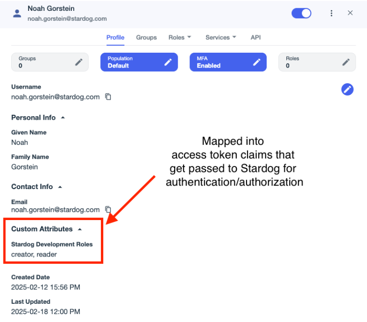

# PingOne Configuration


PingOne can be used both as a login provider to authenticate users into Launchpad and as an SSO connection provider to authenticate users against Stardog endpoints.

## Login Provider Configuration

The following configuration options are available for PingOne SSO.

> [!NOTE]
> See [How to Create a PingOne OIDC Client to login with PingOne in Launchpad](#how-to-create-a-pingone-oidc-client-to-login-with-pingone-in-launchpad) for additional information.

### `PING_AUTH_ENABLED`

`PING_AUTH_ENABLED` is used to enable or disable PingOne authentication to log users into Launchpad.

- **Required:** Yes (if using PingOne)
- **Default:** `false`

### `PING_CLIENT_ID`

`PING_CLIENT_ID` is the client id of the PingOne OIDC client used to log users into Launchpad.

- **Required:** Yes (if using PingOne)
- **Default:** not set

### `PING_CLIENT_SECRET`

`PING_CLIENT_SECRET` is the client secret of the PingOne OIDC client used to log users into Launchpad.

- **Required:** Yes (if using PingOne)
- **Default:** not set

### `PING_ENVIRONMENT_ID`

`PING_ENVIRONMENT_ID` is the environment id of the PingOne environment used to log users into Launchpad.

- **Required:** Yes (if using PingOne)
- **Default:** not set

### `PING_TOKEN_AUTH_METHOD`

`PING_TOKEN_AUTH_METHOD` is the authentication method used to authenticate with PingOne. `client_secret_post` are `client_secret_basic` the only supported values. The default when creating an OIDC client in PingOne is `client_secret_basic`.

- **Required:** No (Yes if the authentication method set in PingOne is not `client_secret_basic`) 
- **Default:** `client_secret_basic`

### `PING_OIDC_DISCOVERY_URL`

`PING_OIDC_DISCOVERY_URL` is the URL of the OIDC discovery document for the PingOne environment. This is used to retrieve the OIDC configuration for the PingOne environment. The default if not set is `https://auth.pingone.com/{PING_ENVIRONMENT_ID}/as/.well-known/openid-configuration`. This can be overridden if needed to support custom PingOne for Enterprise environments.

- **Required:** No
- **Default:** `https://auth.pingone.com/{PING_ENVIRONMENT_ID}/as/.well-known/openid-configuration`

### How To Create a PingOne OIDC Client to login with PingOne in Launchpad

1. **Create an OIDC Application**. [See the Ping docs for more information on creating an OIDC app.](https://docs.pingidentity.com/pingoneforenterprise/pingone_sso_for_saas_apps/p14saas_add_update_oidc_app.html)
   - select **OIDC Web App** as the application type 
   - set the **Redirect URI** to `{BASE_URL}/oauth/ping/redirect`
      - See [`BASE_URL`](../README.md#base_url) for more information on what the value should.
   - under **Resources**, add additional scopes to the application: `email`, `profile`. `openid` should already be added by default but is also required.
   - under **Configuration**, add a redirect URI of `{BASE_URL}/oauth/ping/redirect`
   - **optionally**, under **Configuration** > **Token Endpoint Auth Method**, set the token endpoint auth method to either `Client Secret Basic` (default) *or* `Client Secret Post`. If you set this to `Client Secret Post`, you will need to set `PING_TOKEN_AUTH_METHOD=client_secret_post` in the Launchpad configuration.

2. Configure Launchpad

All of the following settings can be found in the application's overview page, including the client secret.

```
PING_AUTH_ENABLED=true
PING_CLIENT_ID=<client_id>
PING_CLIENT_SECRET=<client_secret>
PING_ENVIRONMENT_ID=<environment_id>

# only required if you selected "Client Secret Post" for the "Token Endpoint Auth Method" in the Ping Application Configuration.
# This will default to `client_secret_basic` if not provided or an invalid value is provided.
# PING_TOKEN_AUTH_METHOD=client_secret_post

# only required if the OIDC discovery URL is different from the default of `https://auth.pingone.com/{PING_ENVIRONMENT_ID}/as/.well-known/openid-configuration`
# PING_OIDC_DISCOVERY_URL=<custom_discovery_url>
```

## SSO Connection Configuration

The following configuration options are available for PingOne SSO Connections, which allow users to authenticate against Stardog endpoints using PingOne tokens.

### `SSOCONNECTION_<unique_identifier>_PING_CLIENT_ID`

The `SSOCONNECTION_<unique_identifier>_PING_CLIENT_ID` is the client id of the PingOne OIDC client used to authenticate and authorize users to connect to the Stardog endpoint.

- **Required:** Yes
- **Default:** not set

### `SSOCONNECTION_<unique_identifier>_PING_CLIENT_SECRET`

The `SSOCONNECTION_<unique_identifier>_PING_CLIENT_SECRET` is the client secret of the PingOne OIDC client used to authenticate and authorize users to connect to the Stardog endpoint.

- **Required:** Yes
- **Default:** not set

### `SSOCONNECTION_<unique_identifier>_PING_ENVIRONMENT_ID`

The `SSOCONNECTION_<unique_identifier>_PING_ENVIRONMENT_ID` is the environment id of the PingOne environment used to authenticate and authorize users to connect to the Stardog endpoint.

- **Required:** Yes
- **Default:** not set

### `SSOCONNECTION_<unique_identifier>_PING_ROLES_SCOPE`

The `SSOCONNECTION_<unique_identifier>_PING_ROLES_SCOPE` is the scope used to retrieve the roles assigned to the user from PingOne. This is used to retrieve the roles assigned to the user from PingOne and assign them to the user in Stardog.

- **Required:** Yes
- **Default:** not set

### `SSOCONNECTION_<unique_identifier>_PING_TOKEN_AUTH_METHOD`

The `SSOCONNECTION_<unique_identifier>_PING_TOKEN_AUTH_METHOD` is the authentication method used to authenticate with PingOne. `client_secret_post` are `client_secret_basic` the only supported values. The default when creating an OIDC client in PingOne is `client_secret_basic`.

- **Required:** No (Yes if the authentication method set in PingOne is not `client_secret_basic`)
- **Default:** `client_secret_basic`

### `SSOCONNECTION_<unique_identifier>_PING_OIDC_DISCOVERY_URL`

The `SSOCONNECTION_<unique_identifier>_PING_OIDC_DISCOVERY_URL` is the URL of the OIDC discovery document for the PingOne environment. This is used to retrieve the OIDC configuration for the PingOne environment. The default if not set is `https://auth.pingone.com/{PING_ENVIRONMENT_ID}/as/.well-known/openid-configuration`. This can be overridden if needed to support custom PingOne for Enterprise environments.

- **Required:** No
- **Default:** `https://auth.pingone.com/{PING_ENVIRONMENT_ID}/as/.well-known/openid-configuration`

### `SSOCONNECTION_<unique_identifier>_PING_DISPLAY_NAME`

The `SSOCONNECTION_<unique_identifier>_PING_DISPLAY_NAME` is the user-facing display name for this SSO Connection. This is the name that will be displayed to users when they are selecting an SSO Connection to connect to a Stardog endpoint. If not set, the unique identifier will be used as the display name.

- **Required:** No
- **Default:** <unique_identifier>

### `SSOCONNECTION_<unique_identifier>_PING_STARDOG_ENDPOINT`

The `SSOCONNECTION_<unique_identifier>_PING_STARDOG_ENDPOINT` is the URL of the Stardog endpoint that users will connect to using this SSO Connection. This is not required. If not set, users will need to manually enter the Stardog endpoint URL when creating an SSO connection. If provided, it will be pre-filled in the SSO Connection form.

- **Required:** No
- **Default:** not set

### Setting up a PingOne SSO Connection

> [!IMPORTANT]
> The following example uses a custom attribute on a user in PingOne to store the Stardog roles assigned to the user. This is just one way to store roles in PingOne that represent a user's Stardog roles. You can use any method that works for your organization. The important thing is that the roles are available in the access token that is issued by PingOne. The `SSOCONNECTION_<unique_identifier>_PING_ROLES_SCOPE` should be set to the scope to pull in the claim representing Stardog roles in the access token.
>
> 
>

1. Add a new custom user attribute to the Ping user profile. This attribute will be used to store the Stardog roles for a user. If you have multiple Stardog servers, you can create multiple attributes, one for each server.
   - Under **Directory** > **User Attributes**, add a **Declared** user attribute.
      - **Name**: `stardogDevelopmentRoles`
      - **Description** (Optional): "Roles assigned to the user on the development Stardog server"
      - **Display Name:** "Development Stardog Roles"
      - **Allow multiple values**: Yes

2. Assign a value to the user attribute for a user.

   - Under **Directory** > **Users**, select a user and assign a value to the `stardogDevelopmentRoles` attribute. You need to click the **+Add** button in the **Custom Attributes** section at the bottom of the user's profile. The values should match **exactly** the roles in Stardog. For example, if you have a role in Stardog called `admin`, you should have a value in the `stardogDevelopmentRoles` attribute called `admin`. Case sensitivity matters.

3. Under **Applications** > **Resources**, create a new custom resource to access the custom attribute representing the Stardog roles in the user's profile. This resource will be used to access the custom attribute in the access token. The new resource dialog has 3 parts:
   - Section 1: Create Resource Profile
      - **Resource Name**: `stardogDevelopmentServer`
      - **Audience** (Optional): Can be left blank in which case it will default to the resource name (`stardogDevelopmentServer`). This can be changed to something else if you want to use a different audience in the access token. We will use this audience in the JWT configuration for Stardog.
      - **Description**: "Access to the development Stardog server roles"
      - **Attributes**: Add the `stardogDevelopmentRoles` attribute
   - Section 2: Attributes
      - Configure the Stardog **Roles** and **Username** attributes for the resource.
         - Click the **+Add** button.
            - For the Stardog roles attribute name, choose a name (e.g., `sd-roles`) and for the PingOne mappings selector, use `Stardog Development Roles`. This will map the `stardogDevelopmentRoles` attribute to the `sd-roles` claim in the access token. The `sd-roles` claim will be used in the JWT configuration for Stardog and will be used to assign roles to the user in Stardog.
            - For the username attribute name, choose a name (e.g., `sd-username`) and for the PingOne mappings selector, use `Email Address` or some other unique attribute. This will map the username of the user to the `sd-username` claim in the access token. The `username` claim will be used to create the user in Stardog.
   - Section 3: Scopes
      - Configure scopes for the resource. This will be used by Launchpad to request the roles claim in the access token.
         - Scope Name: `stardogDevelopmentServerAccess` (or some other name)
         - Description: "Access to the development Stardog server roles"

4. Create an OIDC application for the Stardog server in PingOne. [See the Ping docs for more information on creating an OIDC app.](https://docs.pingidentity.com/pingoneforenterprise/pingone_sso_for_saas_apps/p14saas_add_update_oidc_app.html)
   - select **OIDC Web App** as the application type
   - under **Resources**, add additional scopes to the application:
      - `email`
      - `profile`
      - `offline_access` (used to get a refresh token)
      - `stardogDevelopmentServerAccess` (or the scope name you used in step 3 to access the custom resource representing the Stardog roles)
   - under **Configuration**, add a redirect URI of `{BASE_URL}/auth/sso-connection`
   - optionally, under **Configuration** > **Token Endpoint Auth Method**, select "Client Secret Basic" *or* "Client Secret Post". If you select "Client Secret Post", you will need to set `SSOCONNECTION_<unique_identifier>_PING_TOKEN_AUTH_METHOD=client_secret_post` in the Launchpad configuration.

5. Configure Launchpad

Most of the settings needed can be found in the application's overview page, for the exception of the `SSOCONNECTION_<unique_identifier>_PING_ROLES_SCOPE` which is the scope used to retrieve the Stardog roles assigned to the user from PingOne.

```bash
# required
SSOCONNECTION_<unique_identifier>_PING_CLIENT_ID=<client_id>
SSOCONNECTION_<unique_identifier>_PING_CLIENT_SECRET=<client_secret>
SSOCONNECTION_<unique_identifier>_PING_ENVIRONMENT_ID=<environment_id>
# This is the scope used to retrieve the roles assigned to the user from PingOne. 
# This should match the scope you used in the custom resource in PingOne.
SSOCONNECTION_<unique_identifier>_PING_ROLES_SCOPE=stardogDevelopmentServerAccess

# optional but helpful for Launchpad users
SSOCONNECTION_<unique_identifier>_PING_DISPLAY_NAME=<user-facing-display-name>
SSOCONNECTION_<unique_identifier>_PING_STARDOG_ENDPOINT=<stardog_endpoint>

# only required if you selected "Client Secret Post" for the "Token Endpoint Auth Method" in the Ping Application Configuration.
SSOCONNECTION_<unique_identifier>_PING_TOKEN_AUTH_METHOD=client_secret_post

# only required if the OIDC discovery URL is different from the default of `https://auth.pingone.com/{PING_ENVIRONMENT_ID}/as/.well-known/openid-configuration`
SSOCONNECTION_<unique_identifier>_PING_OIDC_DISCOVERY_URL=<custom_discovery_url>
```

6. Configure Stardog to accept JWT tokens from PingOne. [See the Stardog documentation for more information on configuring Stardog to accept JWT tokens.](https://docs.stardog.com/operating-stardog/security/oauth-integration)

You will need to add the following entry to your Stardog server's jwt configuration. This will allow Stardog to accept JWT tokens from PingOne and auto-create users and assign roles based on the claims in the JWT token.

```yaml
issuers:
  # issuer URL for PingOne (non enterprise)
  https://auth.pingone.com/<SSOCONNECTION_$uid_PING_ENVIRONMENT_ID>/as:
    usernameField: sd-username
    rolesClaimPath: sd-roles
    autoCreateUsers: True
    audience: stardogDevelopmentServer
    algorithms:
    RS256:
      keyUrl: https://auth.pingone.com/<SSOCONNECTION_$uid_PING_ENVIRONMENT_ID>/as/jwks
```

- the top-level key under `issuers`, is the issuer URL for PingOne. This should match the issuer URL in the PingOne OIDC configuration. This should be in your PingOne OIDC application's connection settings under the `Issuer ID` field. For non enterprise, this is `https://auth.pingone.com/<SSOCONNECTION_$uid_PING_ENVIRONMENT_ID>/as`. Replace this as needed for your environment.
- the `rolesClaimPath` should be set to the claim in the JWT token that contains the roles assigned to the user in PingOne. This should match the `sd-roles` (or whatever you named it) attribute in the custom resource in PingOne.
- the `usernameField` should be set to the claim in the JWT token that contains the username of the user in PingOne. This should match the `sd-username` (or whatever you named it) attribute in the custom resource in PingOne.
- the `audience` should be set to the audience defined in the custom resource in PingOne. This should match the `Resource Name` in the custom resource in PingOne if you did not set the `Audience` field.
- similar to the issuer URL, the `keyUrl` should be set to the URL of the public key used to verify the JWT token. This should match the `JWKS URI` in the PingOne OIDC configuration. This may not follow the template below for an enterprise PingOne environment - replace as needed.