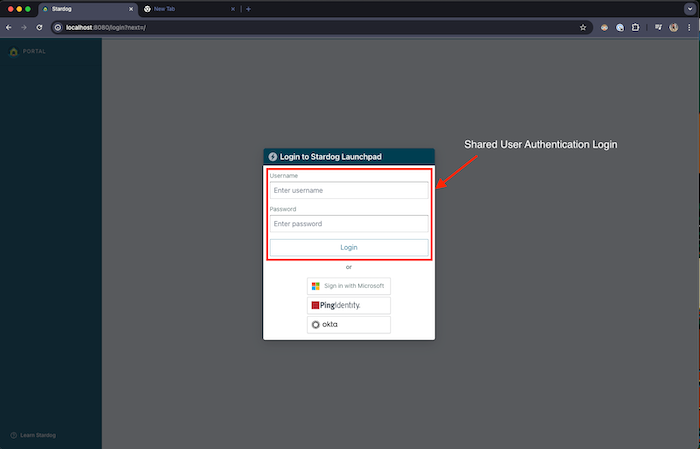

# Shared User Authentication

> [!IMPORTANT]
> **Stardog Launchpad documentation has moved to [docs.stardog.com](https://docs.stardog.com/launchpad/).**
>
> This repository is an archive. It documents **Launchpad v3** and **Voicebox Service `0.x`**, and is no longer updated.
>
> For **Launchpad v4** and **Voicebox Service `v1.0.0`** or later, see:
>
> - [Stardog Launchpad](https://docs.stardog.com/launchpad/) — installing, configuring, and running Launchpad, and its login providers
> - [Voicebox Service](https://docs.stardog.com/launchpad/voicebox-service/) — running, configuring, and deploying the Voicebox Service
> - [Launchpad release notes](https://docs.stardog.com/release-notes/stardog-cloud/stardog-launchpad/)
> - [Voicebox Service release notes](https://docs.stardog.com/release-notes/stardog-voicebox/)

If you prefer not to use SSO for logging into Launchpad, you can enable shared user authentication. This is a login-only authentication method and does not support SSO connections to Stardog endpoints.

> [!WARNING] 
> This method is not recommended for production and should only be used for testing.

Shared user authentication works by defining a single username and password in the Launchpad configuration. Anyone who enters these credentials will be granted access. Note that this method is not secure: only one shared user can be configured at a time, and all data (e.g. saved connections) be attributed to that shared user. 

> [!NOTE]
> This method can be used in conjunction with an SSO login provider.

## Configuration

### `SHARED_USER_AUTH_ENABLED`

The `SHARED_USER_AUTH_ENABLED` is used to enable or disable shared user authentication to log users into Launchpad. When enabled, users will see a username and password inputs in the login form. 

- **Required:** Yes (if using shared user authentication)
- **Default:** `false`

### `SHARED_USER_USERNAME`

The `SHARED_USER_USERNAME` is the username of the shared user used to log users into Launchpad. This username should be between 1 and 150 characters long. Can contain letters/digits/./+/-/_ only. No '@' character is permitted.

- **Required:** Yes (if using shared user authentication)
- **Default:** not set

### `SHARED_USER_PASSWORD`

The `SHARED_USER_PASSWORD` is the optional password of the shared user used to log users into Launchpad.

- **Required:** No
- **Default:** not set