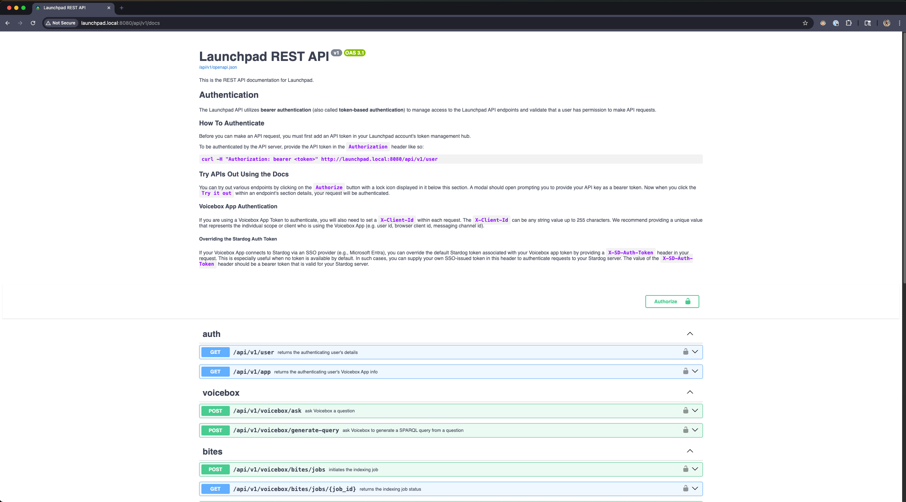
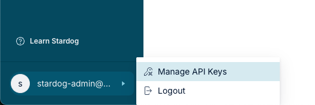
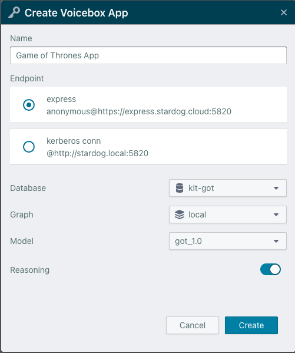
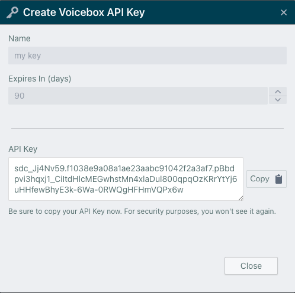
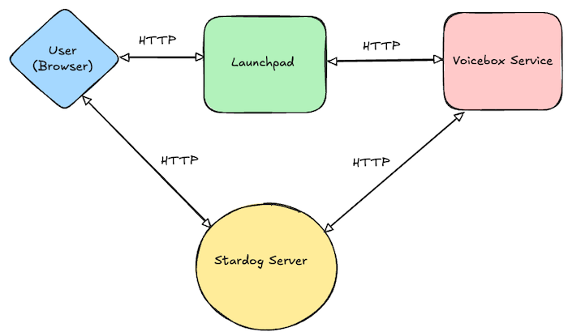

# Voicebox

[Stardog Voicebox](https://docs.stardog.com/voicebox/) is a conversational AI chat interface for your Enterprise Data. This document provides instructions for using Voicebox within Launchpad.

Launchpad can operate with or without the Voicebox. To enable Voicebox, you’ll need to run an additional Docker image ([Voicebox Service](#voicebox-service)) and provide its address to Launchpad. The two services communicate over HTTP.

## Using Voicebox Programmatically

You can interact with Voicebox programmatically using the Launchpad REST API. This allows you to send queries to Voicebox and receive responses in a structured format, which can be useful for integrating Voicebox functionality into other applications or workflows.

In order to use the Voicebox REST APIs, you *must* have the [Voicebox Service](#voicebox-service) running and configured with Launchpad. You can access the REST API documentation served by Launchpad at `/api/v1/docs` endpoint. There's a Swagger UI that provides an interactive interface to explore the API endpoints. Additional documentation about how to use the API is contained there.



### Creating a Voicebox Application and Associated API Key

To use the Voicebox REST API, you need to create a Voicebox application in Launchpad and generate an API key that is scoped to that application. This API key will be used to authenticate your requests to the Voicebox REST API:

To do so, follow these steps:

1. Create a Voicebox application. In the bottom left corner of the Launchpad UI, click on your username opening the user menu, then click on **Manage API Keys**.



2. Click on **New Voicebox App** and fill in the details for your application. It will ask you to scope the application with details such as the connection to use, database, model, etc.



3. Once the application is created, you will need to create an API key that is scoped to the Voicebox application. Click on **New App Key** in the Voicebox application you just created. You can provide a name for the API key, and adjust the expiration date if desired.


4. After creating the API key, you will be able to copy it only once. This API key will be used to authenticate your requests to the Voicebox REST API.



The API key should be provided in the `Authorization` header of your requests as a *Bearer* token. You must also include a `X-Client-Id` header with an identifier < 255 characters long that identifies a user of the Voicebox application. This can be any alphanumeric string.


```
# Voicebox App token
token=sdc_xyz...

curl --silent -X 'POST' \
  'http://launchpad.local:8080/api/v1/voicebox/ask' \
  -H 'Accept: application/json' \
  -H 'X-Client-Id: someones-id' \
  -H "Authorization: Bearer $token" \
  -H 'Content-Type: application/json' \
  -d '{
  "query": "Who is Cersei Lannister married to?"
}' | jq '{ "Result": .result, "SPARQL Query Used": (.actions[] | select(.type == "sparql") | .value)}'
{
  "Result": "Cersei Lannister is married to [Robert Baratheon](urn:stardog:marketplace:demos:got:characters:901).",
  "SPARQL Query Used": "# Who is Cersei Lannister married to?\n\nSELECT DISTINCT ?spouse0 \nWHERE {\n  ?character0 a got:Character . \n  ?character0 stardog:label \"Cersei Lannister\" . \n  ?character0 got:spouse ?spouse0 . \n  ?spouse0 a got:Character . \n  FILTER ( ?character0 != ?spouse0)\n}"
}
```

### Stardog Authentication for API Requests

When making API requests to the Voicebox REST API, the Voicebox Service makes requests to Stardog in order to answer your question. There is a Stardog credential associated with the Voicebox application by means of the Launchpad connection you selected when creating the Voicebox application. In some cases, you may need to override the default authentication method used by Launchpad.

The authentication method depends on your Stardog connection type:

#### Username/Password Connections

When you authenticate through the Launchpad interface (create a new connection), Launchpad obtains a JWT from the Stardog server on behalf of the authenticated user and persists it beyond the Launchpad session for subsequent requests. If you try and use the connection in Launchpad and your token is invalid or expired, Launchpad will prompt you to re-authenticate, obtaining a new JWT and persisting it for future use. This means that it is possible for a JWT associated with the connection to expire when using it programmatically and not through the Launchpad UI since you will not be prompted to re-authenticate.

If you encounter authentication errors or want to ensure you always have a valid token for programmatic requests, you can manually retrieve a fresh token from the Stardog server associated with the Voicebox app's connection using the `/admin/token` endpoint ([as described below](#manual-token-retrieval-from-stardog)) and include it in your requests using the `X-SD-Auth-Token` header to override the stored credential. You could also log 
into Launchpad and re-authenticate the connection to obtain a new JWT, but this is not always practical for programmatic use.

#### SSO Connections

SSO connections (such as Microsoft Entra) require manual token management since Launchpad does not persist JWTs from external identity providers beyond the session. For these connections, you must:

1. **Obtain a valid token** from your SSO provider that Stardog is configured to accept
2. **Include the token** in your API requests using the `X-SD-Auth-Token` header

##### Token Override Capability

The `X-SD-Auth-Token` header can also override any JWT that Launchpad has persisted for a connection. This is particularly useful for ensuring you always have a valid, unexpired token.

###### Manual Token Retrieval from Stardog

As noted earlier, if Stardog is configured to issue JWTs, you can manually retrieve a token using the `/admin/token` endpoint. This is useful for obtaining a fresh token when needed.

**Example:**
```bash
curl -u <username>:<password> https://<stardog-server-url>/admin/token \
```

The returned JWT issued by Stardog can then be included in your Voicebox API requests:

```bash
X-SD-Auth-Token: <your-jwt-token>
```

> [!TIP]
> If using the Stardog CLI, you can also use the [`stardog-admin user token`](https://docs.stardog.com/stardog-admin-cli-reference/user/user-token) command to obtain a JWT from Stardog for a user.

## Voicebox Service

The Voicebox Service is distributed as a Docker image. The Voicebox Service is a stateless HTTP server that packages up Stardog Voicebox functionality. It is intended to be run in conjunction with Stardog Launchpad. The Voicebox Service will communicate directly with whichever Stardog servers you are interacting with in Launchpad, so they should be accessible to this image when run as a container.



### Internal Stardog Endpoint Support

When Voicebox makes requests to Stardog servers, it uses server-side connections that may require different network routing than browser-based requests. To support architectures where the Voicebox service container cannot access Stardog on the public endpoint, Launchpad v3.5.0+ allows you to configure an additional internal endpoint for connections.

When an internal endpoint is configured for a connection, Voicebox automatically uses the internal endpoint while browser-based applications (Studio, Explorer, Designer, Knowledge Catalog) continue using the public endpoint. This is particularly useful in scenarios where:
- Stardog is behind a firewall accessible only within a private network
- Different DNS resolution is needed for internal vs. external access
- Network policies restrict container-to-container communication to internal networks

See the [SSO Connection Configuration](./README.md#sso-connection-configuration) section and individual provider documentation for details on configuring internal endpoints.

### Running the Voicebox Service

1. Similar to Launchpad, the Voicebox Service image can be pulled from Stardog's private Docker registry.

   ```bash
   docker pull stardog-stardog-apps.jfrog.io/voicebox-service:current
   ```

   - The `current` tag will always point to the latest version of the Voicebox Service. You can also specify a specific version tag to avoid accidental upgrades.

2. To run the Voicebox Service with Docker, you can use the following command:

   ```bash
   docker run \
   --env-file .env.voicebox-service \
   -p 8000:8000 \
   -v /host/path/to/vbx-config.json:/voicebox-config/vbx-config.json \
   stardog-stardog-apps.jfrog.io/voicebox-service:current
   ```

   - `.env.voicebox-service` can be named anything but contains the configuration for the Voicebox Service. See [Configuration](#configuration) for more details.
   - `/host/path/to/vbx-config.json` is mounted from the host to `/voicebox-config/vbx-config.json` in the container. This configuration has more LLM specific configuration.
      - `.env.voicebox-service` should have `VBX_CONFIG_FILE=/voicebox-config/vbx-config.json` in it.
   - The Voicebox Service HTTP server is exposed on port 8000 so Launchpad can communicate with it.

3. Update Launchpad configuration to point to URL of the Voicebox Service.

   ```bash
   VOICEBOX_SERVICE_ENDPOINT=http://<host>:8000
   ```

4. Assuming you have restarted Launchpad with the Voicebox Service endpoint configured, you should be able to access Voicebox from the Launchpad UI.

https://github.com/user-attachments/assets/d49f3ddd-a62b-448d-9d03-733d32d9a2eb

### Configuration

The following options should be provided as environment variables to the Voicebox Service. Additional environment variables might be needed based on the LLM provider configured. See the Voicebox Configuration File section below for more details.

| Environment Variable | **Required** | **Description** | **Available Options** |
| --- | --- | --- | --- |
| `LOG_TYPE` | `N` | The format of the logs sent to STDOUT. Default is `JSON` | `TEXT`, `JSON`. |
| `LOG_LEVEL` | `N` | Modifies the log level. Default is `INFO`.  | `DEBUG`, `INFO`, `WARNING`, `ERROR` |
| `VBX_CONFIG_FILE` | `Y` | The **absolute path** to the Voicebox configuration file. You will need to mount a directory with the file in it. The Voicebox configuration file contains information like which LLM model provider and model you want to use. Example: `/config/vbx-azure-config.json` |  |

### Voicebox Configuration File

In addition to the environment variables provided to the Voicebox Service, the Voicebox Service also requires you to give it a configuration file in JSON.

Here's an example configuration file for using Voicebox with AWS Bedrock:

```json
{  
	"enable_external_llm": true,  
	"enable_analytics": true, 
	"enable_charts": true,  
	"default_llm_config": {    
		"llm_provider": "bedrock",    
		"llm_name": "us.meta.llama3-1-70b-instruct-v1:0"  
	}
}
```

The following table explains the fields that can be specified in this configuration file. LLM Configuration is explained in the following section.

| **Configuration Option** | **Required** | **Description** | Type |
| --- | --- | --- | --- |
| `default_llm_config` | `Y` | Configuration for the LLM provider. | **LLM Configuration** |
| `enable_analytics` | `N` | Enable the analytics agents that can perform further analysis over results returned from the Knowledge Graph | boolean |
| `enable_charts` | `N` | Enable the capability to turn tabular results in answers to charts | boolean |
| `enable_external_llm` | `N` | Enable the ability to use the LLM to answer questions with its background knowledge instead of the Knowledge Graph | boolean |
| `external_llm_config` | `N` | Configuration for an alternate LLM provider to use for background knowledge if `enable_external_llm` is enabled. If this configuration is not provided the `default_llm_config` will be used. | **LLM Configuration** |

#### LLM Configuration

The LLM configuration is specified as a JSON object in the Voicebox configuration file with the following fields.

| **Configuration Option** | **Required** | **Description** | Type |
| --- | --- | --- | --- |
| `llm_provider` | `Y` | Name of the LLM provider | String |
| `llm_name` | `Y` | Name of the LLM | String |
| `server_url` | `N` | Optional server URL for the LLM provider. May be required based on the provider configured. | URL |
| `max_tokens` | `N` | Maximum number of tokens for LLM requests. This limit can be used to control LLM costs to prevent LLM from returning very long responses. | Integer |

The following LLM providers are supported:
- [Azure AI](#azure-ai-configuration)
- [AWS Bedrock](#aws-bedrock-configuration)
- [Databricks](#databricks-configuration)
- [Fireworks](#fireworks-configuration)
- [Google Vertex](#google-vertex-configuration)
- [OpenAI](#openai-configuration)

#### Azure AI Configuration

Voicebox can use an Azure AI endpoint deployed within [Azure AI Foundry](https://azure.microsoft.com/en-us/products/ai-foundry). 

The following configuration options are used with Azure LLM in the Voicebox configuration file. Update the `AZURE_AI_ENDPOINT` in the server URL to point to your endpoint.

| **Configuration Option** | **Available Options** |
| --- | --- |
| `llm_provider` | `azure` |
| `llm_name` | `Meta-Llama-3.1-70B-Instruct` , `Meta-Llama-3.3-70B-Instruct`, `Llama-4-Maverick-17B-128E-Instruct-FP8` |
| `server_url` | `https://AZURE_AI_ENDPOINT.services.ai.azure.com/models` |

The following environment variables are used with Azure.

| Environment Variable | **Required** | **Description** |
| --- | --- | --- |
| `AZURE_API_KEY` | `Y` | Azure API key |

#### AWS Bedrock Configuration

Voicebox can use a [Bedrock endpoint](https://aws.amazon.com/bedrock/) deployed within AWS. 

The following configuration options are used with Bedrock LLM in the Voicebox configuration file.

| **Configuration Option** | **Available Options** |
| --- | --- |
| `llm_provider` | `bedrock` |
| `llm_name` | `meta.llama3-1-70b-instruct-v1:0` , `us.meta.llama3-1-70b-instruct-v1:0`, `meta.llama4-maverick-17b-instruct-v1:0`, `us.meta.llama4-maverick-17b-instruct-v1:0`, (application inference profile name) |

AWS Bedrock allows users to create [application inference profiles](https://docs.aws.amazon.com/bedrock/latest/userguide/inference-profiles-create.html) to track usage and costs when invoking a model. The ARN associated with an inference profile can be used as the `llm_name` in Voicebox configuration. All LLM calls initiated by Voicebox will be done using this inference profile.

The following environment variables are used with Bedrock.

| Environment Variable | **Required** | **Description** |
| --- | --- | --- |
| `AWS_ACCESS_KEY_ID` | `Y` | AWS access key ID |
| `AWS_SECRET_ACCESS_KEY` | `Y` | AWS secret access key |
| `BEDROCK_PROFILE` | `N` | AWS profile that can be specified instead of the access key ID and secret access key |
| `BEDROCK_REGION` | `Y` | Name of the AWS region where the Bedrock LLM is deployed, e.g. `us-west-1` |

It is also possible to use IAM roles for accessing Bedrock models instead of specifying access keys if Voicebox service is running on an EC2 instance. The IAM role should have the permissions `bedrock:Get*`, `bedrock:List*`, `bedrock:InvokeModel`, `bedrock:InvokeModelWithResponseStream`. The AWS built-in policy `AmazonBedrockLimitedAccess` includes these permissions and can be used directly or a new role can be defined with these permissions. 

Once the IAM role containing correct permissions is defined, the role can be attached to the EC2 instance where the Voicebox service is running. For the IAM role to take effect none of the environment variables `AWS_ACCESS_KEY_ID`, `AWS_SECRET_ACCESS_KEY`, or `BEDROCK_PROFILE` should be set. When everything is configured correctly, in the Voicebox service logs, you should see a message as follows for the role you have defined:

```
Found credentials from IAM Role: VoiceboxBedrockRole
```

#### Databricks Configuration

Voicebox can use an LLM endpoint deployed within a [Databricks workspace](https://www.databricks.com/product/model-serving).

The following configuration options are used with Databricks LLM in the Voicebox configuration file. Update the `DATABRICKS_WORKSPACE` in the server URL to point to your workspace.

| **Configuration Option** | **Available Options** |
| --- | --- |
| `llm_provider` | `databricks` |
| `llm_name` | `databricks-meta-llama-3-1-70b-instruct`, `databricks-meta-llama-3-3-70b-instruct`, `databricks-llama-4-maverick`  |
| `server_url` | `https://DATABRICKS_WORKSPACE.cloud.databricks.com/serving-endpoints` |

The following environment variables are used with Databricks.

| Environment Variable | **Required** | **Description** |
| --- | --- | --- |
| `DATABRICKS_API_KEY` | `Y` | Databricks API key |

#### Fireworks Configuration

Voicebox can use [Fireworks.ai](http://Fireworks.ai) as an LLM endpoint.

The following configuration options are used with Fireworks in the Voicebox configuration file. 

| **Configuration Option** | **Available Options** |
| --- | --- |
| `llm_provider` | `fireworks` |
| `llm_name` | `accounts/fireworks/models/llama-v3p1-70b-instruct`, `accounts/fireworks/models/llama-v3p3-70b-instruct`, `accounts/fireworks/models/llama4-maverick-instruct-basic` |

The following environment variables are used with Fireworks.

| Environment Variable | **Required** | **Description** |
| --- | --- | --- |
| `FIREWORKS_API_KEY` | `Y` | Fireworks API key |

#### Google Vertex Configuration

Voicebox can use Llama models hosted at [Google Vertex Model Garden](https://cloud.google.com/model-garden) as an LLM endpoint.

The following configuration options are used with Google Vertex in the Voicebox configuration file. Replace the `Google_Vertex_AI_Project_Name` value in the example with your project name.

| **Configuration Option** | **Available Options** |
| --- | --- |
| `llm_provider` | `vertex` |
| `llm_name` | `meta/llama-3.1-70b-instruct-maas`, `meta/llama-3.3-70b-instruct-maas` |
| `provider_args` | { "project": "Google_Vertex_AI_Project_Name" } |

Note that, `provider_args` is a JSON object itself. An example LLM configuration for Google Vertex looks like this:
```json
{  
    "default_llm_config": {    
        "llm_provider": "vertex",
        "llm_name": "meta/llama-3.3-70b-instruct-maas",
        "provider_args": {
          "project" : "My Project Name"
        } 
    }
}
```

The following environment variables are used with Google Vertex.

| Environment Variable | **Required** | **Description** |
| --- | --- | --- |
| `GOOGLE_APPLICATION_CREDENTIALS` | `Y` |  The location of a credential JSON file |

See [Google documentation](https://cloud.google.com/docs/authentication/application-default-credentials) for the details of creating credential files.

#### OpenAI Configuration

Voicebox can use [OpenAI](https://openai.com/api/) as an LLM endpoint.

The following configuration options are used with OpenAI in the Voicebox configuration file.

| **Configuration Option** | **Available Options** |
| --- | --- |
| `llm_provider` | `openai` |
| `llm_name` | `gpt-4o`, `gpt-4o-mini` |
| `server_url` | (Optional - can be set if OpenAI endpoint is access via proxy)  |

It is also possible to provide optional custom HTTP headers included in the OpenAI requests. Here is an example configuration file showing how these custom headers can be configured:

```json
{  
    "default_llm_config": {    
        "llm_provider": "openai",
        "llm_name": "gpt-4o-mini",
        "server_url": "https://api.openai.com/v1/",
        "provider_args": {
          "headers" : {
        "OpenAI-Organization": "org-gnSjNrpIz0bb7V1modfLrNof",
        "OpenAI-Project": "$PROJECT_ID"
          }
        } 
    }
}
```

The values for custom headers should be valid [Python string templates](https://docs.python.org/3/library/string.html#template-strings). The variables mentioned in template string should be defined as environment variables, e.g. in the above example there should be an environment variable named `PROJECT_ID`. Environment variables is a better choice for including sensitive values in the configuration file whereas non-sensitive values can be directly included in the configuration file, e.g. organization value in the above example.

The following environment variables are used with OpenAI.

| Environment Variable | **Required** | **Description** |
| --- | --- | --- |
| `OPENAI_API_KEY` | `Y` | OpenAI API key |

## Release Notes

The Voicebox Service is released independently of Launchpad. 

> [!NOTE] 
> All available releases of the Voicebox Service are listed below. The image tag for a release is simply the release name prepended with `v` as in `v0.1.1`.

## 0.21.0 Release (Oct 2, 2025)

* Support for competency question evaluation functionality in Designer
* Use entity summarization from the KG with RAG
* Add chunk IRIs to the RAG response
* Handle incomplete tags in LLM output during query generation
* Support for virtual graphs in Think mode
* Extend support for local prefixes for plain query-generation
* Upgrade Docker image to use Debian 13 and pull in OS patches
  
## 0.20.2 Release (Aug 21, 2025)

* Fix compatibility issues with AMD processors
* Improve handling of binary data, date/time fields, and token limits when generating mappings for Designer
* Return labels of instances from virtual graphs

## 0.20.1 Release (Jul 21, 2025)
## 0.20.0 Release (Jul 10, 2025)
## 0.19.0 Release (Jun 20, 2025)
## 0.18.10 Release (May 12, 2025)
## 0.18.9 Release (Apr 17, 2025)
