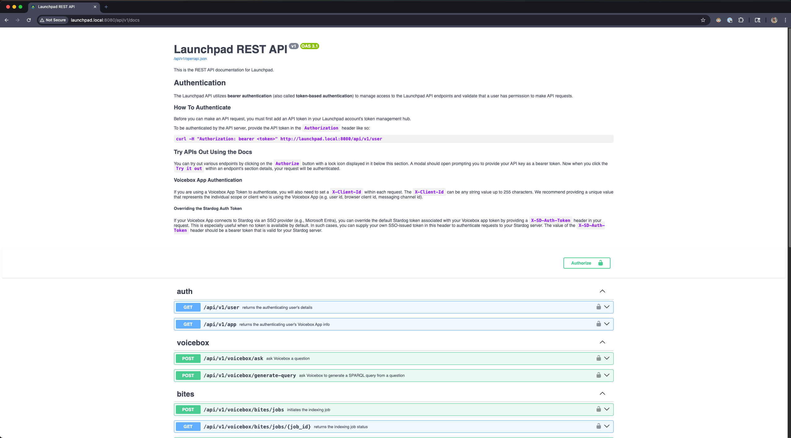
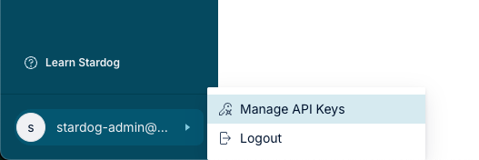
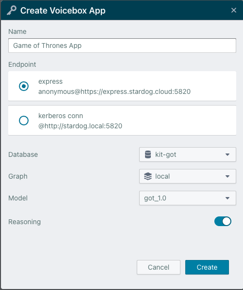
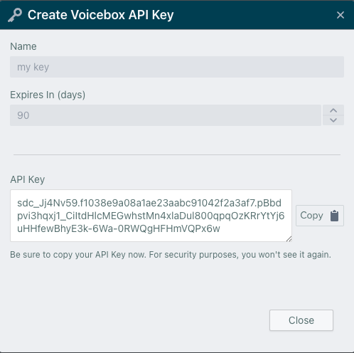
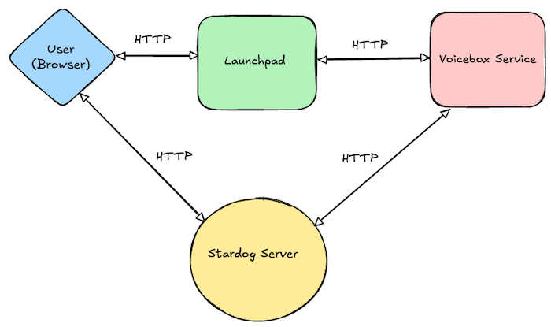

# Voicebox

[Stardog Voicebox](https://docs.stardog.com/voicebox/) is a conversational AI chat interface for your Enterprise Data. This document provides instructions for using Voicebox within Launchpad.

Launchpad can operate with or without the Voicebox. To enable Voicebox, you'll need to run an additional Docker image ([Voicebox Service](#voicebox-service)) and provide its address to Launchpad. The two services communicate over HTTP.

## Voicebox Features

### Think Mode

> [!IMPORTANT]
> **Think Mode does not apply to the Voicebox Service `v1.0.0` or later**, which reasons across multiple steps on every question rather than behind a toggle. Launchpad v4.0.0 routes all Voicebox traffic to `v1.0.0` by default, so this feature and its configuration option are only relevant to a deployment still running the previous-generation `0.x` service.

Think Mode is powered by a multi-agent architecture, enabling chain-of-thought reasoning to handle complex, multi-step questions. When it applies, users see a "Think Mode" button in the Voicebox input interface.


Think Mode is enabled by default. To turn it off on a deployment running the previous-generation service, add the following environment variable to your Launchpad configuration:

```bash
VOICEBOX_THINK_MODE_ENABLED=false
```

> [!NOTE]
> Think Mode requires Voicebox Service version `v0.22.0+` and Stardog version `v11.2.0+`. See the [Voicebox Release Notes](./voicebox-release-notes.md#0220-release-oct-16-2025) and [Stardog Release Notes](https://docs.stardog.com/release-notes/stardog-platform#1120-release-2025-10-01) for more information.

### Voicebox Suggestions for Designer

Voicebox Suggestions makes it possible to create a Voicebox-enabled Knowledge Graph, complete with spotlight questions, from just a project description, input data, and a few clicks. When enabled, users will see the new Voicebox-assisted project creation flow when creating a new project in Designer.


To enable Voicebox Suggestions in your Launchpad deployment, add the following environment variable to your Launchpad configuration:

```bash
VOICEBOX_SUGGESTIONS_ENABLED=true
```

> [!IMPORTANT]
> Voicebox Suggestions requires Voicebox Service version `v0.22.0+` and Stardog version `v11.2.0+`. See the [Voicebox Release Notes](./voicebox-release-notes.md#0220-release-oct-16-2025) and [Stardog Release Notes](https://docs.stardog.com/release-notes/stardog-platform#1120-release-2025-10-01) for more information.

## Using Voicebox Programmatically

You can interact with Voicebox programmatically using the Launchpad REST API. This allows you to send queries to Voicebox and receive responses in a structured format, which can be useful for integrating Voicebox functionality into other applications or workflows.

In order to use the Voicebox REST APIs, you *must* have the [Voicebox Service](#voicebox-service) running and configured with Launchpad. You can access the REST API documentation served by Launchpad at `/api/v1/docs` endpoint. There's a Swagger UI that provides an interactive interface to explore the API endpoints. Additional documentation about how to use the API is contained there.



### Creating a Voicebox Application and Associated API Key

To use the Voicebox REST API, you need to create a Voicebox application in Launchpad and generate an API key that is scoped to that application. This API key will be used to authenticate your requests to the Voicebox REST API:

To do so, follow these steps:

1. Create a Voicebox application. In the bottom left corner of the Launchpad UI, click on your username opening the user menu, then click on **Manage API Keys**.



2. Click on **New Voicebox App** and fill in the details for your application. It will ask you to scope the application with details such as the connection to use, database, model, etc.



3. Once the application is created, you will need to create an API key that is scoped to the Voicebox application. Click on **New App Key** in the Voicebox application you just created. You can provide a name for the API key, and adjust the expiration date if desired.


4. After creating the API key, you will be able to copy it only once. This API key will be used to authenticate your requests to the Voicebox REST API.



The API key should be provided in the `Authorization` header of your requests as a *Bearer* token. You must also include a `X-Client-Id` header with an identifier < 255 characters long that identifies a user of the Voicebox application. This can be any alphanumeric string.


```
# Voicebox App token
token=sdc_xyz...

curl --silent -X 'POST' \
  'http://launchpad.local:8080/api/v1/voicebox/ask' \
  -H 'Accept: application/json' \
  -H 'X-Client-Id: someones-id' \
  -H "Authorization: Bearer $token" \
  -H 'Content-Type: application/json' \
  -d '{
  "query": "Who is Cersei Lannister married to?"
}' | jq '{ "Result": .result, "SPARQL Query Used": (.actions[] | select(.type == "sparql") | .value)}'
{
  "Result": "Cersei Lannister is married to [Robert Baratheon](urn:stardog:marketplace:demos:got:characters:901).",
  "SPARQL Query Used": "# Who is Cersei Lannister married to?\n\nSELECT DISTINCT ?spouse0 \nWHERE {\n  ?character0 a got:Character . \n  ?character0 stardog:label \"Cersei Lannister\" . \n  ?character0 got:spouse ?spouse0 . \n  ?spouse0 a got:Character . \n  FILTER ( ?character0 != ?spouse0)\n}"
}
```

### Stardog Authentication for API Requests

When making API requests to the Voicebox REST API, the Voicebox Service makes requests to Stardog in order to answer your question. There is a Stardog credential associated with the Voicebox application by means of the Launchpad connection you selected when creating the Voicebox application. In some cases, you may need to override the default authentication method used by Launchpad.

The authentication method depends on your Stardog connection type:

#### Username/Password Connections

When you authenticate through the Launchpad interface (create a new connection), Launchpad obtains a JWT from the Stardog server on behalf of the authenticated user and persists it beyond the Launchpad session for subsequent requests. If you try and use the connection in Launchpad and your token is invalid or expired, Launchpad will prompt you to re-authenticate, obtaining a new JWT and persisting it for future use. This means that it is possible for a JWT associated with the connection to expire when using it programmatically and not through the Launchpad UI since you will not be prompted to re-authenticate.

If you encounter authentication errors or want to ensure you always have a valid token for programmatic requests, you can manually retrieve a fresh token from the Stardog server associated with the Voicebox app's connection using the `/admin/token` endpoint ([as described below](#manual-token-retrieval-from-stardog)) and include it in your requests using the `X-SD-Auth-Token` header to override the stored credential. You could also log 
into Launchpad and re-authenticate the connection to obtain a new JWT, but this is not always practical for programmatic use.

#### SSO Connections

SSO connections (such as Microsoft Entra) require manual token management since Launchpad does not persist JWTs from external identity providers beyond the session. For these connections, you must:

1. **Obtain a valid token** from your SSO provider that Stardog is configured to accept
2. **Include the token** in your API requests using the `X-SD-Auth-Token` header

##### Token Override Capability

The `X-SD-Auth-Token` header can also override any JWT that Launchpad has persisted for a connection. This is particularly useful for ensuring you always have a valid, unexpired token.

###### Manual Token Retrieval from Stardog

As noted earlier, if Stardog is configured to issue JWTs, you can manually retrieve a token using the `/admin/token` endpoint. This is useful for obtaining a fresh token when needed.

**Example:**
```bash
curl -u <username>:<password> https://<stardog-server-url>/admin/token \
```

The returned JWT issued by Stardog can then be included in your Voicebox API requests:

```bash
X-SD-Auth-Token: <your-jwt-token>
```

> [!TIP]
> If using the Stardog CLI, you can also use the [`stardog-admin user token`](https://docs.stardog.com/stardog-admin-cli-reference/user/user-token) command to obtain a JWT from Stardog for a user.

## Voicebox Service

The Voicebox Service is distributed as a Docker image. It is an HTTP server that packages up Stardog Voicebox functionality, and is intended to be run in conjunction with Stardog Launchpad. The Voicebox Service communicates directly with whichever Stardog servers you are interacting with in Launchpad, so they should be accessible to this image when run as a container.

> [!IMPORTANT]
> As of `v1.0.0`, the Voicebox Service persists the results of the queries it runs — **frames** — so that later turns in a conversation can reuse a result without re-querying Stardog. Frames can be stored on local disk, in Amazon S3, or in Azure Blob Storage. The default is local disk, which requires a **persistent volume** and limits the service to a **single instance**; either object backend removes both constraints. See [Frame Stores](./guides/voicebox-deployment.md#frame-stores) to choose and configure a backend.



The Voicebox Service has its own documentation:

| | |
| :--- | :--- |
| [Configuring the Voicebox Service](./guides/voicebox-configuration.md) | Running it, environment variables, the `vbx-config.json` file and supported LLM providers, custom headers, and JWT authentication. |
| [Deploying the Voicebox Service](./guides/voicebox-deployment.md) | Choosing a frame store backend, tuning, health probes, and log events. |
| [Voicebox Service Release Notes](./voicebox-release-notes.md) | Released independently of Launchpad. |

